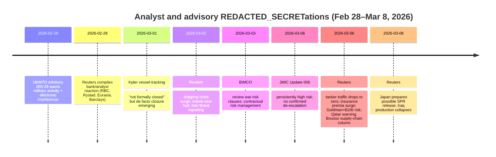

# Strait of Hormuz Crisis Analyst Commentary Synthesis as of 08 Mar 2026

## Executive summary

Commercial passage through the entity["place","Strait of Hormuz","gulf chokepoint"] is widely assessed as **effectively halted**, driven less by a single “legal closure” and more by an interacting stack of **kinetic threat, electronic interference, insurance withdrawal/repricing, and shipowner/charterer risk aversion**. UKMTO warned of “significant military activity” and elevated electronic interference (AIS/navigation/communications disruption) across the Gulf/Strait on 28 Feb. citeturn47view0 JMIC assessed the regional maritime risk as **CRITICAL** (attack “almost certain”) and reported multiple confirmed vessel incidents; later updates reiterated that while reported activity may fluctuate day-to-day, there were **“no confirmed indicators of de-escalation”** and traffic remained sharply reduced. citeturn47view3turn47view1 Reuters quantified the operational outcome: daily tanker transits fell from **~37/day (Feb 27) to zero** by early March. citeturn48view3

A strong cross-source consensus identifies insurance as an immediate transmission mechanism from conflict to physical supply: **war-risk and/or P&I war extensions were cancelled or repriced**, and “aggregation risk” (many high-value hulls clustered in a confined area) became central. Windward describes reinsurers’ role in triggering cancellations by P&I clubs that cover much of the world fleet; without cover, voyages become commercially and financially infeasible even if the waterway is physically navigable. citeturn53view7 Reuters reports war premia rising sharply (in some cases over 1000%), with market quotes clustering around **~1–1.5% of vessel value**, and some examples as high as **3%** for particular risk profiles—implying multi‑million‑dollar incremental costs per voyage for large tankers. citeturn51view2turn51view0 Lloyd’s List framed the same point bluntly: the strait is “effectively … closed … by shipping itself,” with transits down more than 80% after vessels were struck and war cover withdrew. citeturn53view5

Energy-market analysts mostly agree that even temporary disruption is systemically large because bypass options are limited. The entity["organization","International Energy Agency","iea"] (IEA) estimates 2025 average flows of **~20 mb/d** of crude and products through the strait (about **25% of seaborne oil trade**), with only **~3.5–5.5 mb/d** of available pipeline capacity to bypass via entity["company","Saudi Aramco","saudi national oil company"]/Saudi routes and the entity["country","United Arab Emirates","uae"] route to Fujairah; it also flags that Qatar+UAE LNG transiting the strait represents **~19% of global LNG trade**. citeturn46view4 Consistent with this, Wood Mackenzie emphasizes that alternatives cannot fully compensate; it also quantifies LNG at risk and warns of renewed Asia‑Europe competition for cargoes if Qatar/UAE volumes are curtailed. citeturn53view0 Rystad describes the LNG channel as already visible in European gas benchmarks (TTF up **~36%** by market close on 2 Mar; intraday nearly **50%**). citeturn53view2

The **main disagreement** across professional commentary is less about “whether disruption exists” (broad agreement) and more about **duration** and the **likelihood of specific escalation modes**, especially mining. Gard’s maritime risk view rates a *full* official closure as **LOW**, mine deployment as **MODERATE**, and GNSS interference as **EXTREME**—a structured statement that simultaneously downplays one tail risk (formal closure) while elevating others (mining/interference) that can produce de facto closure. citeturn53view8 JMIC similarly highlights mining as a “key escalation variable,” while noting no confirmed deployment in current reporting. citeturn47view1 These differences matter because mining implies a materially longer remediation timeline and higher confidence that disruption persists beyond mere “days-to-weeks.”

Market forecasts increasingly price the possibility that disruption extends beyond the near term. entity["company","Goldman Sachs","global investment bank"] warned oil could exceed **$100/bbl** quickly if no solution emerges; entity["company","Barclays","global bank"] and other strategists cited upside scenarios up to **$120/bbl** if disruption persists for weeks; Qatar’s energy minister warned of **$150/bbl** within **2–3 weeks** if ships cannot pass and indicated restoration could take “weeks to months” even after cessation. citeturn48view0turn49view1turn50view0

## William Spaniel and closest-relevant analyses

Public, directly accessible written work from entity["people","William Spaniel","political scientist | crisis bargaining"] exists primarily on his personal site and academic profile rather than in crisis‑day postings. His blog post “Let’s Temper Expectations with Iran” (Feb 2021) frames Iran‑U.S. bargaining around nuclear outcomes: he argues the nonproliferator often bargains from structural weakness, and that leaving agreements can worsen the nonproliferator’s position by increasing the proliferator’s capabilities; he also outlines three broad endpoints—proliferation, preventive war, or a deal—and cautions that preventive war against Iran is far more demanding than precision strikes against earlier-stage programs. citeturn28view0 His entity["organization","University of Pittsburgh","REDACTED_SECRET university"] faculty bio underscores that his research emphasis is crisis bargaining, nuclear proliferation, and the use of formal/game‑theoretic models. citeturn28view1

For **this specific 2026 Strait crisis**, Spaniel’s most likely relevant commentary appears to be **video-first**; however, in this research environment, attempts to retrieve the full text of his recent YouTube analyses (video pages/posts) were technically constrained (throttling and/or sparse HTML rendering), preventing a reliable extraction of his **dated claims, explicit probability judgments, and recommended actions** directly from original longform content. What can be documented from REDACTED_SECRETly visible search metadata is that commentary labeled to his channel ecosystem includes items explicitly referencing the Strait and shipping conditions in early March 2026 (e.g., a result string referencing “Why Are There No Ships in the Strait of Hormuz | March 5, 2026, Update,” and another referencing “Ships Stranded at Hormuz: 1 March 2026 Update”). citeturn42search1turn42search25 A widely-viewed older/evergreen video result also associates his channel with “Iran Closing the Strait of Hormuz: The Nightmare Scenario in the Middle East,” suggesting the Strait has been a recurring analytical object in his REDACTED_SECRET work even prior to this episode. citeturn4search7

Because the underlying primary video/transcript content could not be retrieved end‑to‑end here, the remainder of this report focuses on professionally attributable, fully accessible analyst and institutional sources, while flagging this as a gap in the methodological notes.

## Peer analyst and institutional commentary

Across official maritime security channels, analysts converge on a description of the operating environment as **high‑end**: UKMTO’s Feb 28 advisory emphasizes “significant military activity,” warns of elevated electronic interference (AIS/navigation/communications), and notes unverified VHF claims about closure while clarifying that such broadcasts are not legally binding under the law of the sea. citeturn47view0 JMIC’s late‑Feb advisory assigns **CRITICAL** risk (“attack is almost certain”) and lists multiple vessel incidents (including strikes, injuries, and fatality reporting) as factual grounding. citeturn47view3 In its Mar 6 update, JMIC again assesses the environment as persistently high risk and explicitly cautions that the apparent reduction in newly reported attacks does not constitute confirmed de‑escalation, while emphasizing ongoing GNSS/GPS spoofing and the continuing sharp traffic reduction. citeturn47view1

Market and industry analysts consistently identify the **insurance–transit feedback loop** as the mechanism converting threat into stoppage. Windward’s analysis explains that war-risk extensions attached to P&I cover were cancelled after reinsurers withdrew support; without replacement cover, voyages cannot be chartered or financed, so closures become “commercially enforced.” citeturn53view7 Reuters reports the same dynamic quantitatively: Jefferies estimated potential industry losses of up to **$1.75B** based on early damage reports, and price indications for hull war risk rose from roughly **0.25%** pre-crisis to quotes that could reach **3%** in some cases (with broader trends around **1–1.5%**). citeturn51view0turn51view2 Lloyd’s List presents a shipping-led operational conclusion—industry self‑deterrence reducing transits more than 80%. citeturn53view5 BIMCO’s response is contractual: it urges owners/charterers to revisit war risk clauses and proactively manage exposure through charterparty terms—an implicit recognition that legal/contractual allocation of risk becomes decisive in whether ships sail. citeturn53view6

Energy and LNG institutions focus on **non-substitutability and timing**. IEA’s structured brief notes that most Gulf producers depend on the strait for the vast majority of exports and that bypass pipelines are limited; it also indicates that even if lasting disruptions are “unlikely,” short-lived disruption can still be market-moving, and LNG impacts are systemically large because Qatar/UAE volumes are a significant share of global LNG trade. citeturn46view4 Wood Mackenzie similarly stresses that alternative routes cannot fully compensate and quantifies LNG exposure: ~81 Mt (110 bcm) of LNG transited the strait in 2025 (~20% of global LNG supply), and each week of halted flows implies significant incremental draw on storage and tighter market conditions beyond resumption. citeturn53view0 Rystad’s insight shows this is not abstract: it links the disruption to a major surge in European gas benchmarks (TTF) and knock-on effects in power markets. citeturn53view2 Kpler’s vessel-tracking framing aligns with maritime security channels: it argues the strait is “not formally closed,” but tracking indicates limited traffic (reportedly skewed toward Iranian/Chinese-flagged ships) while majors/insurers have withdrawn—creating a de facto closure similar in mechanism to Red Sea disruption but at larger volume. citeturn46view5

Market desks and bank research use conditional price language to express duration uncertainty. Reuters’ compilation of analyst reactions (Feb 28) captures Helima Croft (RBC) emphasizing that price impact depends on whether Iran “folds” versus escalates, while Rystad’s Jorge Leon discusses effective supply loss even with bypass infrastructure and explicitly raises strategic reserve releases as a likely policy response if the disruption persists. citeturn49view2turn49view1 Goldman Sachs warns that absent signs of resolution, prices could exceed $100 rapidly; Reuters also reports macro and logistics impacts, including record tanker rates and widespread trade disruption. citeturn48view0turn48view1 A Reuters data‑driven piece quantifies the collapse in transits (37/day to zero), reinforcing that the “closure” is operationally observable. citeturn48view3 Reuters’ Ron Bousso then interprets the supply-chain implication: he describes a near‑complete strait shutdown “stranding” Gulf production and flipping “glut” expectations into conditions requiring stock draws, rerouting, and possibly demand destruction—while stressing inventories are finite and stocks cannot indefinitely replace flows at this scale. citeturn52view0

On escalation scenarios, Gard and JMIC provide structured threat taxonomies: Gard rates full closure as low but mining as moderate and interference as extreme; JMIC flags mining as a key variable but unconfirmed. citeturn53view8turn47view1 Reuters relays a high-impact LNG warning from Qatar’s energy minister: if war continues for weeks, Gulf exporters may declare force majeure and restoring normal deliveries could take “weeks to months,” suggesting a long tail even after cessation. citeturn50view0 Complementing this, entity["company","Janes","defense intelligence"] warns that reduced vessel passages imply widening disruption to oil/LNG flows and heightened strategic risk for import-dependent economies. citeturn53view9

## Consensus, disagreement, and trajectories

The strongest consensus is that the crisis has moved beyond “risk premium” into **observable physical/logistical disruption**. Multiple independent channels (UKMTO warnings, JMIC threat scoring, vessel tracking/market data) indicate reduced or nearly absent transits, widespread GNSS/AIS interference, and multiple vessel incidents—consistent with a system operating in a CRITICAL threat regime where normal commercial behavior collapses. citeturn47view0turn47view1turn48view3turn46view5

In the **30‑day window**, most professional commentary is conditional but leans toward **continued disruption** unless a credible security/insurance mechanism is re-established. Goldman’s forecast logic explicitly depends on seeing evidence of gradual normalization in “the next few days,” which implies that without such evidence, elevated prices and constrained flows are expected to persist through at least March. citeturn48view0 Wood Mackenzie and Reuters/Qatar statements frame early‑March disruption as potentially “temporary,” but with strong emphasis that even a short block causes major price jumps and that restoration could lag cessation by weeks. citeturn53view0turn50view0

For **90 days**, disagreement becomes sharper and centers on whether disruption remains primarily **threat-and-insurance‑driven** (reversible with escorts/cover) or becomes **operationally entrenched** through mining, port/terminal degradation, and sustained strikes. Gard and JMIC treat mining as a salient escalation variable (moderate risk / key variable), suggesting that if mining occurs, the 90‑day disruption scenario becomes more plausible. citeturn53view8turn47view1 IEA provides a structural constraint that shapes every 90‑day scenario: bypass capacity is only a fraction of normal flows, so multi‑month stoppage implies either large coordinated stock draws, heavy demand destruction, or both. citeturn46view4 Reuters’ Bousso further emphasizes that stocks cannot substitute for flows indefinitely at this scale, implying that a 90‑day event is qualitatively different from a short shock because it forces industrial adjustments and creates a longer recovery tail due to production shut‑ins and restart delays. citeturn52view0

For **180 days**, sources are understandably cautious with probability language, but several explicit long-tail mechanisms appear repeatedly: (a) supply-chain hysteresis (shut‑ins and restart constraints), (b) protracted insurance hardening and reinsurance capacity tightening, and (c) re-routing constraints in shipping capacity and ton‑mile demand. Reuters reports that reinsurers may tighten capacity (raising attachment points or reducing capacity), and that rerouting via the entity["place","Cape of Good Hope","southern africa route"] stresses global supply chains—an effect that can persist even if transits partially resume. citeturn51view3turn48view1 Qatar’s “weeks to months” restoration warning, if taken as guidance rather than worst‑case rhetoric, implies that the return to baseline shipping may lag a political settlement. citeturn50view0

## Comparative table of key sources

The table summarizes what each source explicitly asserts and the implied 30/90/180‑day view (as stated or as the bounded scenario framing used by the author). “Confidence” reflects the source’s own language (e.g., “CRITICAL,” “likely,” scenario analysis) and evidentiary posture (measured data vs. conditional commentary).

| Source | Date | Author | Outlet | Main claim | 30/90/180-day view | Confidence language |
|---|---:|---|---|---|---|---|
| UKMTO Advisory 003-26 Update 001 citeturn47view0 | 28 Feb | UKMTO (Verified) | UKMTO | Significant military activity + elevated electronic interference; VHF “closure” claims unverified; passage legally open | Near-term: heightened risk; does not project duration | High (official advisory; operational warnings) |
| JMIC Advisory Update 002 citeturn47view3 | 28 Feb | JMIC | JMIC | Regional threat level **CRITICAL**; attack “almost certain”; confirms multiple vessel incidents | Near-term: critical conditions; duration not forecast | Very high risk language (“CRITICAL”) |
| JMIC Advisory Update 006 citeturn47view1 | 06 Mar | JMIC | JMIC | Persistently high risk; no confirmed de-escalation; traffic sharply reduced; mining a key escalation variable (no confirmation) | Ongoing high risk; emphasizes persistence and monitoring | “Persistently high risk… CRITICAL threat level” |
| MSCI 2026‑001 citeturn46view3 | 09 Feb | MARAD | U.S. Dept. of Transportation | Long-running Iranian boarding/seizure risk; recommends routing near Oman on eastbound transit; coordinate with NAVCENT | Structural risk framing; not a crisis-duration forecast | Advisory, procedural guidance |
| IEA Strait brief citeturn46view4 | 12 Feb (page updated context) | IEA | IEA | ~20 mb/d via strait; limited bypass (3.5–5.5 mb/d); ~19% global LNG transits; even short disruption has huge consequences | Suggests lasting disruption “unlikely,” but short-lived impacts large; no hard forecast | Moderate; structured scenario language |
| Kpler vessel-tracking brief citeturn46view5 | 01 Mar | Kpler analysts | Kpler | Not formally closed, but **de facto closure** as majors/insurers withdraw; limited traffic continues | Near-term disruption; implies persistence while insurers withdraw | High confidence on tracking-based claims |
| Wood Mackenzie price/LNG note citeturn53view0 | early Mar | WoodMac team + Massimo Di Odoardo quoted | Wood Mackenzie | Alternatives can’t fully compensate; LNG disruption could reignite Asia‑Europe bidding; “temporary” framing but dramatic price jump likely | Emphasizes multi-week LNG tightening; duration-sensitive | Scenario-based; structured qualifiers |
| Wood Mackenzie LNG scenario report citeturn53view1 | 02 Mar context | Wood Mackenzie | Wood Mackenzie | Assesses **1‑, 2‑, 3‑month** LNG disruption scenarios | Explicit 1–3 month scenario framing | Scenario/contingency language |
| Rystad gas/power impact citeturn53view2 | 03 Mar (implied) | Rystad analysts | Rystad Energy | Effective closure + Qatari disruption tightened LNG; TTF up ~36% (intraday ~50%); power spillover | Near-term: sharp repricing; persistence depends on flow restoration | Data-linked, analytic tone |
| Gard marine risk bulletin citeturn53view8 | early Mar | Gard Insights | Gard (P&I club) | LOW risk of sustained official closure; MODERATE mine risk; EXTREME GNSS interference; de facto effects underway | Near-term: extreme nav risk; mine risk is key for prolonged impact | Explicit probabilistic labels (LOW/MODERATE/EXTREME) |
| Lloyd’s List shipping analysis citeturn53view5 | early Mar | Lloyd’s List staff | Lloyd’s List | Transits down >80%; effectively closed by shipping after strikes + insurance cancellations | Near-term disruption; implicitly persists until insurance/risks normalize | Strong declarative language |
| BIMCO advisory citeturn53view6 | 03 Mar | BIMCO | BIMCO | Review charterparty war risk clauses; proactively manage contract exposure | Focus on immediate operational/legal mitigation | Advisory, action-oriented |
| Windward insurance mechanism explainer citeturn53view7 | early Mar | Windward analysts | Windward | Reinsurance→P&I cancellations→voyages halted; war-risk APs surge; traffic stalled | Persists until replacement cover + confidence returns | High on mechanism; cites multiple REDACTED_SECRET references |
| Reuters “Market analysts react” citeturn49view2turn49view1 | 28 Feb (upd. 01 Mar) | Reuters compendium | Reuters | Price outcome hinges on escalation; effective loss 8–10 mbpd (Rystad); oil +$5–10 if conflict persists into Sunday (Eurasia); Brent could hit $100 (Barclays) | Near-term price jump; duration depends on conflict evolution | Mixed: conditional language (“hinge on…”, “likely…”) |
| Reuters shipping costs surge citeturn48view1 | 02–04 Mar | Florence Tan & Emily Chow | Reuters | Shipping cost spike; tanker rates record; transit near halt; LNG freight +40% | Persists while threat/insurance remain; highlights immediate logistics shock | High confidence on market data |
| Reuters insurance premiums surge citeturn51view2turn51view0turn51view3 | 06 Mar | Reuters | Reuters | War premia surging; rates ~1–1.5% typical, some ~3%; reinsurers may tighten capacity | Implies persistence if reinsurance hardening continues | High confidence on quoted market participants |
| Reuters tanker traffic collapse graphic citeturn48view3 | 06 Mar | Reuters Graphics/Desk | Reuters | Daily tankers through strait dropped from 37 (Feb 27) to **zero** | Near-term: collapse is current reality; duration uncertain | Data-forward |
| Reuters Goldman warning citeturn48view0 | 06 Mar | Ashitha Shivaprasad | Reuters | Oil likely >$100 next week absent solution; flows down ~90% (GS est.) | Near-term: sharp rise; depends on solution in days | “Likely,” “plans to revisit” (conditional) |
| Reuters Qatar minister warning citeturn50view0 | 06 Mar | Reuters | Reuters | Gulf exporters may shut exports within weeks; restoration “weeks to months”; oil could hit $150 if ships can’t pass for 2–3 weeks | Frames escalation into multi-week disruption; long tail to normalization | Strong scenario warnings from minister |
| Reuters Japan reserve prep citeturn48view5 | 08 Mar | Reuters | Reuters | Japan told to prepare possible oil reserve release; relies ~95% on Middle East crude, ~70% typically via Hormuz | Near-term: preparatory action; implies disruption credibility | High (named institutions, official comms) |
| Reuters Iraq production collapse citeturn48view4 | 08 Mar | Reuters | Reuters | Iraq production down ~70% (4.3→1.3 mb/d) due to export blockage; storage maxing | Near-term: physical constraint binding now; mid-term depends on reopening/storage | High (multiple industry sources) |
| Reuters Ron Bousso column citeturn52view0 | 06 Mar | Ron Bousso | Reuters (Commentary) | Shock flips “glut” → supply crunch; stocks finite; shut‑ins create recovery tail | If sustained: rapid stock draw + industrial disruption; recovery lags reopening | Interpretive; transparent uncertainty |

## Watch indicators cited by analysts

These indicators recur across the above sources and can be monitored with clear thresholds. Thresholds are grounded in the cited language (e.g., “traffic dropped to zero,” “rates trending 1–1.5%,” “CRITICAL threat”). Values below are operational triggers rather than precise predictions.

1. **Daily tanker transits through the strait (AIS-based)**: *Critical* if **≈0/day** or remains near zero for multiple consecutive days (Reuters quantified 37→0). citeturn48view3  
2. **War-risk premium (hull) as % of vessel value**: *Alert* if sustained **≥1%**, *Critical* if **≥3%** for common profiles (Reuters/Jefferies examples). citeturn51view2turn51view0  
3. **P&I war-extension status / reinsurance posture**: *Critical* if broad cancellations persist and replacement terms remain unavailable (mechanism emphasized by Windward). citeturn53view7  
4. **GNSS/GPS/AIS interference reports**: *Critical* if interference is described as persistent/“extreme” and coincides with naval activity (UKMTO/JMIC/Gard). citeturn47view0turn47view1turn53view8  
5. **Vessel incident tempo (missiles/UAVs/limpet/sea-drone indicators)**: *Alert* if attacks occur across multiple days; JMIC’s CRITICAL scale implies “attack almost certain,” and later updates warn drift/anchor operations raise exposure. citeturn47view3turn47view1  
6. **Mine-deployment confirmation**: *Critical* on any confirmed deployment (Gard: MODERATE risk; JMIC: key escalation variable). citeturn53view8turn47view1  
7. **Middle East–Asia VLCC day rates / LNG freight indices**: *Alert* when rates double or spike to record highs (Reuters: Middle East–China VLCC rate > $400k/day; LNG rates +40%). citeturn48view1  
8. **Strategic petroleum reserve (SPR) release signals**: *Watch* when governments prepare releases; *Alert* when coordinated releases are announced (Japan preparing; analysts anticipate SPR use). citeturn48view5turn49view2turn53view0  
9. **Producer shut-ins and force majeure declarations**: *Alert* when major producers cut output due to storage/export constraints (Iraq production collapse; Qatar warning on force majeure). citeturn48view4turn50view0  
10. **European gas benchmarks (TTF) and storage tightness**: *Alert* on outsized moves (Rystad: +36% close / ~50% intraday; WoodMac: storage below norms cited). citeturn53view2turn53view0  
11. **Insurance-market capacity tightening (reinsurance attachment points/capacity)**: *Watch* for notes indicating reduced capacity and higher retention by primary underwriters (Reuters relays this as a likely response). citeturn51view3  
12. **Bypass-route utilization (Saudi/UAE pipelines) vs. normal flows**: *Alert* if bypass routes run near capacity yet total exports remain constrained (IEA and WoodMac emphasize structural limits). citeturn46view4turn53view0  

## Visual aids

### Causal chain emphasized by analysts

```mermaid
flowchart LR
A[Strikes and military escalation] --> B[Threats & attacks on shipping / ports]
B --> C[Higher perceived transit risk]
C --> D[GNSS/AIS interference reduces nav confidence]
C --> E[War-risk & P&I war extensions repriced/cancelled]
E --> F[Financing/chartering constraints]
D --> F
F --> G[Owners/charterers avoid transit]
G --> H[De facto closure & tanker queuing]
H --> I[Exports stranded + producer shut-ins]
I --> J[Freight spikes + oil/LNG price jumps]
J --> K[Stock draws + rerouting + demand destruction]
K --> L{Path}
L -->|Escorts + insurance reinstatement| M[Partial normalization]
L -->|Mining/expanded strikes| N[Prolonged disruption]
```



### Publication timeline of key analyst/advisory items over the past 14 days



## Methodological notes, weighting, and gaps

Source selection prioritized: (a) **official maritime advisories** (UKMTO, JMIC, MARAD) for operational conditions; (b) **energy institutions and data-driven analysts** (IEA, Rystad, Wood Mackenzie, Kpler) for flows and substitution constraints; (c) **market desks and risk transfer channels** (Reuters, Lloyd’s List, BIMCO, Gard, Windward) for insurance/freight/behavioral transmission. citeturn47view0turn47view1turn46view4turn53view2turn46view5turn51view2turn53view5turn53view6turn53view8

Weighting rules were applied implicitly in synthesis: **measured data and official threat scoring** were treated as higher-weight for “what is happening now” (e.g., transits to zero; CRITICAL risk), while **conditional forecasts** (e.g., oil reaching $120/$150 under multi-week disruption) were treated as scenario bounds rather than point forecasts. citeturn48view3turn47view3turn50view0turn48view0

Key gaps and uncertainties:
- Some think-tank analysis pages were **inaccessible due to access controls** in this environment (e.g., CSIS returned HTTP 403).  
- Some commercial research (e.g., Fitch full text) could not be retrieved beyond shell pages in this environment.  
- The request to comprehensively extract entity["people","William Spaniel","political scientist | crisis bargaining"]’s **recent crisis-specific REDACTED_SECRET analyses** could not be fully completed because the primary content appears to be concentrated in YouTube video pages/posts that were either throttled or rendered without recoverable text here; only limited title-level metadata could be corroborated from search results, and his closest-accessible Iran bargaining analysis is from 2021. citeturn28view0turn42search1turn42search25turn4search7  

## Original-source links

```text
UKMTO Advisory 003-26 Update 001 (PDF): https://www.ukmto.org/-/media/ukmto/products/20260228-ukmto_advisory_003-26-update_01.pdf
JMIC Advisory Note Update 006 (PDF): https://www.ukmto.org/-/media/ukmto/products/update-006-jmic-advisory-note-06_mar_2026_final.pdf
JMIC Advisory Update 002 (PDF): https://www.ukmto.org/-/media/ukmto/products/update-002---001---jmic-advisory-note-28_feb_2026_final.pdf
MARAD MSCI 2026-001: https://www.maritime.dot.gov/msci/2026-001-persian-gulf-strait-hormuz-and-gulf-oman-iranian-illegal-boarding-detention-seizure
IEA Strait of Hormuz oil security brief: https://www.iea.org/about/oil-security-and-emergency-response/strait-of-hormuz
Kpler analysis (Mar 1): https://www.kpler.com/blog/us-iran-conflict-strait-of-hormuz-crisis-reshapes-global-oil-markets
Wood Mackenzie press note: https://www.woodmac.com/press-releases/oil-prices-could-hit-%24100bbl-as-strait-of-hormuz-traffic-halts/
Rystad LNG/gas impact insight: https://www.rystadenergy.com/insights/gas-spike-after-middle-east-strikes-lifts-european-power-prices
Lloyd’s List (free to read): https://www.lloydslist.com/LL1156485/Strait-of-Hormuz-transits-collapse-as-shipping%E2%80%99s-risk-appetite-is-tested
BIMCO advisory: https://www.bimco.org/news-insights/bimco-news/2026/03/03-war-risks/
Windward insurance explainer: https://windward.ai/blog/role-of-marine-insurers-in-halting-hormuz-traffic/
Gard risk bulletin: https://gard.no/en/insights/escalating-israel-iran-conflict-threatens-gulf-shipping/
Reuters (selected): https://www.reuters.com/world/middle-east/iran-war-see-how-tanker-traffic-collapsed-strait-hormuz-2026-03-06/
```

