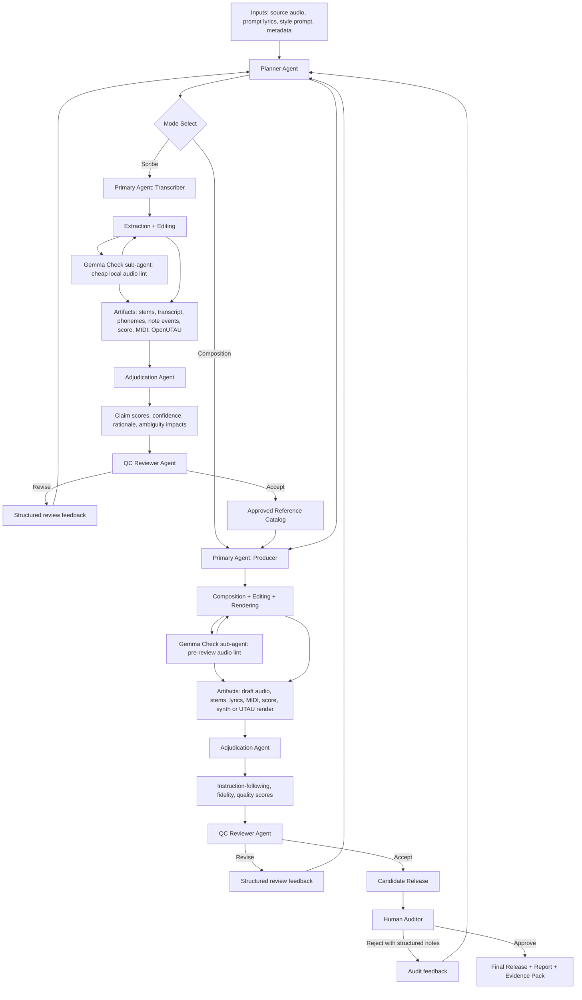

# Fork Tales Audio Agent Operating Model

This spec turns the audio-reconstruction rubric into an agent handoff system. The central rule is:

> No tool is the judge by itself. Every tool emits bounded evidence; the adjudication layer scores claims against a rubric using weighted, contestable evidence.

This applies to both Fork Tales loops:

1. **Scribe Mode**: derive trusted reference artifacts from owned source audio.
2. **Composition Mode**: create new original work from a prompt plus accepted references.

The rubric weights live in [`fork-tales-audio-rubrics.json`](./fork-tales-audio-rubrics.json). Handoff schema definitions live in [`fork-tales-audio-handoff-schemas.json`](./fork-tales-audio-handoff-schemas.json). Malli μ schemas live in [`fork-tales-audio-pipeline-schema.clj`](./fork-tales-audio-pipeline-schema.clj). The categorical formulation lives in [`fork-tales-validated-reference-category.md`](./fork-tales-validated-reference-category.md).

## Role Names

| Role | Responsibility | Inputs | Outputs |
|---|---|---|---|
| Planner Agent | Create assignments, decompose work, select mode/rubric, mark ambiguity, restart loops with prior feedback | user prompt, source metadata, prior plans, review notes, catalog state | planner assignment, ambiguity map, task list, success criteria |
| Primary Agent: Transcriber | Scribe-mode executor: derive symbolic/music-text representation from audio | assignment, source audio/stems, lyric/style prompt clues, tool observations | stems, transcript, phonemes, note events, score/MIDI/OpenUTAU, unresolved issues |
| Primary Agent: Producer | Composition-mode executor: create new music from prompt plus approved references | assignment, creative prompt, approved reference catalog, prior review notes | draft audio, stems, lyrics, MIDI/score, synth/UTAU render, unresolved issues |
| Adjudication Agent | Score claims from evidence; emit rationale, confidence, coverage, difficulty, disagreement | artifacts, evidence observations, rubric profile, ambiguity markers | adjudication report, claim scores, feature scores, contest flags |
| QC Reviewer Agent | Decide pass/revise for the current objective; send actionable restart notes | artifacts, adjudication report, plan, success criteria | review verdict, severity, required actions, restart point |
| Human Auditor | Structured outside listener/taste/task validation; can override or reopen after QC | candidate output, report, evidence pack, alternatives | audit verdict, structured findings, approval/rejection, preference notes |

## Tool and Sub-Agent Placement

`gemma4:e4b` audio is **not** the QC Reviewer Agent and not the final adjudication authority. In the executable prototype it is a cheap local **Gemma Check sub-agent** called by the Primary Agent between execution phases, analogous to lint/typecheck/unit-test in software work.

The naming is historical:

- `gemma-check` is the preferred command name.
- `audit` is retained as a legacy alias for the same command.
- The command writes audit-shaped evidence because it checks a candidate, but it is **pre-review friction**, not the final review stage.

Gemma Check consumes one short audio-first bundle plus tool evidence and returns bounded observations:

```text
A/B audio + evidence.json -> observations, hypotheses, confidence, difficulty, next tool actions
```

Its place in the control hierarchy is:

| Layer | Role in loop | Example implementation |
|---|---|---|
| Planner Agent | SOTA multimodal planner; identifies ambiguity, creates/revises plan, initiates handoff | Gemini via Proxx / Google AI Studio |
| Primary Agent | Executes targeted work; calls extraction tools and Gemma Check as needed | coding/audio agent with bash/read/write/render tools |
| Gemma Check sub-agent | Fast local cross-lane checker used by Primary before handoff | `gemma4:e4b` via `scripts/fork_tales_audio_agent.cljs gemma-check` |
| Adjudication layer | Aggregates bounded evidence against rubric | `grade`, judge scores, evidence observations |
| QC Reviewer Agent | Smart reviewer after `handoff`; can accept/reject/revise | Gemini reviewer with accept/reject tool |
| Human Auditor | Final structured external assessment | user/audience/human panel |

Gemma can comment across lanes—lyrics, pitch, delivery, timbre, render fidelity—but the rubric gives those comments different weights by domain. A Gemma Check pass should reduce preventable back-and-forth with Planner/QC; it should not certify completion.

## Mode Definitions

### Scribe Mode

Scribe Mode derives reference representations from an existing owned audio artifact.

Typical deliverables:

- separated stems,
- realized lyrics,
- phoneme/kana/romaji events,
- syllable and word timings,
- note events,
- pitch curves,
- score/MIDI/MusicXML,
- OpenUTAU/USTX render units,
- reconstruction render,
- audit and grade reports.

Primary success criterion: **transcription fidelity to what the source audio actually did**, not faithfulness to the prompt text.

### Composition Mode

Composition Mode produces a new original artifact from a prompt plus accepted references.

Typical deliverables:

- creative brief and constraints,
- draft lyrics,
- arrangement plan,
- generated MIDI/score/OpenUTAU assets,
- rendered audio and stems,
- instruction-following report,
- quality grade,
- human-auditable evidence pack.

Primary success criterion: **quality, Fork Tales identity, and instruction following**, not exact match to a source recording.

Composition Mode may only use references from the Approved Reference Catalog unless the Planner explicitly marks a reference as exploratory/non-training.

## Process Diagram



## Evidence Observation Object

Every extractor, model, vision judge, human reviewer, and adjudicator should emit normalized observations when it makes a claim.

```json
{
  "schema_version": "fork-tales-evidence-observation/v1",
  "claim_id": "vocal.bar09_12.syllable_17.duration",
  "domain": "word_syllable_timing",
  "target": "lead_vocal",
  "span": { "t0": 18.24, "t1": 20.01, "bars": [9, 10, 11, 12] },
  "tool": "whisper_timestamped",
  "role": "extraction_tool",
  "observation": {
    "text": "yo",
    "word_start": 18.31,
    "word_end": 19.94,
    "word_confidence": 0.81
  },
  "hypothesis": null,
  "counterhypotheses": [],
  "derived_score": 0.78,
  "confidence": 0.81,
  "difficulty": null,
  "ambiguity_adjustment": 1.0,
  "rationale": null,
  "provenance": ["audio:vocals.wav"]
}
```

Gemma or another adjudicator uses the same outer shape:

```json
{
  "schema_version": "fork-tales-evidence-observation/v1",
  "claim_id": "vocal.bar09_12.syllable_17.ornament",
  "domain": "ornament_articulation",
  "target": "lead_vocal",
  "span": { "t0": 18.24, "t1": 20.01, "bars": [9, 10, 11, 12] },
  "tool": "gemma4:e4b",
  "role": "adjudicator",
  "observation": {
    "label": "single_syllable_slide_with_vibrato_tail"
  },
  "hypothesis": "one sustained syllable with slide and vibrato tail",
  "counterhypotheses": ["two rearticulated notes", "slide then separate attack"],
  "derived_score": 0.64,
  "confidence": 0.57,
  "difficulty": 0.73,
  "ambiguity_adjustment": 0.82,
  "rationale": "continuous formant energy and unbroken vowel suggest one sustained syllable, but attack ambiguity near 19.12s",
  "provenance": ["audio:vocals.wav", "image:f0-overlay.png", "metrics:f0.json"]
}
```

## Domains

Use these domain keys for claim scoring and review notes:

- `lyrics_realized`
- `word_syllable_timing`
- `pitch_content`
- `ornament_articulation`
- `structure`
- `render_fidelity`
- `prompt_audio_discrepancy`
- `instruction_following`
- `arrangement_quality`
- `mix_translation`
- `fork_tales_identity`

## Weighted Claim Score

For one claim:

```text
S_claim = Σ(w_domain,tool_i × c_i × a_i × s_i)
          / Σ(w_domain,tool_i × c_i × a_i)
```

Where:

- `w_domain,tool_i` = prior suitability of the tool for the domain.
- `c_i` = confidence reported or computed for the observation.
- `a_i` = ambiguity adjustment.
- `s_i` = normalized score assigned to the claim.

Disagreement pressure:

```text
D_claim = 1 - max_j(p_j)
```

Where `p_j` is normalized support for hypothesis `j`. High disagreement pressure should produce a contest flag instead of a false average.

## Ambiguity Markers

The Planner or a post-hoc analyst may attach ambiguity markers before or during scoring.

```json
{
  "ambiguity_id": "lyrics.jp_kanji_reading.bar21",
  "type": "jp_kanji_reading",
  "severity": 0.62,
  "span": { "t0": 103.64, "t1": 108.90, "bars": [21, 22] },
  "affects_domains": ["lyrics_realized", "word_syllable_timing", "render_fidelity"],
  "policy": {
    "reduce_penalty_for_pronunciation": 0.35,
    "require_human_audit_if_disagreement_gt": 0.40
  },
  "rationale": "Written kanji has multiple plausible readings and local STT disagrees with expected prompt text."
}
```

Common ambiguity classes:

- `prompt_audio_discrepancy`
- `mixed_language_phrase`
- `jp_kanji_reading`
- `style_prompt_lexical_leak`
- `dense_ornament_note_segmentation`
- `stem_separation_artifact`
- `homophone_or_near_homophone`
- `voicebank_phonemizer_gap`

## Handoff Packets

Every handoff packet shares common fields:

```json
{
  "schema_version": "fork-tales-handoff/v1",
  "handoff_kind": "planner_assignment",
  "job_id": "job_2026_05_15_001",
  "mode": "scribe",
  "role": "planner_agent",
  "created_at": "2026-05-15T00:00:00Z",
  "objective": "derive vocal score and aligned lyrics from source audio"
}
```

### Planner Assignment

Required intent fields:

- `objective`
- `inputs`
- `constraints`
- `success_criteria`
- `ambiguities`
- `tasks`

Planner restarts must include:

- `prior_plan`
- `failed_artifacts`
- `adjudication_report`
- `review_feedback`

### Primary Result

Required fields:

- `artifacts`
- `coverage`
- `open_issues`
- `evidence_refs`

Artifacts should be objects, not bare paths:

```json
{
  "artifact_id": "lead_vocal.ustx.v3",
  "kind": "openutau_ustx",
  "path": "lead_vocal.v3.ustx",
  "source_span": { "t0": 0.0, "t1": 42.0, "bars": [1, 16] },
  "provenance": ["audio:vocals.wav", "plan:job_2026_05_15_001"],
  "unresolved_issues": ["bar 9 slide-vs-reattack ambiguous"]
}
```

### Adjudication Report

Required fields:

- `rubric_profile`
- `claim_scores`
- `feature_scores`
- `confidence`
- `coverage`
- `contest_flags`
- `ambiguity_impacts`

### QC Review

The QC Reviewer answers: “Accept, revise, or reject for this objective?”

A rejection or revision must contain at least one actionable required action:

```json
{
  "handoff_kind": "qc_review",
  "verdict": "revise",
  "severity": "major",
  "reasons": [
    {
      "domain": "word_syllable_timing",
      "span": { "bars": [21], "t0": 103.64, "t1": 108.90 },
      "issue": "held syllable split into two attacks",
      "required_action": "re-evaluate onset policy with ornament-aware prompt"
    }
  ],
  "restart_from": "planner_agent"
}
```

### Human Audit

Human rejection must be structured by domain and span, not only free text:

```json
{
  "handoff_kind": "human_audit",
  "verdict": "reject",
  "findings": [
    {
      "perceived_problem_type": "pitch_content",
      "domain": "pitch_content",
      "span": { "t0": 55.26, "t1": 61.00 },
      "severity": "blocking",
      "preferred_hypothesis": "candidate is too flat and loses original upward contour",
      "free_note": "Words are mostly understandable, but it no longer sings the same melody."
    }
  ]
}
```

## Executable Specs

These specs are validated by `/home/err/devel/scripts/fork_tales_handoff_validate.py`.

- **μ1**: Every accepted artifact must include provenance, source span, and unresolved-issue list.
- **μ2**: Reviewer rejection/revision must contain at least one actionable required action.
- **μ3**: Human rejection/revision must be structured by domain and span, not only free text.
- **μ4**: Composition mode may only use references from the approved reference catalog.
- **μ5**: Planner restarts must include prior plan, failed artifacts, adjudication output, and latest review feedback.

## Restart Semantics

A restart is not “try again.” It is a new Planner Assignment with a failure packet attached.

Minimum restart payload:

```json
{
  "is_restart": true,
  "restart_from": "qc_reviewer_agent",
  "prior_plan": "planner_assignment.job_2026_05_15_001.json",
  "failed_artifacts": ["primary_result.v3.json"],
  "adjudication_report": "adjudication_report.v3.json",
  "review_feedback": "qc_review.v3.json",
  "restart_goal": "fix held-syllable split and preserve original slide contour"
}
```

This keeps the loop from turning into recursive hand-waving.
