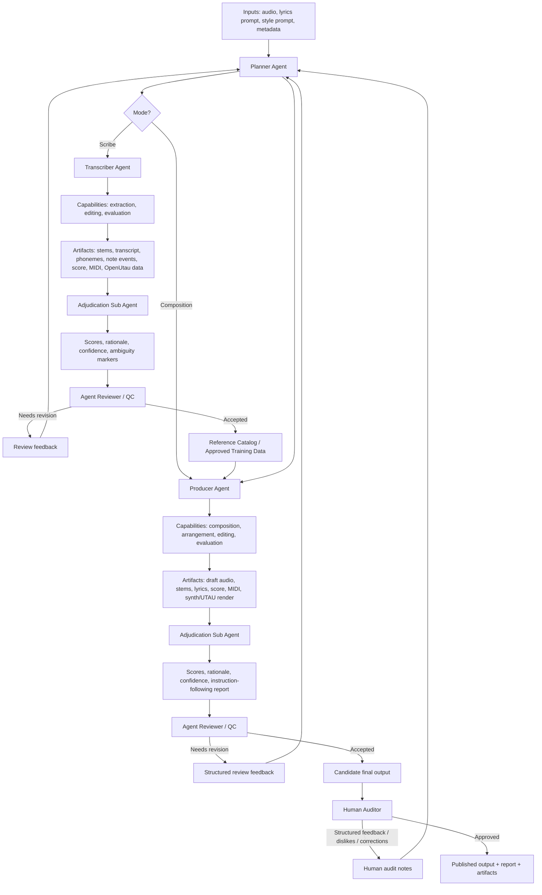
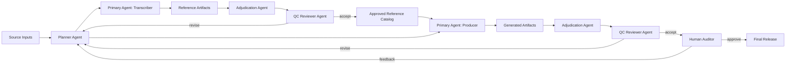
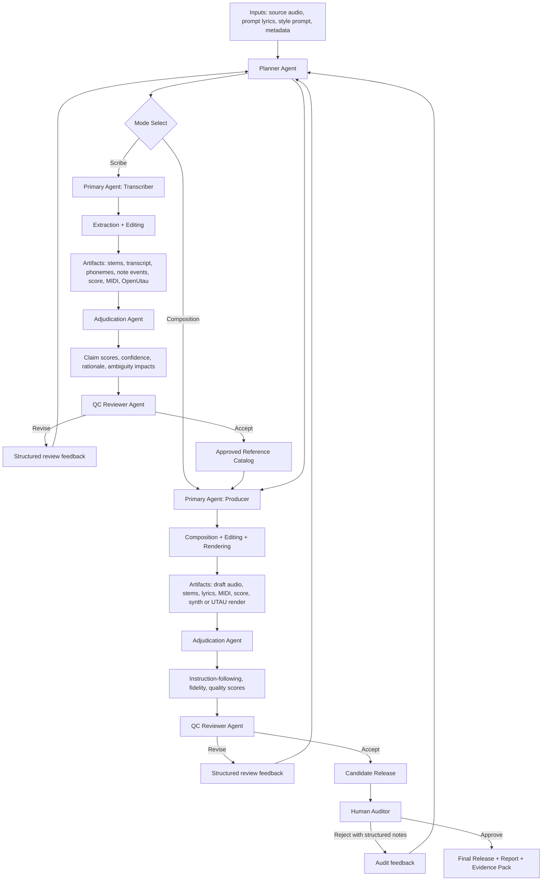

Your core move is this: **do not ask any tool to be a judge by itself**; ask each component to emit bounded evidence, then let an adjudication layer score the claim against a rubric using weighted, contestable evidence. That is closer to how music rubrics work in practice anyway, where rhythm, pitch, notation, articulation, and performance are scored analytically rather than collapsed into one mystical “good musician” number. [rcampus](https://www.rcampus.com/rubricshowc.cfm?code=G32327&sp=yes)

## System roles

Here is a cleaner role split that matches what you described.

| Role | What it does | Can self-score? | Typical authority |
|---|---|---:|---|
| Extraction tool | Produces observations like words, timestamps, F0, note candidates, onset candidates | Usually limited | Narrow, feature-level  [github](https://github.com/linto-ai/whisper-timestamped) |
| Adjudicator | Interprets several observations for one task and emits score, rationale, confidence, difficulty | Yes, provisionally | Medium, contestable  [journals.sagepub](https://journals.sagepub.com/doi/10.1177/0027432111432524) |
| Planner | Flags ambiguity, discrepancy, likely failure modes, and adjusts scoring policy | Yes, provisionally | Medium, upstream |
| Auditor | Human or secondary pass that reviews artifacts and contests/accepts results | Yes | Final social authority  [resources.finalsite](https://resources.finalsite.net/images/v1723834432/greeleyschoolsorg/ekgvbge8cid7knn3eulh/MusicRubric.pdf) |

In your stack, Whisper and the pitch tracker are extraction tools, Gemma is mainly an adjudicator, Gemini is well suited as planner plus selective post-hoc analyst, and humans are auditors. That keeps each component epistemically small. [resources.finalsite](https://resources.finalsite.net/images/v1723834432/greeleyschoolsorg/ekgvbge8cid7knn3eulh/MusicRubric.pdf)

## Rubric domains

For the Suno reverse-engineering case, I would define the rubric at the **feature domain** level, not the model level. University-style music transcription rubrics repeatedly separate rhythmic accuracy, pitch accuracy, notation quality, and performance execution, which maps well to your need for modular evidence. [halleonard](https://www.halleonard.com/texasAddendum/bin/AR11ExpressionInPerf.pdf)

Suggested domains:
- **Lyrics realized**: what was actually sung, not what the prompt said.
- **Word and syllable timing**: onset, offset, duration, alignment to beat grid.
- **Pitch content**: note centers, pitch contour, interval sequence, intonation drift.
- **Ornament and articulation**: slide, bend, trill, vibrato, sustain, release, reattack.
- **Structure**: phrase boundaries, repeated sections, pickup bars, meter stability.
- **Render fidelity**: how close MIDI/OpenUtau playback is to the extracted score/audio.

That keeps the evaluation objective aligned: case 1 is transcription fidelity; case 2 is generated-track quality and instruction following. [journals.sagepub](https://journals.sagepub.com/doi/10.1177/0027432111432524)

## Evidence objects

Have every subsystem emit the same normalized object shape. This matters because then Gemma is not “special” in schema terms; it just produces more fields.

```json
{
  "claim_id": "vocal.bar09_12.syllable_17.duration",
  "domain": "word_syllable_timing",
  "target": "lead_vocal",
  "span": { "t0": 18.24, "t1": 20.01, "bars": [9,10,11,12] },
  "tool": "whisper_timestamped",
  "observation": {
    "text": "yo",
    "word_start": 18.31,
    "word_end": 19.94,
    "word_confidence": 0.81
  },
  "derived_score": 0.78,
  "confidence": 0.81,
  "difficulty": null,
  "rationale": null,
  "provenance": ["audio:vocals.wav"]
}
```

And for Gemma:

```json
{
  "claim_id": "vocal.bar09_12.syllable_17.ornament",
  "domain": "ornament_articulation",
  "target": "lead_vocal",
  "span": { "t0": 18.24, "t1": 20.01, "bars": [9,10,11,12] },
  "tool": "gemma4:e4b",
  "observation": {
    "label": "single_syllable_slide_with_vibrato_tail",
    "counterhypotheses": [
      "two rearticulated notes",
      "slide then separate attack"
    ]
  },
  "derived_score": 0.64,
  "confidence": 0.57,
  "difficulty": 0.73,
  "rationale": "continuous formant energy and unbroken vowel suggest one sustained syllable, but attack ambiguity near 19.12s"
}
```

This lets the orchestrator aggregate without pretending all evidence is of the same type.

## Weighting logic

You were right to resist a rigid “this tool owns this category” split. Better: each domain has a **weight profile** over tools, and each claim’s final weight is adjusted by confidence, ambiguity, and tool suitability. [github](https://github.com/linto-ai/whisper-timestamped)

A useful scoring rule is:

\[
S_{claim} = \frac{\sum_i w_{domain,tool_i} \cdot c_i \cdot a_i \cdot s_i}{\sum_i w_{domain,tool_i} \cdot c_i \cdot a_i}
\]

Where:
- \(w_{domain,tool_i}\) = prior suitability of tool \(i\) for that domain.
- \(c_i\) = confidence reported or estimated for that observation.
- \(a_i\) = ambiguity adjustment, lower when source truth is contested.
- \(s_i\) = normalized score assigned to the claim.

Interpretation: tools do not get equal votes, and even a strong tool gets downweighted when the source is ambiguous or the tool itself is uncertain. [arxiv](https://arxiv.org/html/2502.13446v1)

A second useful term is **disagreement pressure**:

\[
D_{claim} = 1 - \max_j p_j
\]

where \(p_j\) is the normalized support for hypothesis \(j\). If Whisper, pitch analysis, and Gemma strongly disagree, the system should not just average them; it should surface the claim as contested and require review. That mirrors analytic rubric practice better than false precision. [journals.sagepub](https://journals.sagepub.com/doi/10.1177/0027432111432524)

## Domain-specific weights

A practical starting table:

| Domain | Whisper-timestamped | Pitch tracker / DSP | Gemma | Gemini |
|---|---:|---:|---:|---:|
| Lyrics realized | 0.55  [github](https://github.com/linto-ai/whisper-timestamped) | 0.05 | 0.25 | 0.15 |
| Word/syllable timing | 0.50  [github](https://github.com/linto-ai/whisper-timestamped) | 0.20 | 0.20 | 0.10 |
| Pitch content | 0.05 | 0.60 | 0.25 | 0.10 |
| Ornament/articulation | 0.05 | 0.45 | 0.40 | 0.10 |
| Prompt-vs-audio discrepancy | 0.10 | 0.00 | 0.25 | 0.65 |
| Render fidelity | 0.10 | 0.35 | 0.35 | 0.20 |

These are not truths; they are priors. Your system should later learn better values from audited examples.

## Confidence without self-report

You asked the right question: if Whisper and pitch trackers do not really “grade themselves,” how do you derive confidence? For Whisper, `whisper-timestamped` explicitly provides word and segment confidence, so at least part of the confidence story can come from the model output itself. For pitch trackers, you often need **engineered confidence proxies** rather than native self-confidence. [github](https://github.com/linto-ai/whisper-timestamped)

Useful pitch confidence proxies:
- F0 continuity, fewer impossible jumps implies higher confidence.
- Harmonic salience, stronger harmonic structure implies stronger pitch estimate.
- Agreement across trackers, for example CREPE-like contour vs spectral peak method.
- Vocal isolation quality, poorer stem separation lowers confidence.
- Voicing probability or periodicity, if your tracker exposes it.

So the pitch tracker can still emit a usable `confidence`, but it is computed by policy, not introspection.

## Ambiguity policy

This is where Gemini fits naturally. Use it to mark **ground-truth ambiguity classes** before scoring:
- Prompt lyrics differ from sung lyrics.
- Mixed-language phrase with uncertain phonemization.
- Kanji has multiple plausible readings.
- Style prompt leaked lexical material into performance.
- Dense ornament makes note segmentation underdetermined.
- Stem separation artifacts compromise transcription.

Each ambiguity marker should adjust scoring, not excuse everything. For example:

```json
{
  "ambiguity_id": "lyrics.jp_kanji_reading.bar21",
  "severity": 0.62,
  "affects_domains": ["lyrics_realized", "word_syllable_timing", "render_fidelity"],
  "policy": {
    "reduce_penalty_for_pronunciation": 0.35,
    "require_human_audit_if_disagreement_gt": 0.40
  }
}
```

That gives you a principled way to say, “this region is hard in a specific way, so scoring changes here.”

## Rubric levels

Professors often use analytic levels like unsatisfactory, developing, proficient, advanced for transcription and performance. You can do the same, but ground them in measurable thresholds. [blogs.ubc](https://blogs.ubc.ca/richmondsecondary/files/2015/03/MUSIC-PERFORMANCE-TEST-RUBRIC.pdf)

Example for **word/syllable timing**:
- **Advanced**: median onset error under 40 ms; median offset error under 80 ms; held-syllable vs rest classification over 95%.
- **Proficient**: median onset error under 80 ms; median offset error under 150 ms; classification over 90%.
- **Developing**: median onset error under 150 ms; frequent held-note/rest confusions.
- **Unsatisfactory**: timing errors obscure phrase structure or beat placement.

Example for **ornament/articulation**:
- **Advanced**: correctly identifies sustained vs rearticulated syllables, major slides, vibrato zones, and obvious trills.
- **Proficient**: captures most major ornaments but misses fine pitch detail.
- **Developing**: basic note centers found, but ornament structure often flattened.
- **Unsatisfactory**: sustained slides and reattacks are routinely confused.

That gives you academic language without academic vagueness. [rcampus](https://www.rcampus.com/rubricshowc.cfm?code=G32327&sp=yes)

## Human audit layer

Yes, your memory from college is plausible. Performance programs and music appreciation classes often require attendance, critique, and written analysis, which means human evaluation is not some impurity in the process; it is part of the tradition of assessment. In your system, human listeners should act as **auditors of contested evidence**, not as raw vibe-merchants. [maeia-artsednetwork](https://maeia-artsednetwork.org/music/)

Good human-audit tasks:
- Choose between competing lyric transcriptions for one phrase.
- Decide whether a passage is one sustained syllable or multiple articulated notes.
- Rate closeness of OpenUtau render to source on a bounded scale.
- Flag musically important errors that numeric metrics missed.

That lets the audience participate in a controlled way.

## Red-Green-Refactor for your article

Before implementation, define executable specs. For example:

- μ1: If a syllable spans two tied quarter notes, the system must not split it into two lyric tokens unless there is a reattack.
- μ2: If prompt text and sung text diverge, scoring must prefer sung realization for transcription accuracy.
- μ3: If ambiguity severity exceeds 0.6 and tool disagreement exceeds 0.4, the claim enters human audit.
- μ4: Render fidelity must compare both note-center accuracy and contour similarity, not just symbolic note match.
- μ5: A tool without native confidence must expose computed confidence provenance.


---


A **copyist** is adjacent but not quite right for your primary agent, because copyists typically prepare clean, readable parts from an existing score rather than deriving the score from hearing alone. For your system, “Composer/Scribe Agent” is directionally good, but I would split the naming by mode so the role is semantically sharp: **Transcriber Agent** in Scribe mode, **Producer Agent** in Composition mode. [berklee](https://www.berklee.edu/careers/roles/transcriber)

## Role names

Here is the clean mapping.

| Your role | Better industry-aligned name | Why |
|---|---|---|
| Planner Agent | **Music Director** or **Production Planner** | Creates the work plan, flags ambiguities, assigns tasks  [asmac](https://asmac.org/about/what-we-do/) |
| Adjudication Sub Agent | **Adjudicator** or **Analyst** | Scores evidence and explains rationale |
| Composer/Scribe Agent | **Transcriber** in Scribe mode; **Producer** in Composition mode | One derives notation from audio, the other turns brief + references into music  [online.berklee](https://online.berklee.edu/careers-in-music/roles/transcriber) |
| Agent Reviewer | **QC Reviewer** or **Supervising Editor** | Performs quality control and sends work back for revision  [airshowmastering](https://airshowmastering.com/quality-control-what-and-when/) |
| Human auditor | **Human Reviewer** or **Audience Auditor** | Final external assessment, contestable and social  [arpjournal](https://www.arpjournal.com/asarpwp/analysis-of-peer-reviews-in-music-production/) |

If you want one umbrella label for the primary agent across both loops, use **Lead Agent** or **Session Lead** in system docs, then alias it by mode:
- `LeadAgent(role=Transcriber)` in Scribe mode.
- `LeadAgent(role=Producer)` in Composition mode.

That preserves one architecture while keeping domain language accurate.

## Process model

The two loops are not separate systems; they are sequentially coupled production phases. The **Scribe loop** creates trusted reference artifacts from existing audio, and the **Composition loop** uses accepted reference artifacts plus a new prompt to generate original work, with the reviewer closing both loops through iterative QC. [asmac](https://asmac.org/about/what-we-do/)

Here is the process diagram in Mermaid:



## Loop semantics

The **Planner Agent** is the upstream coordinator in both loops. It does not merely schedule work; it interprets task context, records ambiguity, selects the mode, and issues assignments to the primary agent with constraints and expected deliverables.

The **Transcriber Agent** is the lead executor in Scribe mode. It listens, extracts, reconstructs, and writes symbolic representations such as lyrics, phonemes, note events, MIDI, and score, which are then scored and either revised or accepted into the reference catalog. [online.berklee](https://online.berklee.edu/careers-in-music/roles/transcriber)

The **Producer Agent** is the lead executor in Composition mode. It uses the accepted catalog as reference material and turns a prompt into new music, after which the reviewer and then the human auditor can kick the work back into the planning loop for another pass. [airshowmastering](https://airshowmastering.com/quality-control-what-and-when/)

## Distinct reviewer roles

You were also right that the final review agent is not the same thing as the planner. The **Planner** decides how to attempt the work; the **QC Reviewer** decides whether the attempted work is acceptable and whether another iteration is required. In production terms, that is a classic planning-versus-quality-control split, where QC sends failed masters back for correction rather than redesigning the whole project by itself. [airshowmastering](https://airshowmastering.com/quality-control-what-and-when/)

The **Human Auditor** is distinct again. That role is not merely quality control; it represents external judgment, taste, utility, and audience validation, which music-production research treats as important because perceptual evaluation cannot be reduced entirely to isolated technical metrics. [arpjournal](https://www.arpjournal.com/asarpwp/analysis-of-peer-reviews-in-music-production/)

## Suggested naming set

I would recommend this final set for the article:

- **Planner Agent**
- **Primary Agent**
  - **Transcriber Agent** in Scribe mode
  - **Producer Agent** in Composition mode
- **Adjudication Agent**
- **QC Reviewer Agent**
- **Human Auditor**

And these mode definitions:
- **Scribe Mode**: derive reference representations from an existing audio artifact.
- **Composition Mode**: produce a new work from prompt + accepted references.

Here is a compact alternative diagram with those names:



For a paper or README, I would label the primary agent class as **Primary Creative Agent** and specialize it by mode. That gives you one architectural concept and two musically accurate operational identities.

Would you like the next step as a polished system spec with Mermaid plus JSON interfaces for each role handoff?

Then the next move is to turn the role model into a **handoff contract**. In music-production terms, your primary agent is the one “on session” doing the work: **Transcriber** when deriving notation from recordings, **Producer** when making a new track from references and a brief, while the Planner behaves more like production management or music-direction oversight. The reviewer is your QC gate, and the human auditor is the final outside listener who can still reject the result for structured reasons rather than vague taste alone. [apacademy](https://apacademy.se/en/articles/vad-gr-en-musikproducent-roller-arbetsflde-och-vgen-frn-id-till-frdig-lt)

## Operating model

Use one shared architecture with a mode switch instead of two separate systems. The **Planner Agent** creates the assignment, the **Primary Agent** executes it in either Transcriber or Producer mode, the **Adjudication Agent** scores the resulting claims, the **QC Reviewer Agent** decides pass/revise, and the **Human Auditor** can still reopen the loop after acceptance if the artifact fails perceptual or task-level expectations. [trackscore](https://trackscore.ai/blog/music-production-workflow)

That gives you a clean control hierarchy:
- Planner = assignment and constraints.
- Primary Agent = artifact creation.
- Adjudicator = evidence-based scoring.
- Reviewer = quality gate.
- Human Auditor = external override and final acceptance.

## Role contracts

Here is a concise contract table you can put in the spec.

| Role | Primary responsibility | Inputs | Outputs |
|---|---|---|---|
| Planner Agent | Create plan, decompose tasks, mark ambiguity, set rubric profile | Prompt, source audio, lyrics, style prompt, prior feedback | Plan, task list, ambiguity map |
| Primary Agent: Transcriber | Derive symbolic/music-text representation from audio | Plan, audio, lyrics, style hints, tool outputs | Stems, transcript, phonemes, notes, score, MIDI, OpenUtau assets  [online.berklee](https://online.berklee.edu/careers-in-music/roles/transcriber) |
| Primary Agent: Producer | Create new music from prompt plus approved references | Plan, prompt, reference catalog, prior review notes | Draft audio, stems, lyrics, MIDI, score, renders  [asmac](https://asmac.org/about/what-we-do/) |
| Adjudication Agent | Score claims, explain rationale, estimate uncertainty | Artifacts, extracted observations, rubric profile | Claim scores, confidence, difficulty, rationale |
| QC Reviewer Agent | Decide pass/revise and emit actionable notes | Artifacts, adjudication results, plan | Review verdict, restart notes  [trackscore](https://trackscore.ai/blog/music-production-workflow) |
| Human Auditor | Final structured perceptual review | Candidate output, report, reference artifacts | Audit notes, approval/rejection |

## Handoff schema

A good way to keep the loops readable is to make every handoff explicit. One schema can cover both modes.

```json
{
  "job_id": "job_2026_05_15_001",
  "mode": "scribe",
  "role": "planner",
  "objective": "derive vocal score and aligned lyrics from source audio",
  "inputs": {
    "audio": ["source_mix.wav", "vocals_stem.wav"],
    "lyrics_prompt": "optional original prompt text",
    "style_prompt": "optional style text",
    "references": []
  },
  "constraints": {
    "languages": ["ja", "en"],
    "deliverables": ["lyrics_realized", "phonemes", "note_events", "midi", "openutau"],
    "time_budget_s": 900
  },
  "ambiguities": [
    {
      "type": "prompt_audio_discrepancy",
      "severity": 0.62,
      "notes": "written lyrics likely diverge from sung output"
    }
  ],
  "success_criteria": [
    "all deliverables emitted",
    "claim coverage above 0.9",
    "no critical unresolved ambiguity without review note"
  ]
}
```

Then a downstream result packet:

```json
{
  "job_id": "job_2026_05_15_001",
  "mode": "scribe",
  "role": "primary_transcriber",
  "artifacts": {
    "stems": ["vocals_stem.wav"],
    "lyrics_realized": "....",
    "phoneme_events": "phonemes.json",
    "note_events": "notes.json",
    "midi": "lead_vocal.mid",
    "score": "lead_vocal.musicxml",
    "openutau": "lead_vocal.ustx"
  },
  "coverage": {
    "bars_total": 48,
    "bars_transcribed": 46
  },
  "open_issues": [
    "bar 21 mixed-language phonemization unresolved",
    "bar 34 slide versus reattack ambiguous"
  ]
}
```

This makes retries cheap and review legible.

## Process diagram

Here is the fuller dual-loop process diagram with restart paths.



## Review protocol

The reviewer needs a distinct protocol so it does not collapse into adjudication. The **Adjudication Agent** answers “how did this score on defined claims,” while the **QC Reviewer Agent** answers “is this output acceptable for the current objective, or should the loop restart”. [trackscore](https://trackscore.ai/blog/music-production-workflow)

A minimal reviewer packet could be:

```json
{
  "job_id": "job_2026_05_15_001",
  "verdict": "revise",
  "severity": "major",
  "reasons": [
    {
      "domain": "word_syllable_timing",
      "span": "bar 21",
      "issue": "held syllable split into two attacks",
      "required_action": "re-evaluate onset policy with ornament-aware prompt"
    },
    {
      "domain": "render_fidelity",
      "span": "chorus bars 33-40",
      "issue": "OpenUtau render flattens major slides",
      "required_action": "increase pitch-curve resolution and preserve continuous contour"
    }
  ],
  "restart_from": "planner"
}
```

This is important because the planner should receive structured notes, not vibes.

## Human audit protocol

Your human loop should also be constrained. In music-production workflow, QC is strongest when it names specific failures like timing drift, frequency imbalance, bad translation of intent, or poor playback-system compatibility, rather than just “doesn’t slap”. Same principle here. [asmac](https://asmac.org/about/what-we-do/)

Good human audit fields:
- `perceived_problem_type`: lyrics, timing, pitch, articulation, phrasing, render quality, instruction following.
- `span`: timestamp or section.
- `severity`: minor, major, blocking.
- `free_note`: bounded natural-language explanation.
- `preferred_hypothesis`: choose among alternatives when relevant.

That gives the planner something actionable on restart.

## Naming recommendation

For the paper and diagrams, I’d use:

- **Planner Agent**
- **Primary Agent**
  - **Transcriber** in Scribe mode [online.berklee](https://online.berklee.edu/careers-in-music/roles/transcriber)
  - **Producer** in Composition mode [apacademy](https://apacademy.se/en/articles/vad-gr-en-musikproducent-roller-arbetsflde-och-vgen-frn-id-till-frdig-lt)
- **Adjudication Agent**
- **QC Reviewer Agent**
- **Human Auditor**

If you want a slightly more “studio” flavor, you could rename Planner Agent to **Music Director Agent**, but “Planner Agent” is clearer for systems writing. “Primary Agent” is the right superclass because it keeps one architecture while allowing the mode-specific identity to change.

## Executable specs

Before implementation, define these as contracts:

- μ1: Every accepted artifact must include provenance, source span, and unresolved-issue list.
- μ2: Reviewer rejection must contain at least one actionable required action.
- μ3: Human rejection must be structured by domain and span, not only free text.
- μ4: Composition mode may only use references from the approved reference catalog.
- μ5: Planner restarts must include prior plan, failed artifacts, adjudication output, and latest review feedback.

That will keep the loop from turning into recursive hand-waving.
