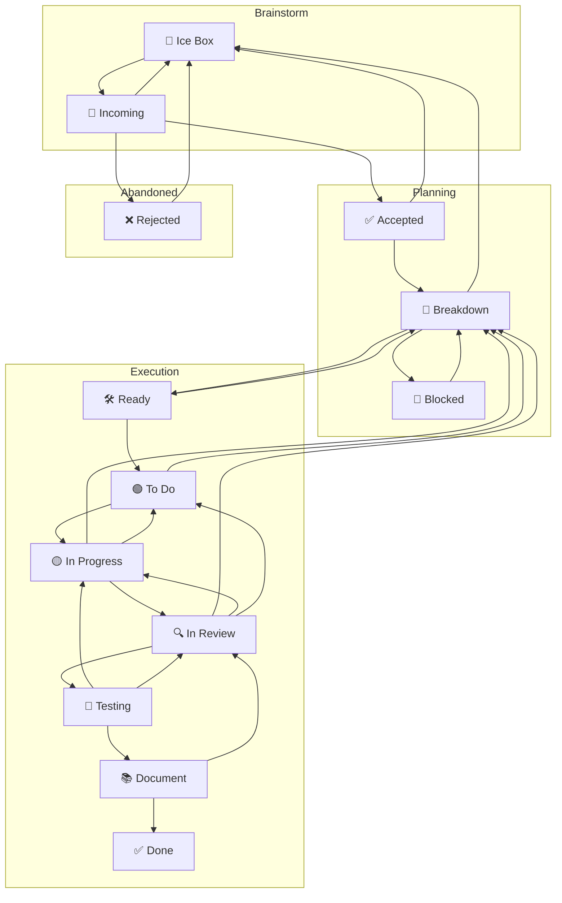

# \# Overview

```
1. **Intake & Associate**
```

Find or create the task; never work off-board; do not edit the board file directly—tasks drive the board. &#x20;

```
2. **Clarify & Scope**
```

Anchor on the kanban card as the single source of truth and, before advancing, do the solo pass:

- Confirm the desired outcomes so the card reflects the slice you intend to deliver.
- Capture acceptance criteria or explicit exit signals on the task so "done" is unambiguous.
- Note any uncertainties, risks, or open questions directly on the task to surface follow-ups early.
- Record the scoped plan and supporting notes on the linked task before moving to step 3.

```
3. **Breakdown & Size**
```

Break into small, testable slices; assess **complexity, scope, and Level of Effort (LoE)** and assign a Fibonacci score from **1, 2, 3, 5, 8, 13** on the task card. Scores of **13+ ⇒ must split**; **8 ⇒ continue refinement before implementation**; **≤5 ⇒ eligible to implement**. Any score **>5** must cycle back through clarification/breakdown until the slice is small enough to implement, capturing the updated score on the task card.&#x20;

4. **Ready Gate** _(hard stop before code)_
Only proceed if:
    - A matching task is **In Progress** (or you move it there), and WIP rules aren’t violated.&#x20;
    - The slice is scored **≤5** and fits capacity after planning; otherwise continue refinement/splitting.&#x20;
```
5. **Implement Slice**
```

Do the smallest cohesive change that can clear gates defined in agent docs (e.g., no new ESLint errors; touched packages build; tests pass).&#x20;
When the scope is larger than the available session, carve off a reviewable subset and explicitly document what remains (e.g.,
inventory lingering files, capture blockers, link references).&#x20;

```
6. **Review → Test → Document**
```

Move through _In Review_, _Testing_ and _Document_ then _Done_ per board flow, recording evidence and summaries.&#x20;

# Kanban as a Finite State Machine (FSM)

We treat the board as an FSM over tasks.

- **States (C)**: the board’s columns.
- **Initial state (S)**: **Incoming** (new tasks land here).
- **Transitions (T)**: moves between columns.
- **Rules R(Tₙ, t)**: predicates over task `t` that permit or block transition `Tₙ`.
- **Single source of status**: each task has exactly one column/status at a time.
- **Board is law**: never edit the board file directly; tasks drive board generation.
- **WIP**: a transition fails if the target state’s WIP cap is full.


### FSM diagram




### Minimal transition rules (only what matters)

- START STATES = Ice Box | Incoming
    - All new tasks must start in either **Ice Box** (for future work) or **Incoming** (for immediate triage)
    - This constraint is enforced by the CLI to ensure proper workflow adherence
    - Tasks cannot be created directly in active columns (todo, in_progress, etc.)
- **Incoming → Accepted | Rejected | Ice Box**
Relevance/priority triage; allow defer to Ice Box.
- **Ice Box → Incoming**
When deferred work is ready for triage and prioritization.
- **Accepted → Breakdown | Ice Box**
Ready to analyze, or consciously deferred.
- **Breakdown → Ready | Rejected | Ice Box | Blocked**
Scoped \& feasible → Ready; non-viable → Rejected; defer → Ice Box;
**→ Blocked** only for a true inter-task dependency with **bidirectional links** (Blocking ⇄ Blocked By).
- **Ready → Todo**
Prioritized into the execution queue (respect WIP).
- **Todo → In Progress**
Pulled by a worker (respect WIP).
- **In Progress → In Review**
Coherent, reviewable change exists.
- **In Review → Testing**
Review approved; proceed to testing phase.
- **Testing → Document**
Testing complete; proceed to documentation.
- **In Progress → Todo** _session-end handoff; no PR required_
Capacity limit reached without a reviewable change. Record artifacts/notes + next step; move to **Todo** if WIP allows; else remain **In Progress** and mark a minor blocker.
Artifacts must include partial outputs (e.g., audit logs, findings lists, reproduction steps) so a follow-on slice can resume immediately.
- **In Progress → Breakdown**
Slice needs re-plan or is wrong shape.
- **In Review → In Progress** _(preferred)_
Changes requested; current assignee free; **In Progress** WIP allows.
- **In Review → Todo** _(fallback)_
Changes requested; assignee busy **or** **In Progress** WIP full.
- **Testing → In Review**
Testing failed or needs review adjustments; return to review phase.
- **Document → Done | In Review**
Docs/evidence complete → Done; otherwise → In Review for another pass.
- **Done → (no mandatory back edge)**
Follow-ups are modeled as new tasks (optionally seeded from Done).
- **Blocked → Breakdown** _(unblock event)_
Fires when any linked blocker advances e.g., to In Review/Done or evidence shows dependency removed; return to Breakdown to re-plan.


### Blocking policy

- **Minor blockers**: record briefly on the task; continue with other eligible work; resolve asynchronously.
    - Uncertainty over a single aspect of an assignment which does not prevent completion of other aspects of the assignment
- **Major blockers**: halt work on that task; capture evidence + attempt remediation
    - A triggered transition rule would result in a column begin over it's WIP limit
    - An agent's current task has only blocked sub tasks


## 🌊 Fluid Kanban Rule Evolution

Kanban is a fluid process that adapts to changing development environments while maintaining core principles.

### When Rules Must Change

A rule should be changed when:

1. **Progress is blocked** despite valid work being ready
2. **Team composition changes** significantly (new contributors, new agent types)
3. **Process discovery** reveals better ways of working
4. **Scaling requirements** exceed current capacity constraints

### Rule Change Process

1. **Identify the constraint**: Which specific rule is preventing forward progress?
2. **Document the rationale**: Why must this rule change now? What's the impact?
3. **Propose a new rule**: Clear, measurable, and time-bound
4. **Implement temporarily**: Test the change with explicit review date
5. **Evaluate and formalize**: Either revert, adjust, or make permanent

### WIP Limit Evolution Example

**Original Rule**: 2 tasks in review per human developer
**Reality**: 1 human + 6-18 AI agents contributing simultaneously
**Constraint**: Review bottleneck blocking all flow
**Solution**:

- Review: 2 → 6 (human review bandwidth for AI work)
- In Progress: 3 → 10 (multi-agent parallel work capacity)
- Document: 2 → 4 (maintain flow proportion)


### Guiding Principles for a Supportive Board

- **The board serves the team, not the other way around**
- **Work gets done, sometimes outside formal processes - and that's okay**
- **Retrospective card movement is a ritual of acknowledgment, not compliance**
- **Failed checks are learning opportunities, not violations**
- **We think better when we're calm** - even urgent work deserves a thoughtful response
- **Focus on capacity and flow** - "We may have taken on more work than we can handle, let's reevaluate priorities"
- **Rules enable flow, they don't dictate activity**
- **Change is temporary unless proven valuable**
- **Document every change with clear rationale**
- **Review changes regularly** (monthly for significant rule changes)
- **Maintain the spirit** of the rule even when adapting the letter

Got it. The clean way to translate that board policy into your work is:

- **No timelines**
- **Use complexity, scope, and LoE**
- **Score every slice with Fibonacci**
- **Only implement slices that are 5 or below**
- **Anything 8 or 13 gets refined or split first**
- **The task card is the source of truth**
- **No off-board work**


## How I’d apply it here

For this project, the board should be treated like the control plane. Each card should carry:

- Desired outcome.
- Acceptance criteria.
- Open questions / risks.
- Proposed slice.
- Story points.
- Current state.

That means the work is not “build the platform,” it’s “move one small, reviewable slice through the FSM.”

## Recommended operating rule for this project

### Intake \& Associate

Create or find one task per deliverable slice. Do not start with implementation until the card exists and is associated with the right epic.

### Clarify \& Scope

Use the card to answer:

- What exactly is being delivered?
- What does done mean?
- What is explicitly out of scope?
- What assumptions are unsafe?


### Breakdown \& Size

If the card scores:

- **1–3**: likely ready.
- **5**: eligible if acceptance criteria are crisp.
- **8**: not ready; split further.
- **13+**: absolutely split.


### Ready Gate

Only implement when:

- The card is in **In Progress**.
- The slice is **5 or below**.
- The work fits the current capacity.


## What this means for the MVP

Instead of a giant “Phase 1” card, you’d want cards like:

- Tenant context resolution.
- File hash on ingest.
- Malware scan and quarantine.
- PII tag pipeline.
- Tenant-scoped search.
- Audit event schema.

Each one can be independently sized and moved.

## My recommendation

For this system, the safest pattern is:

- **One epic**
- **Several small cards under it**
- **Each card scoped to a single testable behavior**
- **Each card sized before coding**
- **Anything ambiguous gets sent back to breakdown**

If you want, I can now rewrite the PRD and backlog into this exact FSM style — with each story expressed as:

- card title,
- acceptance criteria,
- open questions,
- complexity score,
- and “ready/not ready” status.

