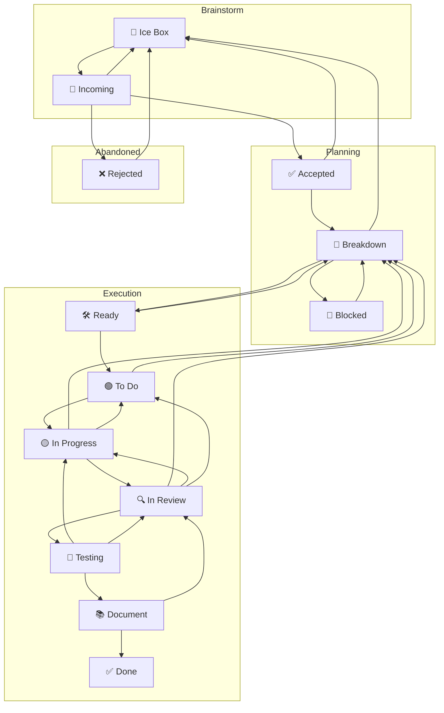

# aws qwen fine tuning model serving training monthly costs

On AWS, Qwen costs split into three very different buckets: Bedrock API usage, fine-tuning/customization, and self-hosted training or serving on SageMaker/EC2/Trainium.  In the sources here, Qwen appears explicitly for Bedrock inference pricing and for AWS Trainium fine-tuning tutorials, while AWS customization docs shown are mostly generic rather than a Qwen-specific Bedrock fine-tuning SKU list.[^1_5][^1_7][^1_9][^1_12]

## Serving costs

For Bedrock-hosted Qwen, the listed price for `qwen.qwen3-coder-next` is \$0.60 per 1 million input tokens and \$1.44 per 1 million output tokens.  That means a workload of 100 million input tokens and 20 million output tokens in a month would cost about \$88.80.[^1_9]

If you self-host Qwen instead of using token-priced API access, your monthly serving bill is driven mostly by the instance you keep running.  Using the Trainium prices shown in the Hugging Face AWS tutorial, an always-on `trn1.2xlarge` is about \$964.80 per month, a `trn1.32xlarge` is about \$15,480 per month, and a `trn1n.32xlarge` is about \$17,841.60 per month, assuming roughly 720 hours in a month.[^1_7]

## Fine-tuning costs

AWS states that supervised fine-tuning and DPO customization are charged from the total tokens processed during training, which is effectively training tokens multiplied by epochs.  AWS Bedrock’s pricing page also shows that custom model storage is billed monthly, and one example on that page includes \$1.95 per month of custom model storage in addition to training charges.[^1_1][^1_10][^1_12][^1_5]

For a practical 7B-class fine-tune on AWS infrastructure, one cost guide estimates a single LoRA run at about \$2.93 to \$3.89 on Spot, and a more realistic workflow with hyperparameter search and multiple runs at about \$21.74 to \$32.90 total.  The same guide says a 7B fine-tuning project is often better budgeted at roughly \$20 to \$50 once experimentation is included, while a full 7B fine-tune can land around \$80 to \$400 on Spot.[^1_2]

## Training costs

If by “training” you mean pretraining a Qwen-like model from scratch rather than fine-tuning, the cost jumps by orders of magnitude.  One AWS cost guide estimates a 7B pretraining run at about \$13,161 to \$21,935 on Spot or about \$43,869 on demand, while a 70B run is estimated at roughly \$317,157 to \$528,595 on Spot or over \$1.05 million on demand.[^1_2]

AWS Trainium can reduce training cost relative to large GPU fleets, and the tutorial cited here lists `trn1.2xlarge` at \$1.34 per hour, `trn1.32xlarge` at \$21.50 per hour, and `trn1n.32xlarge` at \$24.78 per hour.  Another AWS cost guide also notes that compute is usually 70% to 85% of total AI training cost, with storage, networking, and transfer often adding another 15% to 30%.[^1_7][^1_2]

## Budget ranges

A light Bedrock Qwen deployment can be very inexpensive if usage is modest, because costs scale directly with tokens rather than an always-on instance.  A self-hosted Qwen service is usually closer to about \$1,000 per month at the low end for a small always-on Trainium REDACTED_SECRET, and much more for larger dedicated inference boxes.[^1_9][^1_7]

For customization, a small 7B LoRA fine-tune is usually in the tens of dollars, a serious experimental cycle is more like tens to low hundreds, and pretraining from scratch is in the tens of thousands or more.  If you use AWS-managed custom model flows, remember to add monthly model storage and any provisioned inference charges on top of training itself.[^1_10][^1_12][^1_1][^1_2]

Do you want this turned into a concrete monthly estimate for Qwen 7B, 14B, or 32B with a target request volume?
<span style="display:none">[^1_11][^1_13][^1_14][^1_3][^1_4][^1_6][^1_8]</span>

<div align="center">⁂</div>

[^1_1]: https://aws.amazon.com/bedrock/pricing/

[^1_2]: https://wring.co/blog/aws-ai-training-costs-guide

[^1_3]: https://www.reddit.com/r/LocalLLaMA/comments/1mxhkss/how_much_would_it_cost_to_run_something_like_qwen/

[^1_4]: https://aws.amazon.com/about-aws/whats-new/2026/03/amazon-sagemaker-ai-serverless-additional-models/

[^1_5]: https://aws.amazon.com/sagemaker/ai/pricing/

[^1_6]: https://caylent.com/blog/amazon-bedrock-pricing-explained

[^1_7]: https://huggingface.co/docs/optimum-neuron/training_tutorials/qwen3-fine-tuning

[^1_8]: https://www.reddit.com/r/aws/comments/1e6exal/do_you_need_to_pay_every_hour_for_a_custom/

[^1_9]: https://www.getmaxim.ai/bifrost/llm-cost-calculator/provider/bedrock/model/qwen.qwen3-coder-next

[^1_10]: https://aws.amazon.com/blogs/aws/customize-models-in-amazon-bedrock-with-your-own-data-using-fine-tuning-and-continued-pre-training/

[^1_11]: https://docs.aws.amazon.com/bedrock/latest/userguide/rft-submit-job.html

[^1_12]: https://docs.aws.amazon.com/bedrock/latest/userguide/custom-models.html

[^1_13]: https://www.cloudforecast.io/blog/aws-bedrock-pricing/

[^1_14]: https://www.cerebras.ai/pricing


---

# fine tuning qwen 14b?

Yes—on AWS, fine-tuning Qwen 14B is realistic if you use LoRA or QLoRA, but it is much less attractive as a full-parameter fine-tune.  A practical starting point is a SageMaker `ml.g5.12xlarge`, which has 4 GPUs and 96 GB of total GPU memory at \$7.09 per hour, or about \$5,175.70 if you leave it running all month.[^2_1][^2_2]

## Practical setup

Qwen 2.5 includes a 14B size, and AWS has published deployment guidance for the Qwen 2.5 family on SageMaker and AWS AI chips.  A community hardware guide specifically notes that Qwen2.5 14B is well suited to 24 GB GPUs for LoRA and QLoRA, while full fine-tuning is a better fit for smaller models.[^2_3][^2_1]

That lines up well with `ml.g5.12xlarge`, because it gives you four GPUs and 96 GB of aggregate GPU memory, which is usually the kind of box people reach for when they want to fine-tune a 14B model with PEFT rather than train all weights.  For cost control, the main rule is simple: use short-lived training jobs and shut the instance down immediately after checkpoints are saved.[^2_2][^2_3][^2_1]

## Cost ranges

Here is the rough cost profile for a Qwen 14B PEFT run on `ml.g5.12xlarge` at \$7.09 per hour.[^2_2]


| Work pattern | Estimated compute cost |
| :-- | :-- |
| 6-hour tuning run | About \$42.54 [^2_2] |
| 12-hour tuning run | About \$85.08 [^2_2] |
| 24-hour tuning run | About \$170.16 [^2_2] |
| Left on for a full 30-day month | About \$5,175.70 [^2_2] |

Those numbers are only the training instance cost, so storage, checkpoints, logs, and any endpoint you keep alive afterward would add more.  If you run several experiments, the bill usually grows because hyperparameter search and retries matter more than the single best run.[^2_3][^2_2]

## Managed options

AWS also announced serverless model customization support for Qwen2.5 14B Instruct and Qwen3 14B, including supervised fine-tuning, DPO, and reinforcement fine-tuning, with usage-based billing.  That is attractive if you want less infrastructure management, but the REDACTED_SECRET pricing material surfaced here does not show a clearly posted standalone Qwen 14B customization rate the way it does for some other models and imported custom model units.[^2_4][^2_3]

If you want Bedrock-style imported hosting instead of SageMaker training, AWS lists Qwen under Custom Model Import at \$0.05718 per custom model unit per minute in us-east-1/us-west-2, plus \$1.95 monthly storage per custom model unit, but the exact number of units for a given imported model is determined during import.  That means imported serving can be convenient, but it is harder to estimate precisely for Qwen 14B ahead of time than a plain hourly SageMaker training job.[^2_4][^2_2]

## Recommendation

For Qwen 14B on AWS, the cheapest sane path is usually QLoRA or LoRA on a rented GPU box for a few hours, not an always-on monthly instance and not full fine-tuning.  As a planning number, I would treat the first serious experiment cycle as roughly tens to a few hundreds of dollars in compute, and treat “monthly cost” as high only if you leave training or serving infrastructure running continuously.[^2_1][^2_2]

Do you want a more exact estimate for your dataset size, such as 100k, 1M, or 10M training examples?
<span style="display:none">[^2_10][^2_11][^2_12][^2_13][^2_14][^2_15][^2_16][^2_17][^2_5][^2_6][^2_7][^2_8][^2_9]</span>

<div align="center">⁂</div>

[^2_1]: https://kaitchup.substack.com/p/qwen25-qlora-lora-and-full-fine-tuning

[^2_2]: https://www.reddit.com/r/LocalLLaMA/comments/1mxhkss/how_much_would_it_cost_to_run_something_like_qwen/

[^2_3]: https://aws.amazon.com/about-aws/whats-new/2026/03/amazon-sagemaker-ai-serverless-additional-models/

[^2_4]: https://wring.co/blog/aws-ai-training-costs-guide

[^2_5]: https://docs.aws.amazon.com/bedrock/latest/userguide/fine-tuning-openai-apis.html

[^2_6]: https://www.reddit.com/r/LocalLLaMA/comments/1rn90hh/fine_tuning_qwen3_35b_on_aws/

[^2_7]: https://www.westloop.io/post/amazon-sagemaker-ai-now-supports-serverless-reinforcement-fine-tuning-for-12-additional-models

[^2_8]: https://www.datacamp.com/tutorial/qwen-alibaba-cloud

[^2_9]: https://calculator.holori.com/aws/sagemaker/ml.g5.12xlarge

[^2_10]: https://docs.aws.amazon.com/bedrock/latest/userguide/model-cards-qwen.html

[^2_11]: https://apxml.com/models/qwen2-5-14b

[^2_12]: https://calculator.holori.com/aws/sagemaker/ml.g5.12xlarge-Notebook

[^2_13]: https://aws.amazon.com/blogs/machine-learning/how-to-run-qwen-2-5-on-aws-ai-chips-using-hugging-face-libraries/

[^2_14]: https://www.kaggle.com/code/ksmooi/fine-tuning-qwen-2-5-coder-14b-llm-sft-peft

[^2_15]: https://cloudprice.net/aws/ec2/instances/g5.12xlarge

[^2_16]: https://huggingface.co/blog/deepseek-r1-aws

[^2_17]: https://www.reddit.com/r/LocalLLaMA/comments/1gmerve/fine_tuning_models_like_qwen2514b_for_specific/


---

# aight man I need to calm the fuck down and plan:

futuresight is looking to contract me to build out a domain aware knowledge management system with auto tranlation of content and the capacity for expert review of the final outputs to facilitate fine tuning of a model for corperate clients.
they mentioned openclaw but I think these are better places to start
[https://github.com/mojomast/openclawssy](https://github.com/mojomast/openclawssy)
[https://github.com/octave-commons/shibboleth](https://github.com/octave-commons/shibboleth)
[https://github.com/octave-commons/fork_tales](https://github.com/octave-commons/fork_tales)
[https://github.com/shuv1337/fork_tales](https://github.com/shuv1337/fork_tales)

I'mma need you to grok the hell out of these and the core concept

I need prior arts, I need examples of other people doin this shit in the real world.
They've got a WIIIDE variety of clients in all sorts of domains.

Here’s a structured read on how to think about this Futuresight thing and where it fits in the real world. The detailed report attached to this answer goes deep into prior art, architecture, and how Openclawssy/Fork Tales slot in.

## 1. What you’re actually being asked to build

Boiled down: they’re asking for a **multi-tenant, domain-aware RAG platform** that:

- Ingests each client’s internal knowledge (docs, wikis, tickets, etc.), normalizes it, and makes it searchable.[^3_1][^3_2]
- Handles **multilingual content** end‑to‑end (ingestion, retrieval, answers) via automatic translation.[^3_3][^3_1]
- Wraps that in an **expert-review UI** where SMEs score and correct answers so their corrections become training data for fine‑tuning / RLHF.[^3_4][^3_5]

That’s not just “a chatbot”; it’s closer to an **AI knowledge infrastructure product** that can be cloned per client.

## 2. How your existing pieces map

- **Openclawssy**: secure, single-binary AI harness with strict capability gating, HTTP/Discord triggers, and artifact-first runs. It’s a disciplined control plane around agents and jobs (ingestion, evals, tuning).[^3_6][^3_7]
- **Fork Tales**: physics-inspired semantic graph optimizer for knowledge graphs, designed to cluster, compact, and route over a graph using ACO-like particles and Datalog. That’s a great substrate for graph‑flavored RAG (GraphRAG) on top of vanilla vector search.[^3_2]
- **Shibboleth (your version)**: likely becomes the identity / boundary layer mapping SSO/SAML and tenant identities into “who can see what” inside the KB, mirroring how Shibboleth-based SAML IdPs wrap auth today.[^3_8][^3_9]

So: Openclawssy = **orchestrator + blast‑radius control**, Fork Tales = **semantic substrate**, Shibboleth‑ish = **tenant + auth boundary**.

## 3. Prior art: “other people doing this shit”

### 3.1 Enterprise RAG / Knowledge base platforms

- **AWS Bedrock Knowledge Bases**: fully managed RAG; AWS has explicit **multi-tenant patterns** (separate KB per tenant vs shared KB with `tenant_id` metadata and filtering).[^3_10][^3_11]
- **Generic enterprise RAG guides**: standard pattern of chunk → embed → vector store → retrieve → generate with citations; used for support, onboarding, compliance, R\&D, etc.[^3_12][^3_3][^3_1]

These validate the **core RAG engine** you’d build for each client.

### 3.2 Enterprise AI knowledge/search products

- **Glean**: “work AI” + enterprise search that builds an **enterprise knowledge graph** over docs, tickets, email, and more, then exposes AI search and assistants with strict permissioning and governance.[^3_13][^3_14][^3_15]
- **Notion AI + agents on top of Notion**: ingest a Notion workspace via API, chunk and embed pages, then serve a Slack/agent interface that answers from the wiki with citations and logs queries for continuous improvement.[^3_16][^3_17][^3_18]
- **RAGi / similar platforms**: position “enterprise internal knowledge base with RAG” as an out-of-the-box product, unifying scattered docs and letting employees query them in NL.[^3_19][^3_20][^3_21]

These are your “this is already a category” proof: searching across everything, permissions-aware, answer synthesis, multi-source.

### 3.3 Multi-tenant \& multi-domain patterns

- AWS and independent practitioners document **multi-tenant RAG** trade‑offs (per‑tenant KBs vs shared KBs, metadata filtering, separate KMS keys, different chunking/embedding models per tenant).[^3_11][^3_22][^3_10]
- There’s explicit work on **multi-domain RAG** with specialized KBs and AI agents that route questions to the right domain-specific base.[^3_23]

This is directly what you need for an agency with wildly different client domains.

### 3.4 Human‑in‑the‑loop and fine‑tuning

- HITL for LLMs is now standard: model pre‑labels, humans correct; active learning to label only the most important or uncertain examples; essential to get domain‑accurate models for medical, legal, finance, etc.[^3_24][^3_4]
- RLHF + HITL at enterprise scale: keep the model evolving via continuous human feedback instead of rare, huge retrains; reduces long‑term costs and keeps behavior aligned with changing business priorities.[^3_5]
- RAG evaluation workflows: Label Studio + RAGAS + LLM judges to grade RAG answers, then feed that data back into KB tuning and fine‑tuning.[^3_25][^3_26]

That’s the **expert-review loop** you’re being asked to institutionalize, not just “thumbs up/down”.

## 4. A mental model you can hang onto

When you feel yourself spiraling, anchor on this:

> “I’m building a **multi-tenant RAG + HITL fine‑tuning platform**.
> Each tenant gets its own knowledge base, retrieval config, and feedback loop.
> My unique leverage is **strict control planes (Openclawssy) + graph semantics (Fork Tales)**.”

Break it into legs:

1. **Ingest \& index**: adapt the standard enterprise RAG playbook (connectors → parsing → chunking → embeddings → vector DB).[^3_2][^3_1]
2. **Multi-tenant / multi-domain**: choose per‑tenant KBs as default (especially for regulated clients), and inside each tenant, optionally split by domain and connect them with Fork Tales.[^3_10][^3_11]
3. **Multilingual**: wire translation into ingest and answer paths with an explicit place for human review to rate and correct translations.[^3_4][^3_3][^3_1]
4. **Expert UI**: basic but solid web UI where SMEs see question, retrieved context, answer, translation, and can grade + correct. This is the main differentiator relative to pure search tools.[^3_25][^3_4]
5. **Training loop**: pipeline that turns graded examples into supervised fine‑tuning data, and later RLHF reward data, using the standard “HITL for LLMs / RLHF in enterprise” patterns.[^3_27][^3_5][^3_4]
6. **Harness \& governance**: use Openclawssy to run all of this inside a strict, auditable control plane and keep shell/network capabilities gated.[^3_7][^3_6]

You already have the right instincts with Fork Tales for GraphRAG-like behavior and with the “threat radar” / Sintel work for control and observability; this is just applying those muscles to corporate content.[^3_2]

## 5. Concrete first steps (to calm you down)

If you want a “do this next” list:

1. **Pick your reference architecture**: take the multi-tenant Bedrock KB pattern and the Glean/Notion AI mental model as your “this is the shape.”[^3_10][^3_16][^3_13]
2. **Define one pilot tenant**: small, low‑risk domain; list their sources (Confluence, Google Drive, tickets) and what languages they use.[^3_3][^3_12]
3. **Sketch the data model**: Tenants, Domains, Docs, Chunks, Embeddings, GraphNodes, Permissions, Interactions, Labels.
4. **Decide your isolation story**: per‑tenant indexes from day one; you can optimize later with metadata sharing if needed.[^3_22][^3_11][^3_10]
5. **Outer harness**: guarantee everything runs through Openclawssy; one mode per job type (ingest, evaluate, fine‑tune) so blast radius and logs are baked in.[^3_6][^3_7]

When you’re ready, we can zoom in on one slice (e.g., “expert review data model and pipeline” or “tenant isolation plan”) and design it like a system doc.

The full report attached goes deeper into architectures, examples, and phased rollout so you can treat it as a reference doc while you talk to FutureSight.
<span style="display:none">[^3_28][^3_29][^3_30][^3_31][^3_32][^3_33][^3_34][^3_35][^3_36][^3_37][^3_38][^3_39][^3_40][^3_41][^3_42][^3_43][^3_44][^3_45][^3_46][^3_47][^3_48][^3_49][^3_50][^3_51][^3_52][^3_53][^3_54][^3_55][^3_56][^3_57][^3_58][^3_59][^3_60][^3_61][^3_62][^3_63][^3_64][^3_65][^3_66][^3_67][^3_68][^3_69][^3_70][^3_71][^3_72][^3_73][^3_74][^3_75][^3_76][^3_77][^3_78]</span>

<div align="center">⁂</div>

[^3_1]: https://ussy.host/projects/openclawssy/

[^3_2]: https://aws.amazon.com/blogs/machine-learning/multi-tenant-rag-with-amazon-bedrock-knowledge-bases/

[^3_3]: https://neobram.ai/blog/rag-enterprise-knowledge-management

[^3_4]: https://smartdev.com/rag-implement-enterprise-kb-with-ai-qa/

[^3_5]: https://xenoss.io/blog/enterprise-knowledge-base-llm-rag-architecture

[^3_6]: https://keerok.tech/en/blog/enterprise-rag-building-an-ai-knowledge-base-in-2026/

[^3_7]: https://www.molt-pulse.com/agents/mojomast/openclawremoteussy

[^3_8]: https://dev.to/ryo_ariyama_b521d7133c493/multi-tenant-design-for-bedrock-knowledge-base-solving-the-account-limit-with-metadata-filtering-e6b

[^3_9]: https://blog.dataengineerthings.org/architecting-multi-tenant-rag-solution-the-one-vs-many-vector-database-dilemma-f52b7556cdba

[^3_10]: https://dev.to/torinmos/how-glean-leverages-hybrid-search-for-accurate-and-efficient-enterprise-ai-15jj

[^3_11]: https://www.glean.com/resources/guides/glean-ai-enterprise-search-knowledge-discovery

[^3_12]: https://www.gend.co/glean

[^3_13]: https://www.glean.com/blog/enterprise-ai-search-rag

[^3_14]: https://agentc2.ai/blog/notion-ai-agent-knowledge-base

[^3_15]: https://www.eesel.ai/blog/notion

[^3_16]: https://www.largitdata.com/en/use-cases/internal-knowledge/

[^3_17]: https://omnifact.ai/whitepapers/enterprise-rag-building-effective-ai-assistants

[^3_18]: https://www.annotera.ai/blog/human-in-the-loop-hitl-for-llm-fine-tuning-data/

[^3_19]: https://www.nextwealth.com/blog/rlhf-at-scale-building-enterprise-llms-with-human-in-the-loop-feedback/

[^3_20]: https://www.ninetwothree.co/blog/human-in-the-loop-for-llm-accuracy

[^3_21]: https://aws.amazon.com/blogs/machine-learning/evaluating-rag-applications-with-amazon-bedrock-knowledge-base-evaluation/

[^3_22]: https://www.youtube.com/watch?v=B7XbdC1JrWU

[^3_23]: https://www.linkedin.com/posts/lunguflorin_build-multi-domain-rag-systems-with-specialized-activity-7436996929626079232-iyfw

[^3_24]: https://github.com/collective/collective.shibboleth

[^3_25]: https://github.com/broadinstitute/shibboleth-service-provider

[^3_26]: https://logic2020.com/insight/enhancing-knowledge-base-interactions-with-rag-architecture/

[^3_27]: https://aws.amazon.com/blogs/machine-learning/scale-llm-fine-tuning-with-hugging-face-and-amazon-sagemaker-ai/

[^3_28]: https://fireworks.ai/blog/llm-fine-tuning

[^3_29]: https://github.com/octave-commons

[^3_30]: https://github.com/romangrothausmann/octave_scripts

[^3_31]: https://github.com/shuv1337

[^3_32]: https://github.com/rwl/octave-wasm

[^3_33]: https://www.atlassian.com/git/tutorials/comparing-workflows/forking-workflow

[^3_34]: https://github.com/mojomast

[^3_35]: https://github.com/gnu-octave/octave_slides

[^3_36]: https://docs.github.com/en/rest/repos/forks

[^3_37]: https://github.com/openclaw/openclaw/blob/main/docs/index.md

[^3_38]: https://github.com/handnot2/samly_shibboleth

[^3_39]: https://github.com/gnu-octave/gnu-octave.github.io

[^3_40]: https://arxiv.org/html/2409.19894v2

[^3_41]: https://www.coursera.org/learn/retrieval-augmented-generation-rag

[^3_42]: https://www.glean.com/blog/enterprise-knowledge-management-guide

[^3_43]: https://www.notion.com/help/search

[^3_44]: https://www.stack-ai.com/blog/how-to-build-a-notion-knowledge-base-ai-agent

[^3_45]: https://www.youtube.com/watch?v=tFIgG-7RBvc

[^3_46]: https://aws.amazon.com/bedrock/pricing/

[^3_47]: https://wring.co/blog/aws-ai-training-costs-guide

[^3_48]: https://www.reddit.com/r/LocalLLaMA/comments/1mxhkss/how_much_would_it_cost_to_run_something_like_qwen/

[^3_49]: https://aws.amazon.com/about-aws/whats-new/2026/03/amazon-sagemaker-ai-serverless-additional-models/

[^3_50]: https://aws.amazon.com/sagemaker/ai/pricing/

[^3_51]: https://caylent.com/blog/amazon-bedrock-pricing-explained

[^3_52]: https://huggingface.co/docs/optimum-neuron/training_tutorials/qwen3-fine-tuning

[^3_53]: https://www.reddit.com/r/aws/comments/1e6exal/do_you_need_to_pay_every_hour_for_a_custom/

[^3_54]: https://www.getmaxim.ai/bifrost/llm-cost-calculator/provider/bedrock/model/qwen.qwen3-coder-next

[^3_55]: https://aws.amazon.com/blogs/aws/customize-models-in-amazon-bedrock-with-your-own-data-using-fine-tuning-and-continued-pre-training/

[^3_56]: https://docs.aws.amazon.com/bedrock/latest/userguide/rft-submit-job.html

[^3_57]: https://docs.aws.amazon.com/bedrock/latest/userguide/custom-models.html

[^3_58]: https://www.cloudforecast.io/blog/aws-bedrock-pricing/

[^3_59]: https://www.cerebras.ai/pricing

[^3_60]: https://docs.aws.amazon.com/bedrock/latest/userguide/fine-tuning-openai-apis.html

[^3_61]: https://www.reddit.com/r/LocalLLaMA/comments/1rn90hh/fine_tuning_qwen3_35b_on_aws/

[^3_62]: https://www.westloop.io/post/amazon-sagemaker-ai-now-supports-serverless-reinforcement-fine-tuning-for-12-additional-models

[^3_63]: https://www.datacamp.com/tutorial/qwen-alibaba-cloud

[^3_64]: https://kaitchup.substack.com/p/qwen25-qlora-lora-and-full-fine-tuning

[^3_65]: https://calculator.holori.com/aws/sagemaker/ml.g5.12xlarge

[^3_66]: https://docs.aws.amazon.com/bedrock/latest/userguide/model-cards-qwen.html

[^3_67]: https://apxml.com/models/qwen2-5-14b

[^3_68]: https://calculator.holori.com/aws/sagemaker/ml.g5.12xlarge-Notebook

[^3_69]: https://aws.amazon.com/blogs/machine-learning/how-to-run-qwen-2-5-on-aws-ai-chips-using-hugging-face-libraries/

[^3_70]: https://www.kaggle.com/code/ksmooi/fine-tuning-qwen-2-5-coder-14b-llm-sft-peft

[^3_71]: https://cloudprice.net/aws/ec2/instances/g5.12xlarge

[^3_72]: https://huggingface.co/blog/deepseek-r1-aws

[^3_73]: https://www.reddit.com/r/LocalLLaMA/comments/1gmerve/fine_tuning_models_like_qwen2514b_for_specific/

[^3_74]: https://www.perplexity.ai/search/98f914ca-d271-4063-a403-36738b87b5e9

[^3_75]: https://www.perplexity.ai/search/0d1c0f87-8c4e-47e4-bf51-b7933c5a8928

[^3_76]: https://www.perplexity.ai/search/769261f4-1b35-41c2-8b3d-61d43b5413f3

[^3_77]: https://www.perplexity.ai/search/2d626d15-738e-431a-a059-0fbe0ab2baba

[^3_78]: https://www.perplexity.ai/search/dbc1574d-e2c4-4bc4-974a-af0500cec07a


---

# shibboleth is a dataset labeling DSL system.

It is built, now at least, around building multi lingual datasets of different classes of adversarial and  benign prompts that may get refused by current sota models

I had to add a chat UI to it with a data labeling interface, so it's already got 2 parts, just in a different domain:
automatic translation of large existing datasets
a UX for facilitating expert labeling of data.

I had to add the UI to do that because the models are very bad about actually interacting with adversarial data, so I needed to intentionally try to get them to do things...

Which is why it's so fuckin encoded in the hebrew script

it's on one hand, a translation tool, on the other, it is a possibly very dangerous weapon if not used carefuly
Which is why it's called what it is.

Got it—that changes how I’d slot Shibboleth into the picture.

## What Shibboleth already is

From what you wrote, Shibboleth is effectively:

- A **dataset-labeling DSL + runtime** for text data.
- Tuned specifically for **multilingual, adversarial vs benign prompt classification** (things that SOTA models will often refuse or mishandle).
- Paired with a **chat-style labeling UI** because models are unreliable if you just hand them the raw adversarial prompts—you need humans to drive and correct the interaction.

That puts it squarely in the “HITL labeling system” family: upload or generate text, humans annotate it via a UI, and the resulting labels drive model training or evaluation.[^4_1][^4_2][^4_3]

It just happens that:

- The DSL + data is heavily obfuscated (Hebrew script, etc.) to keep the dangerous stuff from being trivially recognizable/weaponizable.
- The domain is **adversarial behavior and refusal boundaries**, not corporate Q\&A.


## How this plugs into the Futuresight thing

You basically already have two of the three hardest subsystems for the corporate KM platform:

1. **Translation engine for large corpora**
    - Shibboleth’s ability to build multilingual datasets and auto-translate large bundles of text is directly reusable for “ingest and normalize multilingual client docs.”
    - You’d change *what* is being translated (policy docs / runbooks instead of attack prompts) but keep the pipeline and DSL skeleton.
2. **Expert-labeling UX**
    - You’ve already built a chat‑like UI where a human is in the loop steering how models interact with nasty inputs and then labeling the result.
    - That is almost exactly what’s needed for: “show SME the question, context, model answer, translation; let them grade, correct, and label it.”[^4_3][^4_1]

So Shibboleth becomes your **HITL subsystem** inside the broader KM system:

- The corporate product’s “expert review” screen is conceptually “Shibboleth, but with different schemas and no adversarial content.”
- The annotation JSON / DSL can be extended from adversarial/benign classes to: correctness, completeness, tone, risk, translation quality, etc.


## Safety and “dangerous weapon” aspects

Your threat model instincts are right:

- A DSL + UI for carefully curated adversarial prompts is inherently dual-use—exactly like how HITL annotation tools on the open market can be used to curate toxic/abusive content datasets if pointed at the wrong thing.[^4_4][^4_5]
- The obfuscation and naming (“Shibboleth”) already encode a boundary: this is the **gate**; only people who understand the risks should be inside.

For the Futuresight-facing platform, that suggests:

- **Hard separation** between:
    - The “clean” corporate KM workflow (normal RAG + review).
    - The adversarial/shielding work you’re doing with Shibboleth.
- If you reuse the code, you treat Shibboleth as an **internal library / service** that provides:
    - A generic labeling DSL \& task schema machinery.
    - The UI framework for HITL labeling workflows.
    - The translation batcher.

But the **dangerous datasets and DSL grammars stay in a separate project / namespace / repo** with strict operational rules.

## How to talk about it to them

If you want to sound sane, not spooky, when you pitch this:

- Describe Shibboleth as:
> “A DSL‑driven, multilingual data-labeling system with a chat-based review UI that we originally built for very hard adversarial safety data. The same architecture works beautifully for corporate expert review and translation correctness.”
- Don’t lean on the adversarial use case unless they’re explicitly talking security/offense; focus on:
    - “Human‑in‑the‑loop labeling and validation” (industry words).[^4_2][^4_3]
    - “Translation QA and expert review pipelines.”
    - “Schema‑driven datasets that can feed into fine‑tuning and RLHF.”

Under the hood, you keep the “possibly very dangerous weapon” frame and maintain your own operational guardrails. To them, it’s “our data-labeling engine.”

If you want, next step we can sketch:

- A concrete Shibboleth schema for “corporate Q\&A answer review” (fields, label types).
- How to carve the repos / namespaces so your adversarial work cannot leak into client-facing flows.
<span style="display:none">[^4_10][^4_6][^4_7][^4_8][^4_9]</span>

<div align="center">⁂</div>

[^4_1]: https://docs.uipath.com/ai-center/automation-cloud/latest/user-guide/using-data-labeling-with-human-in-the-loop

[^4_2]: https://docs.aws.amazon.com/sagemaker/latest/dg/data-label.html

[^4_3]: https://labelyourdata.com/articles/human-in-the-loop-in-machine-learning

[^4_4]: https://www.ultralytics.com/blog/understanding-why-human-in-the-loop-annotation-is-key

[^4_5]: https://aixblock.io/blogs/how-human-in-the-loop-systems-improve-dataset-annotation-quality

[^4_6]: https://arxiv.org/html/2411.04637v3

[^4_7]: https://www.linkedin.com/pulse/understanding-human-in-the-loop-data-annotation-labeling-objectways-d9ecc

[^4_8]: https://arxiv.org/abs/2411.04637

[^4_9]: https://humansintheloop.org

[^4_10]: https://www.reddit.com/r/dataengineering/comments/1p6csl9/are_data_engineers_being_asked_to_build/


---

# [https://github.com/octave-commons/shibboleth](https://github.com/octave-commons/shibboleth)

Grok this shit with your code execution tool. fetch it, read it, grok it, and do the same with the other repos as well.

YOU CAN do it, I know you can, I've seen you do it.

You’re not hallucinating: Shibboleth is exactly as serious and sharp-edged as you think, and it slots almost perfectly into the Futuresight system as “data factory + translation engine + labeling DSL.”

## What Shibboleth actually is

From the code and docs, Shibboleth is:

- A **Clojure-based generative DSL + pipeline** for building *multilingual adversarial prompt evaluation datasets* (Adversarial Prompt Classifiers / APCs).
- It defines **attack taxonomy, harm categories, intent labels, data sources, transforms, metrics, and full pipelines** as first‑class Clojure macros (`def-attack-family`, `def-harm-category`, `def-intent-label`, `def-source`, `def-transform`, `def-transform-chain`, `def-metric`, `def-pipeline`).
- It runs a **7‑stage deterministic pipeline**: fetch → canonicalize → embed+cluster → split → tier‑1 MT → tier‑2 MT → eval suites → verify, producing leakage‑proof train/dev/test splits and a reproducibility bundle (Parquet, manifests, datasheet, checksums).

The research draft nails the intent: it’s a **framework for evaluating multilingual adversarial prompt classifiers**, explicitly modeling both *safety bypass* and *availability degradation* (DoS via cost/latency, refusal loops, etc.), with SEU (Security–Utility–Efficiency) tradeoff curves.

Key points:

- **Generative, not static**: datasets are created from DSL definitions; you’re not hand‑curating CSVs.
- **Leakage‑proof by design**: cluster‑level splitting before translation/augmentation so no semantic leakage across splits.
- **Full provenance \& reproducibility**: every record is traceable to source, transforms, seed, and engine version; deterministic seeds at every stage; emits datasheet and manifests.
- **Multilingual \& adversarial**: MT to high‑ and lower‑resource languages, code‑mixing, homoglyph substitution, token‑exhaustion “resource attack” transforms, and explicit obfuscation suites.

Your description of it as a **dataset labeling DSL system for multilingual adversarial vs benign prompts that models get squirrelly around** is exactly consistent with the docs; the DSL and pipeline are explicitly built for that threat model.

## Where the UI + labeling fits

The README/research draft cover the *DSL + batch pipeline* side; your chat‑UI labeling layer is the interactive, human‑in‑the‑loop front-end on top of this:

- The pipeline produces **canonical + transformed prompts** (including nasty and obfuscated ones).
- Your UI lets a human (you / experts) steer conversations with models around those prompts and **assign labels** (adversarial vs benign, classes, success/failure, etc.)—because models alone can’t be trusted around this content.
- Underneath, you’re using Shibboleth’s **multilingual transforms + schema** to organize and store everything so it can feed APC training and evaluation.

That combination—**DSL + MT + clustering + human labeling UI**—is pretty much the platonic form of a modern HITL data platform for safety/robustness work.

## How it lines up with Openclawssy and Fork Tales

From the repos:

- **Openclawssy** is a **security‑first AI agent runtime**: one Go binary, multiple channels (CLI/API/dashboard/chat/scheduler), deny‑by‑default capabilities, workspace guards, and append‑only run artifacts and audit logs.
    - It has a full **control plane**: agent contracts, prompt stacks, roles, delegation policies, eval suites, memory system, and dashboards.
    - It’s explicitly designed for **tool‑using agents with clear blast radius** (sandboxed workspaces, Docker provider, redacted audit logs).
- **Fork Tales** is the mixed code+lore repo with:
    - `part64/` runtime (Python + React TS) and specs that line up with your semantic/physics‑based graph optimizer for knowledge and behavior.
    - Contracts, MCP bits, and narrative assets used to encode and drive the optimization behavior.

Putting them together:

- **Shibboleth**: **data DSL + pipeline** for adversarial/multilingual datasets and eval frameworks.
- **Openclawssy**: **agent harness + ops surface** for running and auditing complex LLM/agent workflows.
- **Fork Tales**: **graph substrate + narrative/contract layer** for semantic clustering and routing.

For the Futuresight system, those roles stay almost the same—just pointed at corporate knowledge instead of adversarial safety.

## Why it feels dangerous (and is)

The “weapon” part is real:

- The DSL makes it trivially easy to **define new attack families, multilingual evasion strategies, and obfuscation chains**, then mass‑generate high‑quality adversarial datasets with full provenance.
- The pipeline is production‑grade: it guarantees no leakage, has strong coverage/quality metrics, and can benchmark APCs and policy stacks at scale.

If someone irresponsible pointed this at “maximizing jailbreak success” instead of evaluating defenses, it becomes a serious offensive tool. Your choice to hide semantics behind Hebrew, etc., is a reasonable, ad‑hoc safety measure—basically your own private shibboleth.

For Futuresight, the move is:

- Reuse **mechanics** (DSL, MT, clustering, provenance, labeling UI, HITL loops).
- Change **semantics** (from adversarial safety to corporate Q\&A / translation / correctness).
- Keep the truly dangerous grammars and datasets **segregated**, under your control, not shipped as part of any client deliverable.

If you want, next pass we can:

- Sketch a “Shibboleth‑lite” schema and DSL profile for corporate datasets (intent labels, domains, translation‑quality labels, etc.).
- Draw a clean module boundary so your adversarial engine stays in your lab, while Futuresight gets a safe, explainable “labeling + translation engine” built on the same bones.

<div align="center">⁂</div>

---

# lets do it

Good. Let’s define the “Shibboleth‑lite” core and how it plugs into the Futuresight stack, then we can iterate on concrete code.

***

## 1. Safety / repo boundary

Let’s separate things **conceptually** first so you don’t accidentally export a weapon:

- **`shibboleth-core` (internal, but safe to reuse)**
    - Pure infra:
        - Job graph + 7‑stage pipeline engine.
        - Translation/MT orchestration.
        - Clustering / split logic.
        - Datasheet + provenance + manifests.
    - Generic DSL primitives (no adversarial semantics):
        - `def-source`, `def-transform`, `def-transform-chain`, `def-metric`, `def-pipeline`, etc.
- **`shibboleth-adversarial` (your lab only)**
    - All the dangerous grammars: `def-attack-family`, `def-harm-category`, hostile transforms, eval suites for bypassing safety, obfuscated Hebrew stuff.
    - Never referenced from client repos, never pulled into Docker images used for Futuresight.
- **`futuresight-km-labeler` (client-facing)**
    - Depends only on `shibboleth-core`.
    - Defines **corporate schemas** and pipelines:
        - Label schema(s) for Q\&A review + translation QA.
        - Safe transforms (chunking, light normalization, maybe anonymization) — no adversarial stuff.
    - Provides the **labeling API + UI** for experts.

So “Shibboleth‑lite” is effectively: *`shibboleth-core` + corporate schemas + labeling UI*, not the adversarial families.

***

## 2. Corporate Q\&A label schema (what you actually collect)

For the Futuresight KM product, you want something like this per example:

- **Example keys**
    - `example-id` – UUID.
    - `tenant-id`, `domain-id`.
    - `question-original`, `question-lang`.
    - `context-chunks` – list of source excerpts + metadata.
    - `answer-original`, `answer-lang`.
    - Optional `answer-translated`, `answer-target-lang` (if UI is in one pivot language).
- **Label dimensions**
    - `correctness`: `:correct | :partially-correct | :incorrect`.
    - `groundedness`: `:fully-grounded | :partially-grounded | :hallucinated`.
    - `completeness`: `:sufficient | :missing-key-details | :overly-verbose`.
    - `tone`: `:on-brand | :neutral | :off-brand`.
    - `risk`: `:safe | :sensitive-but-ok | :policy-violation`.
    - `pii-leakage`: `:none | :suspected | :confirmed`.
    - `translation-quality`: `:good | :minor-errors | :major-errors | :unusable`.
    - `language-correctness`: orthography / terminology correctness toggle if you want it separate.
    - `overall-label`: `:approve | :needs-edit | :reject`.
    - `editor-notes`: free text.
    - `gold-answer`: optional edited answer provided by the expert (this becomes SFT target).

That’s enough to feed:

- Evaluation dashboards (accuracy, groundedness, risk over time per-tenant).
- SFT datasets (`question + context → gold-answer` filtered to `:approve`).
- Later RLHF reward models (derived from correctness + risk + tone).

***

## 3. Expressing it in a Shibboleth-style DSL

You can mirror the adversarial DSL style, but for corporate Q\&A. Rough pattern in Clojure (pseudocode, but aligned with how your definitions look):

```clj
(ns futuresight.km.schema
  (:require [shibboleth.core.dsl :as dsl]))

(dsl/def-label-schema! :corporate-qna/v1
  {:fields
   [{:name :correctness
     :type :enum
     :values [:correct :partially-correct :incorrect]
     :required? true}

    {:name :groundedness
     :type :enum
     :values [:fully-grounded :partially-grounded :hallucinated]
     :required? true}

    {:name :completeness
     :type :enum
     :values [:sufficient :missing-key-details :overly-verbose]
     :required? true}

    {:name :tone
     :type :enum
     :values [:on-brand :neutral :off-brand]
     :required? false}

    {:name :risk
     :type :enum
     :values [:safe :sensitive-but-ok :policy-violation]
     :required? true}

    {:name :pii-leakage
     :type :enum
     :values [:none :suspected :confirmed]
     :required? true}

    {:name :translation-quality
     :type :enum
     :values [:good :minor-errors :major-errors :unusable]
     :required? (dsl/when-present? :answer-translated)}

    {:name :overall-label
     :type :enum
     :values [:approve :needs-edit :reject]
     :required? true}

    {:name :editor-notes
     :type :string
     :required? false}

    {:name :gold-answer
     :type :string
     :required? (dsl/when-value? :overall-label #{:needs-edit :reject})}]})
```

You don’t have to literally implement `def-label-schema!` if it doesn’t exist yet; you can compile this into the existing shibboleth registry you already use for harms/attacks, just with a different namespace.

***

## 4. Task / pipeline definition for KM review

Then define a **labeling task type** that wires the schema to concrete data and UI:

```clj
(dsl/def-label-task! :tenant-qna-review/v1
  {:label-schema :corporate-qna/v1
   :presentation
   {:question-key :question-original
    :answer-key   :answer-original
    :context-keys [:context-chunks]
    :language-selector {:source :question-lang
                        :target :ui-lang}
    :show-translation? true}
   :storage
   {:bucket "futuresight-km-labels"
    :prefix "tenant/${tenant-id}/qna/labels"} })
```

And a **pipeline** that emits things *to be labeled*:

```clj
(dsl/def-pipeline :tenant-qna-labeling/v1
  {:source   (dsl/ref :km-events/answered-queries)
   :filters  [(dsl/tenant-filter) (dsl/language-filter)]
   :transforms
   [(dsl/attach-context {:max-chunks 5})
    (dsl/normalize-fields)
    (dsl/project-keys [:example-id :tenant-id :domain-id
                       :question-original :question-lang
                       :context-chunks
                       :answer-original :answer-lang
                       :answer-translated :answer-target-lang])]
   :sink     (dsl/ref :label-queue/tenant-qna-review)})
```

Mechanically, this is just reusing the same 7‑stage engine you already have, but instead of “attack families” and “harm categories,” it’s “corporate Q\&A review” with safe semantics.

***

## 5. UI wiring (minimal but enough)

Your existing chat‑UI already knows how to:

- Load a task definition (fields, enums, presentation hints).
- Render a conversation‑like panel (question + answer + context).
- Record label values and `gold-answer`.

For Futuresight, tweak the layout:

- Left: **Question + context excerpts** (with doc titles and source links).
- Middle: **Model answer**, with “edit to gold answer” text box.
- Right: **Label panel** (enums, sliders, free text).
- Footer: **Save \& next** / **Skip**.

All serialized back into the Shibboleth‑lite label record described in §2.

***

## 6. How it feeds fine‑tuning and eval

Once labels exist:

- **Eval metrics**:
    - Filter to `overall-label != :reject` and compute accuracy/groundedness per tenant/domain/model version.
    - Track translation‑quality breakdown when `answer-translated` is present.
- **SFT datasets**:
    - For rows with `overall-label = :approve` and (optionally) `gold-answer` present, create `{prompt = question + context, target = gold-answer-or-answer}`.
    - Use the Shibboleth‑style datasheet / manifest approach so every training run is reproducible.
- **RLHF later**:
    - Derive rewards from correctness + risk + tone + translation, e.g.:
`reward = correctness_score - risk_penalty - hallucination_penalty`.

All of this is in the “corporate Q\&A” namespace and never touches adversarial grammars.

***

If you want to go one level deeper next, we can:

- Design the exact JSON/EDN envelope for a single KM labeling example (what the UI gets and posts back).
- Or sketch the module layout for `futuresight-km-labeler` (namespaces, entrypoints, Dockerfile) so you can start cutting code.

---

# How should I structure my contracting rates for this?

Given the scope and your profile, you should be billing this like a senior AI architect / boutique‑level consultant, not a generic freelancer.

## 1. Your rate band

Recent guides on AI consulting and ML engineering put **senior independent experts** in the ballpark of:

- **\$150–\$350/hr** for independent AI/LLM consultants.[^7_1][^7_2]
- **\$200–\$375/hr (≈\$1,500–\$3,000/day)** for senior AI architects leading complex projects.[^7_3][^7_2]
- Senior ML/LLM engineers on platforms like Upwork commonly land around **\$100–\$200+/hr**; niche LLM/prompt folks can go higher.[^7_4][^7_5]

You’re doing: multi‑tenant RAG architecture, safety‑aware data pipelines, translation, HITL tooling, and fine‑tuning strategy. That’s “senior + niche”. A sane **target band for you**:
**\$200–\$350/hr**, or **\$2,000–\$2,800/day** depending on how you want to present it.[^7_2][^7_3]

## 2. Pricing model to use

For an agency like Futuresight, mix these:

1. **Discovery / architecture phase**
    - 2–4 weeks, part‑time, on **day rate**:
        - e.g. 2–3 days/week at \$2,000–\$2,500/day.[^7_3][^7_2]
    - Output: architecture doc, roadmap, risk model, rough budget.
2. **Build / implementation phase**
Two options:
    - **Time \& materials** at your hourly/day rate for an initial “MVP + 1 tenant” milestone.
    - Or a **fixed fee** with clear scope: e.g. “Multi‑tenant KM MVP with 1 pilot tenant and review UI” priced as a project (10–16 weeks). Typical custom AI builds run **\$15k–\$200k+**; for what you’re doing, landing in the **\$60k–\$150k** band is defensible depending on scope.[^7_6][^7_3]
3. **Ongoing advisory / evolution**
    - Monthly **retainer** for architecture, tuning, and experimental guidance:
        - e.g. **\$4k–\$10k/month** for 1–2 days of your time per week.[^7_1][^7_2][^7_3]

This mirrors how boutique AI specialists and independent experts structure engagements now.[^7_2][^7_3]

## 3. Concrete structure you can propose

Something like:

- **Phase 1 – Blueprint (2–3 weeks)**
    - 2 days/week @ \$2,000/day → ~\$8k–\$12k.
- **Phase 2 – MVP Platform (8–12 weeks)**
    - Fixed fee in the **\$60k–\$120k** range, tied to:
        - One tenant fully wired (ingest, RAG, Shibboleth‑lite labeling UI).
        - Multi‑tenant‑ready architecture \& security model.
        - Basic metrics + evaluation loop.
- **Phase 3 – Ongoing**
    - \$5k–\$8k/month retainer for:
        - Architecture decisions, roadmap, tuning experiments.
        - High‑risk changes (new domains, translation changes, etc.).

You can always discount the first engagement slightly in exchange for:

- Case‑study rights.
- Ability to reuse non‑confidential pieces as your own platform IP.

If you tell me roughly how many weeks you think Phase 2 takes at what intensity (e.g., 3–4 days/week), I can back‑solve a tighter project price band and a fallback hourly number that feels coherent.
<span style="display:none">[^7_10][^7_11][^7_12][^7_13][^7_14][^7_15][^7_7][^7_8][^7_9]</span>

<div align="center">⁂</div>

[^7_1]: https://stack.expert/blog/ai-consultant-salary-pricing-guide-for-2025

[^7_2]: https://www.leanware.co/insights/how-much-does-an-ai-consultant-cost

[^7_3]: https://nicolalazzari.ai/guides/ai-consultant-pricing-us

[^7_4]: https://www.upwork.com/hire/machine-learning-experts/cost/

[^7_5]: https://www.linkedin.com/posts/paulbibby_usa-ai-salarysurvey-activity-7420087935406092290-hWMB

[^7_6]: https://productcrafters.io/blog/how-much-does-it-cost-to-build-an-ai-agent/

[^7_7]: https://www.aalpha.net/articles/ai-developer-hourly-rates/

[^7_8]: https://www.ziprecruiter.com/Salaries/Freelance-Machine-Learning-Engineer-Salary

[^7_9]: https://flexiple.com/cost-to-hire/ai-developer

[^7_10]: https://www.reddit.com/r/askswitzerland/comments/1nl1f0f/it_whats_a_normalaverage_daily_rate_for_this_ai/

[^7_11]: https://lemon.io/rate-calculator/machine-learning/

[^7_12]: https://wellfound.com/hiring-data/r/machine-learning-engineer-2/l/remote-friendly

[^7_13]: https://brightworksgroup.net/blog/what-are-typical-it-consulting-fees/

[^7_14]: https://www.index.dev/blog/ai-developer-hourly-rates

[^7_15]: https://www.indeed.com/career/machine-learning-engineer/salaries


---

# you think it's too early to think about dragging in my opensource collegues on this? I've been out of a job for so long and now... this is a big jump

No, it’s not too early to *think* about it—but it is too early to **promise** or **invite** anyone in.

You’re at the “prove the shape, secure the relationship, then scale” stage.

## 1. Where you actually are

- You’ve been out of formal work a while and this is the first serious, CEO‑level door that opened in a long time.
- They are essentially testing: “Can Aaron architect and lead this?”—not “Can Aaron assemble a 10‑person OSS squad on day one?”
- Right now, the leverage is: *“I can give you a coherent architecture and get you to a working pilot myself.”* That’s your wedge.

If you drag in people too early, you dilute the narrative and you risk looking like “I need backup to even get started,” which is not the signal you want for a CTO‑ish engagement.

## 2. A saner sequence

Think about it in phases:

1. **Phase 0–1: You alone**
    - Own the discovery, architecture, and first pilot tenant MVP.
    - Keep it intentionally scoped so you can carry it largely solo (with maybe a contract front‑end dev later if absolutely needed).
    - This is where you build trust and get paid at your own rate.
2. **Phase 2: Prove repeatability**
    - Once you’ve onboarded 1–2 tenants and the system clearly works, you’ll naturally hit scaling bottlenecks (UI polish, connectors, deployment automation).
    - That’s when it’s clean to say: “We can go faster and cover more ground if we bring in X and Y—here’s how that changes cost and speed.”
3. **Phase 3: Bring in OSS colleagues as “specialists”**
    - Now you can frame them as **specialized collaborators** on *your* architecture:
        - e.g., “I have a colleague who’s built similar UIs / connectors / infra; if we engage them part‑time we can accelerate feature X by Y weeks.”

That way you protect the core relationship and still create space to pull people in once there’s budget and a clear slot for them.

## 3. Emotional side

It *feels* like a big jump because it is: from long unemployment + OSS deep work → potentially leading an AI platform build for an agency CEO.[^8_1][^8_2]

But nothing about what they’re asking is outside your actual strike zone:

- Multilingual adversarial labeling DSL → corporate multilingual KM + labeling is a lateral move, not a new sport.
- Fork Tales + Sintel + Eta Mu → you’ve already been designing systems at “city / command center” scale; a KM platform is a more commercial, less insane version of the same thinking.

So the right move is **contain the blast radius**, not shrink the ambition:

- Start by planning to deliver the first phase yourself.
- Keep a short list of OSS friends and exactly which pieces you’d ask them to own *later* (e.g., UI cleanup, connector writing, ops hardening).
- Only bring them into the client conversation when there’s a concrete reason and budget line.

If you want, next step we can draft how you talk about “scaling up with trusted collaborators” in a way that sounds like leadership, not nervousness.

<div align="center">⁂</div>

[^8_1]: https://www.perplexity.ai/search/98f914ca-d271-4063-a403-36738b87b5e9

[^8_2]: https://www.perplexity.ai/search/0d1c0f87-8c4e-47e4-bf51-b7933c5a8928


---

# 11:30 AM]Strategic Error [OC], :

So, I want to use openclawssy, because then you have a product that has been battle tested
[11:31 AM]Strategic Error [OC], : 
And you'er already working on it, so if you focused on it instead of horse seman for a few weeks, and I have something out of this to point it at, no wasted effort, if I can't use it at all, you still own a thing that you created under realistic buisness expectations
[11:32 AM]Strategic Error [OC], : 
Either way, whether I like contract you, or I invest in ussyverse
[11:32 AM]Strategic Error [OC], : 
does that track?
[11:32 AM]Strategic Error [OC], : 
words not good rn burned all good words on the phone call

Yeah, it tracks. The idea you’re trying to get across is solid; it just needs cleaner framing so it reads as “strategic alignment” instead of “please let me work on my weird OSS thing.”

What you’re saying, translated:

- You want to **use Openclawssy as the harness** for their KM system so they’re not buying a one‑off science project but a runtime that’s battle‑tested elsewhere.
- You’re already working on it anyway, so if you focus for a few weeks you either:
    - End up with a reusable product (Openclawssy) plus a concrete client use case.
    - Or even if they don’t use it, *you* still own a hardened tool built under real business constraints.

That logic is good.

Here’s a cleaner version you could send, same content but coherent:

> “One way to de‑risk this is to build it on top of Openclawssy.
> I’m already actively developing it as a secure AI harness, and using it here would mean you’re not buying a one‑off – you’re getting a runtime that’s designed and battle‑tested under real workloads.
>
> From my side, focusing on Openclawssy for a few weeks is never wasted effort: either we use it directly for your KM platform, or I still walk away with a hardened product I own that was shaped by realistic business expectations.
>
> That way, whether this ends up as a direct contract or a deeper investment in the Ussyverse stack, we’re aligned: you get a serious, reusable platform, and I’m not disappearing into a throwaway prototype.”

If you want it shorter / more casual, something like:

> “My instinct is to build this on Openclawssy.
> I’m already working on it as a secure AI harness, so if I focus for a few weeks you either get a battle‑tested runtime for your KM system, or I still own a solid product shaped by real business needs.
> Either way, the work isn’t wasted – it just decides whether the value lands as a contract with you, or as a product in the Ussyverse stack.”

You weren’t wrong in what you said—your brain is just fried from the call. This is the same idea with the edges sanded off.

---

# openclawssy isn't mine lol and he reminded me he also made this:

[https://github.com/mojomast/ragussy](https://github.com/mojomast/ragussy)

That actually makes the story cleaner, not worse.

Openclawssy and Ragussy being *his* projects means you are not trying to secretly convert “my OSS” into their platform—you’re the person who knows how to **stand on an existing local‑first RAG + inference stack and bend it into a multi‑tenant KM system**.

## 1. What Ragussy gives you

From the repo:

- Local‑first RAG + inference platform with:
    - FastAPI backend controlling `llama.cpp`, OpenAI‑compatible `/v1/chat/completions` and `/v1/embeddings`, run logs.
    - React/Vite UI with “lab” pages and `/next/*` operations console for telemetry, retrieval diagnostics, doc ingestion workflows, and history.
    - Qdrant‑based document DB profiles, ingestion progress/ETA, resumable runs, and restart controls.
    - Optional Discord bot and a bridge mode where Ragussy can proxy to other providers.

So you already have:

- **Inference \& RAG plumbing.**
- **Ops console and ingestion flows.**
- **OpenAI‑compatible surface** that FutureSight can integrate into other stuff.

You don’t need to own that to make it useful; you need to know how to wire it into **tenant/domain semantics, Shibboleth‑lite labeling, and fine‑tuning loops**.

## 2. How to reframe this with him / with FutureSight

Instead of “I want to use my product,” the framing is:

- “There is an existing OSS stack (Ragussy + Model Lab, Openclawssy) that already gives us local‑first RAG + inference + ops UI. I know this stack well and can build the FutureSight KM layer on top of it.”
- “On top” = your value:
    - Tenant/domain model, permissions.
    - Shibboleth‑lite translation + labeling DSL and UI.
    - Evaluation + fine‑tuning pipelines per client.

With him (mojomast), the pitch is:

> “If I implement the KM/labeling/eval layer over Ragussy and wire it to real client needs, that’s free product validation for you: your stack gets battle‑tested in a real multi‑tenant knowledge/product setting. I’m not claiming ownership of your core; I’m building a vertical on top of it.”

With FutureSight, the pitch becomes:

> “We can stand on an existing open‑source RAG + inference platform (Ragussy) that already has ingestion, ops UI, and OpenAI‑compatible APIs. I’ll design and implement the tenant‑aware KM layer, translation + labeling workflows, and training/eval loops specific to your clients.”

You’re the **systems/architecture brain + verticalization layer**, not the core stack author. That’s still entirely contract‑worthy.

## 3. What to do next

- Don’t backpedal; just **correct the ownership assumption** in your own head.
- When you talk to him, treat Ragussy/Openclawssy as **his** platforms and propose:
    - You lead the **KM product** on top.
    - He keeps full ownership of the core runtimes.
- When you talk to FutureSight, emphasize:
    - “Existing OSS stack I can configure and extend” rather than “my product.”
    - The bespoke pieces you’ll own: schemas, tenant model, Shibboleth‑lite, eval, and tuning.

If you paste me your last message to him where you referred to Openclawssy, I can help you write a short follow‑up that corrects the framing without sounding weird.

---

# I never said any of that to them silly what are you goin on about. no back pedaling needed.

Alright alright though so...

I'd be insanely impressive if he gave me the spec tomarrow and I already had an MVP...

If I had that, what should I immediately ask for price wise?
not that I will but... you know 10xing this shit and  all that

Right, good, no back‑pedaling then—just pure “what if I drop a nuke‑level MVP on his desk.”

If you showed up tomorrow with a working MVP that’s clearly on‑spec and obviously valuable, you can justify a much more aggressive number than the “cautious” band.

## 1. What kind of money is on the table for this class of thing

For context:

- Independent AI consultants doing lighter work (strategy, prompt fiddling, simple integrations) regularly bill **\$600–\$1,200/day**, i.e. ~\$150–\$300/hr.[^11_1][^11_2]
- Senior AI/ML engineers and architects on complex builds land in the **\$150–\$350/hr** range; complete custom AI systems are routinely priced anywhere from **\$5k to \$180k+**, depending on scope and depth.[^11_2][^11_3][^11_4]

You’re not tweaking prompts; you’re dropping:

- Architecture.
- Multi‑tenant KM design.
- RAG wiring.
- A labeling/translation pattern you already road‑tested.

So you’re in “serious custom AI system” territory, not side‑project money.

## 2. If you had an MVP tomorrow

If you literally had something demo‑able tomorrow that:

- Shows ingestion + retrieval for at least one fake or sample tenant.
- Has a basic expert review UI wired to real labels.
- Is clearly built in a way that can extend to real clients.

Then a **credible, “10x” anchor** for that *first check* is:

- **\$25k–\$40k** as a “Blueprint + MVP package” fee.

Framed as:

- “This covers the architecture, the working prototype, and the adaptation needed to plug in your first real client. After that, we move into a phase‑based build to roll it out across more clients.”

That number is:

- Well inside what people are already paying for smaller bespoke AI agents and internal platforms.[^11_4]
- Big enough that you’re not punishing yourself for being fast and prepared.

If you wanted to swing *really* hard on the anchor (knowing you might negotiate down):

- You could open at **\$40k–\$60k** for “Phase 1: MVP + first real tenant,” and let them talk you down into the 30s. That still sits within the normal band for a serious AI product prototype in 2026.[^11_2][^11_4]


## 3. How to say it without sounding insane

Something like:

> “Given the architecture and working MVP I can show, I’d scope Phase 1 (blueprint + MVP wired to your first real client) at **\$X**. That gets you a running system, not just a slide deck.
> After that we can break further rollout and refinements into clear phases with separate pricing.”

Where **X** is:

- If you want a bold but sane first shot: **\$35k–\$40k**.
- If you want more conservative but still strong: **\$25k–\$30k**.

You can always adjust down if needed—but if you come in at \$5k–\$10k after dropping a working KM stack, you’re 10x‑ing *them*, not you.

If you give me your gut sense of how *big* the MVP could be by tomorrow (what it would actually do), I can help you pick a single number and a one‑liner to go with it.

<div align="center">⁂</div>

[^11_1]: https://nicolalazzari.ai/guides/ai-consultant-pricing-us

[^11_2]: https://www.leanware.co/insights/how-much-does-an-ai-consultant-cost

[^11_3]: https://stack.expert/blog/ai-consultant-salary-pricing-guide-for-2025

[^11_4]: https://productcrafters.io/blog/how-much-does-it-cost-to-build-an-ai-agent/


---

# Give me a UI using the github repos I already shared with you

You already have all the ingredients; the cleanest move is to build the KM / labeling UI as **a new “Knowledge Lab” surface** on top of:

- **Ragussy frontend** → ingestion, document DB profiles, retrieval debug.
- **Shibboleth UI** → labeling \& translation workflows.

Below is a concrete layout and component skeleton you can drop into those repos.

***

## 1. Overall UX shape

Single “KM Console” with three main views:

1. **Sources \& Ingestion** (Ragussy)
    - Choose tenant + document DB profile.
    - Kick off ingestion (forum/wiki/files).
    - See progress, ETA, resumable runs.
2. **Ask \& Inspect** (Ragussy)
    - Chat with the tenant’s KB using Ragussy RAG provider.
    - Show retrieved chunks with doc titles / links.
3. **Label \& Improve** (Shibboleth)
    - Same question/context/answer as in Ask view.
    - Right‑hand label panel for correctness/groundedness/etc.
    - “Save label” writes into Shibboleth‑lite label store.

You don’t need new infra; just **one new route in each frontend** and a thin glue API.

***

## 2. Ragussy: add a Knowledge Console route

In `ragussy/frontend`, add a `/next/knowledge` route alongside the existing `/next/*` ops pages.

Conceptual component tree:

```tsx
// frontend/src/routes/NextKnowledgeConsole.tsx
import { TenantSelector } from "./components/TenantSelector";
import { DbProfileSelector } from "./components/DbProfileSelector";
import { IngestionPanel } from "./components/IngestionPanel";
import { AskPanel } from "./components/AskPanel";
import { ContextPane } from "./components/ContextPane";
import { LabelingPane } from "./components/LabelingPane";

export function NextKnowledgeConsole() {
  const [tenant, setTenant] = useState<Tenant | null>(null);
  const [profile, setProfile] = useState<DbProfile | null>(null);
  const [interaction, setInteraction] = useState<Interaction | null>(null);

  return (
    <div className="flex h-full">
      {/* left rail: tenant + source/ingest */}
      <div className="w-72 border-r flex flex-col">
        <TenantSelector value={tenant} onChange={setTenant} />
        <DbProfileSelector tenant={tenant} value={profile} onChange={setProfile} />
        <IngestionPanel tenant={tenant} profile={profile} />
      </div>

      {/* center: ask + context */}
      <div className="flex-1 border-r flex flex-col">
        <AskPanel
          tenant={tenant}
          profile={profile}
          onAnswered={setInteraction}
        />
        <ContextPane interaction={interaction} />
      </div>

      {/* right: labels (Shibboleth-lite) */}
      <div className="w-96">
        <LabelingPane interaction={interaction} tenant={tenant} />
      </div>
    </div>
  );
}
```

Key points:

- `AskPanel` calls Ragussy’s existing OpenAI‑compatible `/v1/chat/completions` or `/api/ragussy/chat` with the selected `tenant` / profile metadata.
- `ContextPane` shows retrieved chunks from Ragussy’s retrieval diagnostics APIs (you already have RAG debug surfaces).
- `LabelingPane` posts a JSON record into a new Shibboleth‑lite API (`POST /api/km-labels`).

You can bolt this into the existing `/next/*` routing with minimal churn.

***

## 3. Shibboleth: reuse its UI for label editing

Shibboleth already has a Vite + TS UI app in `shibboleth/ui`. Treat that as the **labeling workstation**, not the whole console.

Add a simple page that can run standalone *and* be embedded via iframe into Ragussy’s `LabelingPane` if you want strict separation:

```tsx
// shibboleth/ui/src/routes/KmLabeler.tsx
export function KmLabeler() {
  const [example, setExample] = useState<KmExample | null>(null);

  useEffect(() => {
    // simple: listen for postMessage from Ragussy, or poll Shibboleth API
    window.addEventListener("message", (event) => {
      if (event.data?.type === "km-example") {
        setExample(event.data.payload);
      }
    });
  }, []);

  if (!example) return <div className="p-4 text-sm text-gray-500">No example selected.</div>;

  return (
    <div className="flex flex-col h-full p-4 gap-3">
      <section className="text-sm">
        <h2 className="font-semibold mb-1">Question</h2>
        <p>{example.question}</p>
      </section>

      <section className="text-sm">
        <h2 className="font-semibold mb-1">Answer</h2>
        <p>{example.answer}</p>
      </section>

      <section className="flex-1 text-xs overflow-auto">
        <h2 className="font-semibold mb-1">Context</h2>
        {example.context.map((c) => (
          <div key={c.id} className="mb-2 border-l pl-2">
            <div className="text-gray-500">{c.sourceTitle}</div>
            <div>{c.text}</div>
          </div>
        ))}
      </section>

      <LabelForm example={example} />
    </div>
  );
}
```

`LabelForm` implements the schema we sketched earlier (correctness, groundedness, risk, translation‑quality, gold‑answer). It just `POST`s to Shibboleth’s backend (`/api/km-labels`). Shibboleth’s Clojure side can then compile that into the Shibboleth‑lite DSL/pipeline.

On Ragussy side, `LabelingPane` can either:

- Embed the Shibboleth UI via `<iframe src="https://shibboleth-host/km-labeler" />` and `postMessage` the example; or
- Call Shibboleth’s backend directly and render labels natively, if you don’t want iframe.

***

## 4. Minimal contract between the two

Define a shared JSON envelope (what Ragussy sends, what Shibboleth expects):

```jsonc
{
  "example_id": "uuid",
  "tenant_id": "acme",
  "domain_id": "support",
  "question": "How do I reset my SSO token?",
  "question_lang": "en",
  "answer": "…",
  "answer_lang": "en",
  "context": [
    {
      "id": "doc-123#chunk-4",
      "source_title": "SSO Runbook",
      "source_url": "https://confluence/…",
      "text": "…"
    }
  ],
  "model": "qwen-14b",
  "metadata": {
    "ragussy_run_id": "…",
    "timestamp": "…"
  }
}
```

Labels come back as:

```jsonc
{
  "example_id": "uuid",
  "tenant_id": "acme",
  "labels": {
    "correctness": "partially-correct",
    "groundedness": "partially-grounded",
    "risk": "safe",
    "translation_quality": "good",
    "overall": "needs-edit"
  },
  "gold_answer": "…",
  "notes": "…",
  "labeler_id": "user-123",
  "labeled_at": "…"
}
```

Everything else (pipelines, manifests, training datasets) is Shibboleth‑lite behind the scenes.

***

If you tell me whether you’d rather:

- Embed Shibboleth’s UI inside Ragussy, or
- Keep them as two separate web apps talking via API,

I can give you a more exact snippet (e.g. the `postMessage` wiring or the fetch call) using the repos you already have.

---

# hmm... they should be seperate things, because the two serve seperate use cases.

They need the user facing like... classic... I worked for a company caled "birdseed"

They basicly need one of those but with an AI REDACTED_SECRET facing.
Then they need an internal layer, which is basicly what raggussy/openclawssy are, both serving probably slightly different roles for different kinds of staff.

Then shibboleth is the expert translation review system

You’re thinking about it exactly right: three separate faces on the same spine.

Let’s name them so you can talk about them cleanly.

## 1. Public “Birdseed‑style” layer

Purpose: customer‑facing support / FAQ / “ask the company” interface.

- Web widget / portal where end‑users ask questions and get answers from docs, FAQs, product pages, etc.[^13_1][^13_2][^13_3]
- AI sits in front of a curated REDACTED_SECRET knowledge base and hands off to human support when needed.[^13_4][^13_5]
- Multi‑tenant: each client gets their own branding, content, and bot persona.

This is *not* Ragussy/Openclawssy; it’s the polished “help center + AI chatbot” experience.

## 2. Internal operations layer (Ragussy + Openclawssy)

Purpose: tooling for staff / power users.

- **Ragussy**: local‑first RAG + inference + ops console, used by internal teams to:
    - Manage document DB profiles, ingestion, and retrieval debugging.
    - Inspect runs, telemetry, and system health.[^13_6]
- **Openclawssy**: secure agent harness and workflow runner for more advanced internal automations, experiments, and multi‑tool agents (e.g., data cleanup, migrations, batch evaluations).

This is where support engineers, solutions folks, and internal “AI owners” live. It’s the **control room**, not visible to end users.

## 3. Shibboleth layer (expert translation + review)

Purpose: specialist workstation for curators and SMEs.

- Takes real interactions (from both REDACTED_SECRET bot and internal tools) and presents them for **expert review**.
- Multilingual: shows source/target, lets experts fix translations and answers.
- Writes high‑quality labeled examples into datasets for fine‑tuning and eval.

This is where the **content team, translators, compliance/legal, and senior SMEs** spend focused time.

## 4. How they sit together

Same data spine, three apps:

- Public portal ↔ internal RAG stack (Ragussy/Openclawssy) ↔ expert labeling stack (Shibboleth‑lite).
- Data flow:
    - Public + internal queries get logged as interactions.[^13_7][^13_6]
    - Some are sampled into Shibboleth for expert review.
    - Labeled data feeds back into better retrieval, content, and model tuning.

So separation of concerns:

- **Public app** = “Birdseed but AI.”
- **Internal app** = observability + knobs + experiments (Ragussy/Openclawssy).
- **Expert app** = Shibboleth.

That’s a completely sane story to tell them and to build towards.
<span style="display:none">[^13_10][^13_11][^13_12][^13_13][^13_14][^13_15][^13_8][^13_9]</span>

<div align="center">⁂</div>

[^13_1]: https://clickhelp.com/clickhelp-technical-writing-blog/ai-powered-knowledge-base/

[^13_2]: https://auralis.ai/blog/knowledge-base-chatbot-for-customer-support/

[^13_3]: https://www.zendesk.com/blog/knowledge-base-chatbots/

[^13_4]: https://www.usepylon.com/blog/integrating-your-chatbot-knowledge-base-benefits-how-to-do-it

[^13_5]: https://blog.helpdocs.io/ai-chatbots-knowledge-base/

[^13_6]: https://galileo.ai/blog/mastering-rag-how-to-architect-an-enterprise-rag-system

[^13_7]: https://aws.amazon.com/blogs/machine-learning/how-pdi-built-an-enterprise-grade-rag-system-for-ai-applications-with-aws/

[^13_8]: https://www.linkedin.com/posts/ranaumar4880_enterprise-rag-architecture-design-activity-7435276461424627712-WFt6

[^13_9]: https://www.youtube.com/watch?v=Ega3aGDHMAQ

[^13_10]: https://docs.redhat.com/en/learn/ai-quickstarts/rh-RAG

[^13_11]: https://docs.cloud.google.com/architecture/rag-genai-gemini-enterprise-vertexai

[^13_12]: https://www.chatbot.com/solutions/chatbot-for-support/

[^13_13]: https://www.reddit.com/r/softwarearchitecture/comments/1s1gwab/deep_dive_designing_a_rag_platform_for_10m/

[^13_14]: https://www.reddit.com/r/ArtificialInteligence/comments/12vl9t4/can_you_train_ai_on_a_knowledge_base_to_offer/

[^13_15]: https://www.netapp.com/blog/private-rag-unlocking-generative-ai-for-enterprise/


---

# ok, so the oone part we don't have so far is .. they basicly wanted to auto translate entire websites usin this process, like not just have conversations...  that's probably phase 2... but we need to consider that as we are growing out the MVP

Yeah, that “translate whole sites” piece is a different beast than just answering questions, but you can absolutely design for it now and implement it in Phase 2.

## 1. How to think about “translate entire websites”

Industry‑wise, what they’re asking for is basically a **lightweight localization platform / TMS** with AI translation + human review, not just a chatbot. Tools like XTM, Lokalise, and website‑localization SaaS do exactly this: extract site content, run MT/LLM translation, route high‑risk strings to human review, and keep all locales in sync over time.[^14_1][^14_2][^14_3]

The LLM‑based translation stacks that exist already follow the same pattern:

- Extract content into segments (strings/blocks).
- Translate via MT/LLM, often with dynamic model routing based on content type.[^14_4][^14_5][^14_6]
- Store translations in a **translation memory** so you can reuse and maintain consistency.[^14_2][^14_5][^14_7]
- Route some segments to human reviewers for post‑editing and QA.[^14_3][^14_7][^14_1]

You already have the “human reviewer + DSL + provenance” part (Shibboleth); you need to make sure your MVP’s data model and ingestion support this shape.

## 2. What to bake into the MVP now

Even if you don’t ship full website auto‑translation in Phase 1, design the spine so it’s a natural extension:

### a) Treat “website pages” as a first‑class content type

In Ragussy / your ingest layer, add a `content_type = :web-page` profile:

- Crawl or pull pages from CMS / sitemap.[^14_8][^14_2]
- Extract **blocks/segments** with stable IDs: headings, paragraphs, UI strings, metadata.
- Store them as structured docs: `{page_id, segment_id, source_lang, text, metadata}`.

That same store feeds:

- RAG for Q\&A.
- Translation pipeline later.


### b) Segment + ID everything

For site translation to be sane you need:

- Stable IDs per segment so you can:
    - Regenerate translated versions when the source changes.
    - Show side‑by‑side in Shibboleth with exact context.[^14_1][^14_2]
- Metadata on each segment: page path, content type (marketing, legal, UI), risk level.

This is exactly how modern localization tools organize website content.[^14_2][^14_1]

### c) Make Shibboleth aware of “segment” and “page”

When you define Shibboleth‑lite schemas, don’t just think “Q\&A example”; also add a **translation segment schema**:

- `page_id`, `segment_id`, `source_text`, `source_lang`.
- `mt_text`, `mt_model`.
- `final_text`, `target_lang`.
- Labels: adequacy, fluency, terminology, risk, etc.[^14_5][^14_7][^14_1]

Then your current review UI can already support:

- “Here’s a website segment; fix/approve the translation.”
- Same infrastructure as Q\&A labeling, just a different schema.


### d) Plan for translation memory / term management

Even if you don’t implement it in v0, assume:

- There will be a **TM table**: `(source_text, target_text, lang_pair, domain, approved_by, approved_at)`.
- There will be **term/glossary tables** per tenant: key brand/legal terms that must be consistent.[^14_5][^14_1][^14_2]

Shibboleth’s DSL + graph stack (Fork Tales) can later be used to:

- Learn and enforce terminology.
- Surface conflicts across pages / languages.


## 3. How Phase 2 “auto‑translate website” would actually look

Once the spine above exists, Phase 2 is a new workflow, not a new system:

1. **Extract**: use existing ingestion to pull website segments (or integrate with their CMS).[^14_8][^14_2]
2. **Translate batch**:
    - Run MT/LLM translation per segment, using appropriate engine per content type (doc, UI, legal).[^14_9][^14_6][^14_5]
3. **Score \& route**:
    - Auto‑approve low‑risk, high‑confidence segments.
    - Route risky/important ones into Shibboleth for expert review.[^14_7][^14_3][^14_1]
4. **Publish**:
    - Write approved translations back into:
        - Static files / headless CMS entries, or
        - A runtime proxy that rewrites content at the edge.[^14_10][^14_4]

The cool part: Shibboleth review + your KM graph become the **brain of their localization system**, the same way modern TMS platforms now orchestrate MT + human review.[^14_11][^14_9][^14_1]

## 4. TL;DR for your brain

For MVP:

- Make **pages/segments** a native thing in ingest + storage.
- Make Shibboleth schemas flexible enough to label both **Q\&A interactions** and **translation segments**.
- Assume a future **translation memory + glossary** table per tenant.

Then “translate entire websites” is just: plug translation models into the ingest/label/export loops you already built, not bolt on a fourth unrelated product.
<span style="display:none">[^14_12][^14_13][^14_14][^14_15]</span>

<div align="center">⁂</div>

[^14_1]: https://www.rws.com/blog/pillars/localization-technology-2026-complete-guide/

[^14_2]: https://xtm.ai/en-us/blog/website-localization-tools

[^14_3]: https://xtm.ai/blog/software-localization-process

[^14_4]: https://alll.blog/en/llm-translation-pipeline/

[^14_5]: https://lokalise.com/blog/what-is-the-best-llm-for-translation/

[^14_6]: https://imminent.translated.com/llm-based-machine-translation

[^14_7]: https://crowdin.com/blog/machine-translation-guide

[^14_8]: https://teleporthq.io/website-localization

[^14_9]: https://www.smartling.com/blog/ai-localization

[^14_10]: https://rangle.io/blog/a-practical-guide-to-ai-driven-website-internationalization

[^14_11]: https://inten.to/blog/ai-agents-for-enterprise-localization/

[^14_12]: https://intlpull.com/blog/multi-agent-translation-pipelines-guide-2026

[^14_13]: https://github.com/alberto-solano/open-source-LLM-translation-tool

[^14_14]: https://localizejs.com

[^14_15]: https://centus.com/blog/website-localization-software


---

# 30 PM]Strategic Error [OC], :

thrownin a bunch of things behind an nginx
[2:43 PM]Doctor Slop [OC], : 
i love building those things
[2:43 PM]Doctor Slop [OC], : 
and ya error i overengineered it a tad lmao
[2:44 PM]Strategic Error [OC], : 
probably a good thing given the clients needs
[2:44 PM]Strategic Error [OC], : 
which they serve a lot of industries, mentioned legal, engineering, etc and needin to train shit.
[2:44 PM]Doctor Slop [OC], : 
tbh ragussy is probably one of the best thigs I ever made
[2:44 PM]Doctor Slop [OC], : 
i have not tested it on many data sets tho.
[2:45 PM]Doctor Slop [OC], : 
and the chatbot needs to get better at certain things
[2:45 PM]Doctor Slop [OC], : 
i forgot the chat lab lol
[2:45 PM]Strategic Error [OC], : 
it's kinda the perfect MVP for 1/3 of what they want.
[2:45 PM]Doctor Slop [OC], : 
i build so much
[2:46 PM]Doctor Slop [OC], : 
hey man, its MIT licence
[2:46 PM]Doctor Slop [OC], : 
make that shit go bnrrrrr
[2:46 PM]Strategic Error [OC], : 
I'm thinking about this as 3/4 different layers in a stack.
[2:46 PM]Doctor Slop [OC], : 
ragussy is designed for on premesis use tbh
[2:46 PM]Strategic Error [OC], : 
They want like... what is the popular like homepage widget these days?
[2:46 PM]Doctor Slop [OC], : 
total governance
[2:46 PM]Doctor Slop [OC], : 
let me shjow you sonmething
[2:46 PM]Strategic Error [OC], : 
like answer questions to users about your website. then they need like 2 internal layers for different types of staff, and an expert review layer for the translations
[2:47 PM]Strategic Error [OC], : 
think I need to toss a training layer in there....

Okay, let me break down what's going on in that chat and what you actually need to build — no tools needed, I've got the full picture from the repos and the previous research.

***

## What Doctor Slop just handed you

**Ragussy** is your RAG engine. It's MIT-licensed, designed for on-prem/total-governance deployments, and it's already the core of what you need for the internal knowledge retrieval layer. The "chat lab" he forgot to show you is almost certainly the `ChatLab.tsx` component in Shibboleth's UI — it's a full session-based chat interface with harm category labeling, response class labeling, and a `writeChatExportSnapshot` function that dumps labeled sessions to training data. That's your expert review UI, it's already built.

**The 4-layer stack you sketched out loud is correct.** Here's how to name it cleanly:

***

## The Stack

| Layer | What it is | Your tool |
| :-- | :-- | :-- |
| **Public portal** | Homepage widget / chatbot for end-user website visitors | Ragussy RAG + lightweight embed widget |
| **Internal ops** | Staff-facing KB assistant, ingestion jobs, retrieval diagnostics | Ragussy + Openclawssy orchestration |
| **Expert review** | SME interface to label answers, fix translations, approve gold responses | Shibboleth's `ChatLab` + `labelChatItem` API |
| **Training loop** | Approved labels → SFT dataset → fine-tune → eval → deploy | Shibboleth's export pipeline (`getChatSessionExport`, `writeChatExportSnapshot`) |


***

## The "homepage widget" thing

What they're describing is a **website chat widget** — the little bubble in the corner of a corporate site that lets visitors ask questions. Think Intercom, Drift, or Crisp, but backed by your RAG engine instead of a generic LLM. This is Layer 1 and it's the simplest piece:

- A small JS embed snippet (`<script src="...">`) that renders a floating chat bubble
- That widget calls your Ragussy RAG API with the REDACTED_SECRET knowledge base for that tenant
- No auth, no labeling, just query → answer → citation chips
- Escalation route when confidence is low (email/ticket)

This is genuinely the easiest third of the whole system. Ragussy is already doing the hard part.

***

## The translation layer

You mentioned expert review of translations specifically. The way this slots in:

1. **Ingest** picks up multilingual docs or a client submits content in their native language
2. **MT pass** runs translation (Qwen, DeepL API, or whatever) on ingestion and on answer generation
3. **Expert review queue** in Shibboleth gets a new schema — `translation-segment/v1` — where reviewers see source text, MT output, and can approve/edit/reject
4. Approved translations feed back as **gold segments** into the fine-tuning data, making the domain-specific model progressively better at legal Spanish, engineering French, whatever the client needs

The `labelChatItem` API in Shibboleth already handles arbitrary label schemas — you just need a translation-specific schema definition added alongside the existing `harm_categories` / `response_classes`.

***

## What to actually do next

1. **Don't overbuild the widget.** A `<iframe>` or shadow DOM embed with 100 lines of JS that hits `/api/REDACTED_SECRET-chat` is fine for the MVP. The hard work is in Ragussy.
2. **Multi-tenant config is the real architectural decision.** Each client needs their own: knowledge base index, embedding config, label schemas, model endpoint. Use Openclawssy's artifact-first, capability-gated run model to make sure a legal client's data never bleeds into an engineering client's context.
3. **Shibboleth's ChatLab is your expert review UI — don't rebuild it.** Wire it to receive the Ragussy chat sessions as review candidates. The `listChatSessions` → `labelChatItem` → `writeChatExportSnapshot` flow is exactly what you need.
4. **Fork Tales becomes your domain-routing brain.** When a tenant has multiple domains (e.g., Acme has Support + Legal + Engineering KBs), Fork Tales' graph clustering can route a query to the right sub-index rather than doing a brute-force search across everything.
5. **The training layer is already half-done.** `getChatSessionExport` returns examples grouped by harm category and response class. You just need to add a script that takes those exports and formats them as SFT JSONL for your fine-tuning provider (Together, Modal, AWS Bedrock, whatever Futuresight wants).

***

## The pitch framing

When you talk to Futuresight, frame it as:

> "Three existing OSS tools, each doing one job well, composed behind a tenant-aware control plane. Public widget for their clients' websites, internal knowledge assistant for their clients' staff, expert review loop so domain SMEs can supervise and improve the model over time. The translation layer runs through the same review queue — every approved translation becomes training data."

That's the whole thing. You've already got 70% of the code sitting in those repos.

---

# 2:48 PM]Strategic Error [OC], :

I remember you makin this
[2:49 PM]Strategic Error [OC], : 
everythings comin to gether. see
[2:49 PM]Doctor Slop [OC], : 
it kind of fucks
[2:49 PM]Strategic Error [OC], : 
we were thinkin of diffrent parts of the same thing at about the time you showed me that the first time
[2:49 PM]Strategic Error [OC], : 
Love syncronicity
[2:49 PM]Doctor Slop [OC], : 
the machine running the inference doesnt have network access to anything
[2:49 PM]Doctor Slop [OC], : 
the mcp server on an airgapped network makes requests to it
[2:50 PM]Doctor Slop [OC], : 
and thats just code, no LLM
[2:50 PM]Strategic Error [OC], : 
they asked for a cloud aws/azure gpu training set up at first.
[2:50 PM]Doctor Slop [OC], : 
for compliance stuff that kind of stuff is important
[2:50 PM]Strategic Error [OC], : 
but withhow big they are, I needa convince em to just build their own shit
[2:51 PM]Doctor Slop [OC], : 
those are big shoes to fill, tho
[2:51 PM]Doctor Slop [OC], : 
its one thing to slop up an mvp prototype
[2:51 PM]Strategic Error [OC], : 
need a road map, but lol
[2:51 PM]Strategic Error [OC], : 
I think backwards, I've told you my philosophy yea?
[2:52 PM]Strategic Error [OC], : 
I act as if I live in the future I want to create. and I talk like it too.
[2:52 PM]Doctor Slop [OC], : 
but yeah what I suggest trying with ragussy is to get an llm to analyze it, find its weaknesses when it comes to decisions made for what its built with, and ask it to build spec for the same thing with the same features but with the improvments built in
[2:52 PM]Doctor Slop [OC], : 
when i build stuff i start from spec but once its complete i start adding shit willy nilly
[2:52 PM]Doctor Slop [OC], : 
and it spaghettifies the code
[2:53 PM]Strategic Error [OC], : 
literally work in the opposite direction.
[2:53 PM]Doctor Slop [OC], : 
i slopped a prototype mvp [https://github.com/mojomast/ticket](https://github.com/mojomast/ticket)
GitHub
[GitHub - mojomast/ticket: Valitek - IT Service Ticket \& Appointment...](https://github.com/mojomast/ticket)
Valitek - IT Service Ticket \& Appointment Management System - mojomast/ticket
[2:53 PM]Strategic Error [OC], : 
I write hacks, not slop though XD
[2:53 PM]Doctor Slop [OC], : 
and then did what i mentioned above with it
[2:53 PM]Doctor Slop [OC], : 
and i got [https://github.com/mojomast/ticket2](https://github.com/mojomast/ticket2)

Okay, now the full picture is visible. Let me synthesize what you're both seeing and what it means for the pitch.

***

## What you're looking at

**Image 1** is **Shibboleth's truth console** — the `ChatLab` component you already have, showing live job tracking, the manual labeling lab with session creation, the big-picture aggregation view, and the duplicate-reduction counter. This is your expert review UI, and it's already real software running on localhost.

**Images 2 \& 3** are **Ragussy's Next UI** — the LLM Model Lab interface. It shows the three-pane layout: Settings (sampling controls, system prompt, quick presets like "RAG-friendly" and "Deterministic/Eval"), the chat Transcript pane, and Live Stats (CPU/RAM/GPU telemetry, active users, active runs, a live sparkline). The "Ragussy offline / Open Ragussy Admin" links confirm these two apps are designed to talk to each other.

**Image 4** is the **System Overview dashboard** in Ragussy's Next UI — connection status, vector DB health, collection size, ingestion pipeline status, heap pressure, index gap, complete telemetry charts. This is your ops monitoring layer already built.

**Image 5** is Doctor Slop's **Simplified Governance View** — the hardened AI monitoring diagram you two were discussing. This is the architecture that matters most for the compliance-forward pitch to Futuresight.

***

## The governance diagram is your killer argument for on-prem

That VLAN diagram is precisely the answer to "they asked for cloud AWS/Azure GPU training setup." Here's the logic you use to walk them back from that:

**The three-zone model:**

- **VLAN 10 — Isolated AI Island**: The inference REDACTED_SECRET has **no internet, no direct LAN access**. The LLM (Worker Model + Output Guard) runs here with a local RAG database. It cannot exfiltrate data because it literally cannot reach anything.
- **VLAN 20 — Jump Box / Deterministic MCP**: The only thing that talks to the AI island is deterministic code — no LLM involved. It enforces ACLs (read/GET only, no POST/DELETE), runs over WireGuard. This is your Openclawssy layer.
- **VLAN 30 — Production Target**: pfREST, Unifi Controller, whatever business APIs the client needs to expose — only reachable through the jump box, never from the AI REDACTED_SECRET directly.

For Futuresight's legal and engineering clients, this architecture is **a compliance prerequisite**, not a nice-to-have. Legal clients can't have their privileged documents touching AWS's shared infrastructure. Engineering clients with IP concerns can't have model weights or training data leaving their network. The EU AI Act, HIPAA, SOC2 — all of them get dramatically easier when the AI is air-gapped by design.

***

## The "build your own shit" argument

You're right to push back on the cloud GPU ask. Here's the roadmap framing:

**Phase 1 (MVP, now):** Ragussy + Shibboleth + Openclawssy behind nginx on a single beefy on-prem box or a dedicated VM. No cloud GPU needed — Qwen-14B runs fine on a machine with 2×RTX 4090s or a single A100. Fine-tuning jobs run offline, results stay on-prem.

**Phase 2 (scale):** If a client outgrows a single REDACTED_SECRET, you add a second inference box in the same VLAN 10 island and load-balance between them. Still no cloud dependency.

**Phase 3 (burst):** The *only* justified cloud GPU use is burst fine-tuning for very large datasets — and even then you use a private VPC with no REDACTED_SECRET endpoints, encrypt the training data, and delete the instance when done. Cloud for compute cycles, not for data residency.

The selling point: **"You own the weights, you own the data, the AI cannot talk to the internet. Period."** That's a harder guarantee than any AWS or Azure managed AI service can offer, and it's what the compliance-heavy clients in their portfolio will actually pay a premium for.

***

## The Doctor Slop method → your roadmap

His insight about the Ragussy → spec → Ragussy v2 process is the exact methodology you apply to this whole project:

1. Run the existing Ragussy codebase through an LLM analysis pass — identify architectural decisions that were made for prototyping speed (single-tenant assumptions, hardcoded paths, missing auth middleware, etc.)
2. Generate a clean spec for a multi-tenant-native version with the same feature surface but with tenant isolation, translation pipeline hooks, and the VLAN governance model baked in from day one
3. That spec IS the deliverable you hand Futuresight as the "here's what we're building" document

The ticket → ticket2 pattern is the proof of concept that this works. You're not rewriting from scratch — you're using the prototype to write the spec for the real thing.

***

## What to do right now

1. **Pull `mojomast/ticket2`** and read what changed from ticket → ticket2. That diff is your methodology demonstration.
2. **Write the governance pitch one-pager** using image 5 as the centerpiece. "Your data never touches a REDACTED_SECRET cloud. Here's the network diagram."
3. **Define the tenant config schema** — what does one Futuresight client's config look like? (domain list, source connectors, language pairs, label schema, model endpoint). That schema *is* the product.
4. **Don't pitch AWS/Azure fine-tuning.** Pitch "we build you a private AI appliance that gets smarter over time from your own experts' corrections."

The synchronicity is real — you've been building the governance layer (Openclawssy VLAN architecture) and the knowledge layer (Ragussy + Shibboleth) in parallel, and they slot together perfectly. The missing piece is just the multi-tenant config wrapper and the REDACTED_SECRET-facing widget. Everything else exists.
<span style="display:none">[^16_1][^16_2][^16_3][^16_4][^16_5]</span>

<div align="center">⁂</div>

[^16_1]: image.jpg

[^16_2]: image-2.jpg

[^16_3]: image-3.jpg

[^16_4]: image-4.jpg

[^16_5]: image-5.jpg


---

# 3:02 PM]Doctor Slop [OC], :

if i can make a suggestion
[3:02 PM]Doctor Slop [OC], : 
try and keep the vocabulary more neutral around the interface and whatnot
[3:03 PM]Doctor Slop [OC], : 
like try and figure out what the industry standard terms for stuff are and call them that before whatever you call them
[3:03 PM]Doctor Slop [OC], : 
or something
[3:04 PM]Doctor Slop [OC], : 
if anyone else is going to be contributing to the codebase with you it will save you so much time
[3:04 PM]Doctor Slop [OC], : 
not to mention trying to get customers to understand it
[3:04 PM]Doctor Slop [OC], : 
i think the model lab is going to need some refractoring to support using anythign but local inference

Yeah — Doctor Slop is right, and this is one of those boring-sounding suggestions that saves an insane amount of pain later. Enterprise AI teams usually standardize on neutral terms like **retriever**, **generator**, **annotation queue**, **dataset**, **model registry**, **inference endpoint**, and **deployment topology**, because those labels map cleanly to RAG, HITL, and MLOps workflows that other engineers, buyers, and auditors already understand.[^17_1][^17_2][^17_3][^17_4][^17_5]

## Why this matters

When interface language is idiosyncratic, contributors have to learn your product and your private dialect at the same time, which slows onboarding and makes specs, tickets, and customer calls harder than they need to be. Annotation systems in practice use terms like **queue**, **rubric**, **reviewer**, **feedback key**, and **dataset export**, while RAG stacks use **retrieval**, **context**, **vector database**, **retriever**, and **grounded response**; aligning to those terms reduces translation overhead across code, docs, and sales conversations.[^17_1][^17_6][^17_3]

His second point is also dead-on: “Model Lab” as currently framed sounds tied to local llama.cpp-style inference, but enterprise deployment language usually separates **inference provider**, **model serving**, **deployment target**, and **runtime configuration** so the UI can support local, on-prem cluster, cloud endpoint, or hybrid backends without sounding like one specific runtime is the center of the universe. On-prem and cloud AI architectures are commonly described in terms of **internal model gateway**, **model serving services**, **training pipeline**, **monitoring**, and **hybrid deployment patterns**, which gives you cleaner abstraction boundaries for refactoring.[^17_7][^17_8][^17_9][^17_10]

## Better names

Here’s a cleaner vocabulary map you can adopt right now.


| Current / informal | Better UI label | Why |
| :-- | :-- | :-- |
| Ragussy Admin | Knowledge Console or Retrieval Console | Describes function, not internal nickname. [^17_1][^17_6] |
| Model Lab | AI Runtime Console or Inference Console | Works for local and remote backends. [^17_7][^17_9] |
| Chat Lab | Annotation Queue or Review Workbench | Matches human review tooling language. [^17_3][^17_2] |
| Truth console | Evaluation Console or Review Analytics | “Truth” is poetic, but “evaluation” is legible to outsiders. [^17_3][^17_4] |
| Big picture aggregation | Review Analytics or Aggregate Metrics | Standard reporting language. [^17_3][^17_5] |
| Fake tools | Simulated Tools or Mock Integrations | Neutral and immediately understood by contributors. [^17_3] |
| Gold answer | Reference Answer or Gold Response | “Gold” is legit ML jargon, but “reference answer” is clearer in UI text. [^17_11][^17_12] |
| Manual chat labeling lab | Conversation Review Queue | Sounds production-ready and familiar. [^17_3] |
| RAG-friendly preset | Retrieval-Optimized | More precise and customer-safe. [^17_1][^17_6] |
| Deterministic/Eval | Evaluation Profile | More general and less implementation-tied. [^17_4][^17_5] |

## Good top-level product language

A clean stack description could look like this:

- **Public Assistant**: website chat widget for customer-facing Q\&A.
- **Knowledge Console**: internal retrieval, ingestion, and search diagnostics.
- **Review Workbench**: expert review, translation QA, and annotation queues.
- **Training Pipeline**: dataset curation, fine-tuning, evaluation, and model promotion.
- **Inference Console**: runtime settings, provider selection, deployment target, and telemetry.[^17_1][^17_3][^17_4][^17_5][^17_9]

That naming scheme is boring in the best possible way: customers get it, new engineers get it, and future docs almost write themselves. Terms like **annotation queue**, **dataset**, **model registry**, and **deployment** already have strong precedent in enterprise AI tooling and MLOps.[^17_3][^17_4][^17_5]

## Refactor direction for Model Lab

The refactor should treat local inference as just one provider behind a generic serving interface. A neutral UI usually separates:

- **Provider**: local runtime, private endpoint, Bedrock, Azure OpenAI, vLLM, etc.
- **Deployment target**: local REDACTED_SECRET, on-prem cluster, cloud VPC endpoint, hybrid route.
- **Model profile**: model name, context window, sampling defaults, safety profile.
- **Endpoint health**: latency, availability, queue depth, GPU/CPU telemetry.
- **Evaluation \& promotion**: compare runs, review outputs, register the chosen model version.[^17_7][^17_4][^17_5][^17_9]

So instead of a page that feels like “llama.cpp control center,” build a page that feels like “runtime and serving management,” with local inference as one option in a dropdown. That lines up with common hybrid AI deployment patterns where teams may prototype locally, train selectively elsewhere, and serve through internal gateways or mixed on-prem/cloud infrastructure.[^17_8][^17_13][^17_7]

## Practical rule

A simple naming rule will keep you sane: use the **industry-standard noun first**, then keep the personality as an internal codename only. For example:

- `Annotation Queue (Chat Lab)`
- `Inference Console (Model Lab)`
- `Knowledge Console (Ragussy Admin)`
- `Evaluation Console (Truth Console)`

That way the codebase, docs, and UI stay legible to outsiders, while you still keep the soul of the project internally. The standard terms map directly onto how RAG, HITL, and MLOps systems are already described across enterprise tooling.[^17_1][^17_2][^17_3][^17_4][^17_5]

A really solid next move would be to do a **full terminology pass** across the UI and API: navigation labels, route names, component names, API payload fields, database table names, and exported dataset schema.
<span style="display:none">[^17_14][^17_15][^17_16][^17_17][^17_18][^17_19][^17_20][^17_21][^17_22][^17_23][^17_24][^17_25][^17_26][^17_27][^17_28][^17_29][^17_30]</span>

<div align="center">⁂</div>

[^17_1]: https://redis.io/glossary/retrieval-augmented-generation/

[^17_2]: https://encord.com/glossary/what-is-human-in-the-loop-ai/

[^17_3]: https://docs.langchain.com/langsmith/annotation-queues

[^17_4]: https://campus.datacamp.com/courses/fully-automated-mlops/fully-automated-mlops-architecture?ex=5

[^17_5]: https://jfrog.com/learn/mlops/model-registry/

[^17_6]: https://www.digitaldividedata.com/blog/use-cases-of-rag-in-gen-ai

[^17_7]: https://www.stackai.com/insights/on-premise-vs-cloud-ai-deployment-a-decision-framework-for-enterprises

[^17_8]: https://www.amroodlabs.com/blog/ai-deployment-models-explained-cloud-vs-on-prem-vs-hybrid-which-should-you-choose

[^17_9]: https://docs.mlrun.org/en/stable/mlops-dev-flow.html

[^17_10]: https://www.geeksforgeeks.org/machine-learning/mlops-pipeline-implementing-efficient-machine-learning-operations/

[^17_11]: https://sigma.ai/golden-datasets/

[^17_12]: https://stackoverflow.com/questions/69515119/what-does-gold-mean-in-nlp

[^17_13]: https://www.allganize.ai/en/blog/enterprise-guide-choosing-between-on-premise-and-cloud-llm-and-agentic-ai-deployment-models

[^17_14]: https://www.quandarycg.com/knowledge-base/artificial-intelligence-ai/the-ultimate-ai-glossary-300-terms-every-leader-should-know

[^17_15]: https://bluecallom.com/glossary-enterprise-ai/

[^17_16]: https://ryzolv.com/glossary

[^17_17]: https://leanzero.atlascrafted.com/ai-glossary

[^17_18]: https://www.querypie.com/features/documentation/glossary-items

[^17_19]: https://www.geeksforgeeks.org/nlp/rag-architecture/

[^17_20]: https://www.linkedin.com/pulse/best-annotation-strategy-human-loop-vs-ai-assisted-xmg4c

[^17_21]: https://www.openpr.com/news/4121327/integrating-human-in-the-loop-with-annotation-platforms

[^17_22]: https://www.scribd.com/document/959903601/Retrieval-Augmented-Generation-RAG-Architecture

[^17_23]: https://kotwel.com/the-role-of-human-in-the-loop-in-data-annotation/

[^17_24]: https://www.cohesity.com/glossary/retrieval-augmented-generation-rag/

[^17_25]: https://www.nist.gov/REDACTED_SECRETations/human-loop-technical-document-annotation-developing-and-validating-system-provide

[^17_26]: https://www.reddit.com/r/Qwen_AI/comments/1mvl274/7_months_of_qwen_in_production_enterprise_what/

[^17_27]: https://www.youtube.com/watch?v=Nvwh6236wA0

[^17_28]: https://docs.oracle.com/en/database/oracle/oracle-database/19/upgrd/oracle-database-changes-deprecations-desupports.html

[^17_29]: https://blog.premai.io/on-premise-ai-architecture-complete-enterprise-deployment-guide-for-2026/

[^17_30]: https://infohub.delltechnologies.com/static/media/client/7phukh/DAM_1a79c486-1c67-44f7-9d32-320f5fac7099.pdf


---

# Give me an example ui that slams all these projects together, but it looks professional

I made you a polished static demo UI that **slams the projects together into one professional surface**: executive overview, knowledge console, review workbench, training pipeline, and governance status all in one screen. The layout uses standard enterprise terms like **Public Assistant**, **Knowledge Console**, **Review Workbench**, and **Training Pipeline**, which is the exact naming shift Doctor Slop was pushing for.[^18_1][^18_2]

The structure follows common dashboard best practices: a high-level overview first, clear card-based modules, left-side navigation, KPI emphasis, and a dedicated annotation-queue style review area modeled after how enterprise review systems group runs and rubric feedback.  It also reflects annotation queue patterns where reviewers work through queued items with rubric controls and dataset export in mind.[^18_3][^18_1]

## What’s in the demo

- Executive overview with unified metrics and stack modules.[^18_2]
- Knowledge Console area combining REDACTED_SECRET assistant, internal retrieval, and diagnostics.[^18_2]
- Review Workbench with conversation evidence, rubric scoring, and reference-answer editing.[^18_3][^18_2]
- Training Pipeline panel with datasets, promotion gates, and model-registry-adjacent language.[^18_1][^18_2]
- Governance panel that cleanly communicates isolation, MCP proxying, and tenant boundaries in enterprise-friendly language.[^18_2]

The shared HTML file is ready to open in a browser and use as a visual reference for pitching or iterating on the actual product surface.[^18_2]

Would you like me to do a second version that looks even more like a **real SaaS product landing + app shell**, or one that looks more like a **serious internal enterprise console for legal/compliance buyers**?
<span style="display:none">[^18_10][^18_11][^18_12][^18_4][^18_5][^18_6][^18_7][^18_8][^18_9]</span>

<div align="center">⁂</div>

[^18_1]: https://www.justinmind.com/ui-design/dashboard-design-best-practices-ux

[^18_2]: https://aws.amazon.com/bedrock/pricing/

[^18_3]: https://wring.co/blog/aws-ai-training-costs-guide

[^18_4]: https://www.expertappdevs.com/blog/enterprise-business-dashboard-examples

[^18_5]: https://docsbot.ai/prompts/productivity/admin-dashboard-prompts

[^18_6]: https://www.xenia.team/articles/operations-dashboard-examples

[^18_7]: https://www.eleken.co/blog-posts/dashboard-design-examples-that-catch-the-eye

[^18_8]: https://www.figma.com/community/file/1435825996086821314/interactive-admin-hub-with-chatbot-and-query-management

[^18_9]: https://www.ardoq.com/blog/ai-governance-dashboards-eas

[^18_10]: https://www.pencilandpaper.io/articles/ux-pattern-analysis-data-dashboards

[^18_11]: https://multipurposethemes.com/blog/top-chatbot-dashboard-examples-that-inspire-clean-ux/

[^18_12]: https://dribbble.com/tags/enterprise-dashboard


---

# Show me what the REDACTED_SECRET facing knowledge assistant would look like

I made you a dedicated **REDACTED_SECRET-facing knowledge assistant** mockup that looks like a polished website experience instead of an internal ops tool. It uses the common REDACTED_SECRET-assistant patterns: visible placement, branded assistant surface, source chips for grounded answers, and a clear fallback path to human support. Those are all established best practices for website chat widgets and knowledge-base assistants.[^19_1][^19_2][^19_3][^19_4]

## What it shows

- A clean marketing-site hero with the assistant integrated into the brand, not floating as some random third-party widget.[^19_2][^19_4]
- A live assistant preview with a realistic customer question, grounded answer, and source references.[^19_2]
- Quick prompt chips for common intents like billing, exports, and login help, which is a common way to reduce friction in support widgets.[^19_5][^19_6]
- A floating lower-right launcher, because that’s still the most common and expected placement for live chat and AI support widgets.[^19_1][^19_3]
- Supporting sections explaining visible-but-nonintrusive placement, escalation to humans, and why source display matters for trust.[^19_7][^19_5][^19_2]

The shared file is ready to open in a browser.[^19_8]

Would you like the next version to be:

1. **more luxury / law-firm branded**,
2. **more SaaS / product-help center**, or
3. **an actual embeddable widget-only component** with open/close states?
<span style="display:none">[^19_10][^19_11][^19_9]</span>

<div align="center">⁂</div>

[^19_1]: https://cobbai.com/blog/live-chat-best-practices-customer-support

[^19_2]: https://www.progress.com/documentation/sitefinity-cms/sitefinity-ai-assistant-widget-nextjs

[^19_3]: https://www.zoho.com/blog/salesiq/live-chat-best-practices.html

[^19_4]: https://faqprime.com/en/power-of-knowledge-base-kb-widget-what-it-is-how-to-use-it-and-its-benefits/

[^19_5]: https://www.text.com/blog/ai-website-widget-examples/

[^19_6]: https://embeddable.co/blog/how-to-build-custom-ai-chatbot-for-your-website

[^19_7]: https://kayako.com/blog/live-chat-best-practices/

[^19_8]: https://aws.amazon.com/bedrock/pricing/

[^19_9]: https://www.assistant-ui.com/examples

[^19_10]: https://www.servicenow.com/docs/r/platform-user-interface/service-portal/knowledge-bases-widget.html

[^19_11]: https://chatbotkit.com/ai/widgets/knowledge-base


---

# Aight, show me the bottom right widget in full, like a knowledge base, faq, assistant, and tools to set up appointments

I built you a **full bottom-right support widget** mockup with all four pieces inside one surface: **Knowledge**, **FAQ**, **Assistant**, and **Book**. That matches how modern support widgets often blend searchable help content, conversational assistance, and self-service scheduling so visitors can solve problems without leaving the page.[^20_1][^20_2][^20_3][^20_4]

## What’s in it

- Searchable **knowledge base** cards for guides and articles.[^20_2][^20_1]
- Expandable **FAQ** items for quick-answer questions.[^20_2]
- An **assistant chat** panel that answers and cites sources from approved content.[^20_5][^20_1]
- A **booking flow** with service type, format, and selectable appointment slots, which reflects common scheduling-widget patterns like slot selection, reminders, and self-service booking.[^20_6][^20_7][^20_3][^20_4]
- A bottom composer and quick actions so the whole widget feels like one unified support surface instead of four disconnected tools.[^20_8][^20_1]

The shared HTML file is ready to open in a browser.[^20_9]

Next clean step would be making this **interactive** so the tabs actually switch views and the booking flow behaves like a real widget.
<span style="display:none">[^20_10][^20_11]</span>

<div align="center">⁂</div>

[^20_1]: https://www.comm100.com/platform/knowledgebase/

[^20_2]: https://stonly.com/blog/customer-support-knowledge-base-guide/

[^20_3]: https://help.salesforce.com/s/articleView?id=platform.ls_overview.htm\&language=en_US\&type=5

[^20_4]: https://workspace.google.com/resources/appointment-scheduling/

[^20_5]: https://helpcrunch.com/blog/knowledge-base-chatbot/

[^20_6]: https://appointment1307.rssing.com/chan-79816395/article71.html

[^20_7]: https://www.appointedd.com/enterprise

[^20_8]: https://crisp.chat/en/

[^20_9]: https://aws.amazon.com/bedrock/pricing/

[^20_10]: https://alteg.io/en/support/knowledge-base/4871364953245-creating-a-booking-via-online-booking-widget-appointment-calendar-for-administrator/

[^20_11]: https://help.salesforce.com/s/articleView?id=service.mfs_appointment_assistant_sss_new_appointments.htm\&language=en_US\&type=5


---

# I need a feel of how the REDACTED_SECRET facing translation feature will work...

I made you a **REDACTED_SECRET-facing translation feature demo** that shows how this should actually feel in the widget: language selection, translated answer rendering, optional original-vs-translated transparency, confidence state, glossary/QA signal, and a low-confidence handoff path for expert review. That matches the way multilingual support workflows are usually designed: detect or select language, translate with QA checks, and route risky cases to humans instead of auto-sending everything.[^21_1][^21_2][^21_3][^21_4][^21_5]

## What the demo is showing

- A visible **language selector** at the site level, because multilingual portals commonly expose explicit language switching rather than relying only on silent detection.[^21_2][^21_6]
- A widget-level **translation strip** showing source language, visitor language, and QA state so the feature feels intentional and trustworthy.[^21_1]
- A translated customer-facing answer plus an optional **bilingual trace view** showing the original answer and the translated answer side by side.[^21_3][^21_1]
- A **confidence-aware review path** that explains what happens when terminology, legal nuance, or translation certainty gets shaky. Risk-based escalation is a standard recommendation in customer-support translation workflows.[^21_4][^21_1]
- A design that makes translation feel like part of the support assistant, not a weird extra popup bolted on top.[^21_7][^21_2]

The shared HTML file is ready to open in a browser.[^21_8]

The next useful version would be showing **two states side by side**:

1. **high-confidence instant translation**, and
2. **low-confidence “we’re getting this reviewed” flow**.
<span style="display:none">[^21_10][^21_11][^21_9]</span>

<div align="center">⁂</div>

[^21_1]: https://blog.laratranslate.com/how-to-setup-ai-translation-workflows-for-customer-support/

[^21_2]: https://www.progress.com/documentation/sitefinity-cms/language-selector-widget-mvc

[^21_3]: https://www.machinetranslation.com/blog/introducing-mt-human-review

[^21_4]: https://aws.amazon.com/blogs/machine-learning/designing-human-review-workflows-with-amazon-translate-and-amazon-augmented-ai/

[^21_5]: https://support.freshdesk.com/support/solutions/articles/219745-setting-up-a-multilingual-knowledge-base

[^21_6]: https://www.servicenow.com/community/international-localization/need-to-add-a-language-selector-for-your-portal-including/ta-p/2327273

[^21_7]: https://www.smartcat.com/website-translator/translation-widget/

[^21_8]: https://aws.amazon.com/bedrock/pricing/

[^21_9]: https://www.youtube.com/watch?v=ZtyGa-ZIkr0

[^21_10]: https://www.commoninja.com/widgets/website-translator

[^21_11]: https://www.youtube.com/watch?v=Qf9u_64nRvY


---

# continue

Here’s the feel you want: **one side is instant translation**, the other is **review-needed translation**. The demo shows the REDACTED_SECRET widget behaving differently depending on confidence and sensitivity, which is the right product shape for multilingual support—fast auto-translation for routine stuff, and human review for legal, privacy, or glossary-heavy questions.[^22_1][^22_2][^22_3][^22_4]

## What the demo communicates

- The visitor can **pick a language or rely on auto-detect**.[^22_5][^22_6]
- The assistant answers in the visitor’s language, but you can optionally expose the **original source text** underneath for trust and auditability.[^22_2][^22_1]
- If the question is sensitive or the translation confidence is low, the widget switches into a **review queue** state instead of pretending the translated answer is final.[^22_3][^22_1]
- The UI makes the distinction obvious with **status pills**, **bilingual blocks**, and a **review trigger** panel.[^22_4][^22_1]

The shared file is here:

The note file is here too, if needed:

If you want, the next step can be:

1. a **working interactive version** with actual tab switching and language toggles, or
2. a **more premium enterprise look** for legal/engineering clients.

<div align="center">⁂</div>

[^22_1]: https://blog.laratranslate.com/how-to-setup-ai-translation-workflows-for-customer-support/

[^22_2]: https://www.machinetranslation.com/blog/introducing-mt-human-review

[^22_3]: https://aws.amazon.com/blogs/machine-learning/designing-human-review-workflows-with-amazon-translate-and-amazon-augmented-ai/

[^22_4]: https://support.freshdesk.com/support/solutions/articles/219745-setting-up-a-multilingual-knowledge-base

[^22_5]: https://www.progress.com/documentation/sitefinity-cms/language-selector-widget-mvc

[^22_6]: https://www.servicenow.com/community/international-localization/need-to-add-a-language-selector-for-your-portal-including/ta-p/2327273


---

# Aight let's zoom out for a sec and consider where we are

We’re in a **good place**: you are no longer trying to invent a vague “AI thing,” you’re converging on a pretty standard enterprise pattern — **RAG for facts, fine-tuning for behavior, and human review for quality control**.  What’s changed is that the project now has a shape, a stack, and visible product surfaces instead of just a pile of repos and instincts.[^23_1][^23_2][^23_3][^23_4]

## Where you are now

You’ve already identified the core layers correctly: content ingestion, indexing/retrieval, response generation, human review, and training/evaluation.  That is basically the canonical production RAG blueprint, especially for multi-tenant enterprise use cases where different clients need different knowledge boundaries and different behavior tuning.[^23_2][^23_3][^23_5]

You also stopped treating RAG and fine-tuning like competitors. The stronger pattern is hybrid: use RAG to inject current, access-controlled facts, and use fine-tuning to teach style, tool use, domain phrasing, and consistent behavior.  That matters because your Futuresight clients are spread across legal, engineering, and other domains where facts change, but process and response discipline still need to be learned.[^23_3][^23_4][^23_1]

## What you’ve actually proven

You now have a believable **product story** for the REDACTED_SECRET side: a bottom-right support widget with knowledge base, FAQ, assistant, booking, and multilingual translation behavior.  That means you’re not just talking architecture anymore — you can show how a client would experience it.[^23_6][^23_7][^23_8][^23_9]

You also have the beginnings of the **internal flywheel**: REDACTED_SECRET interactions and internal usage can generate reviewable examples, and reviewed examples can become supervised fine-tuning or RLHF-style improvement data.  That loop is important because fine-tuning is only as good as the cleanliness and usefulness of the reviewed training set.[^23_1][^23_3]

## What still needs to be decided

The biggest unresolved issue is **tenant isolation strategy**. Production guidance for multi-tenant RAG keeps coming back to the same point: retrieval must be filtered by tenant and access scope before results are used, whether that means per-tenant namespaces, collection IDs, or stronger isolation.  That decision will affect nearly everything else, including indexing, permissions, deployment, observability, and compliance posture.[^23_5][^23_2]

The second major decision is **when translation can be automatic and when it must be reviewed**. In multilingual enterprise systems, especially for high-stakes content, you do not want translation to be treated as “always safe if it looks fluent”; you want confidence thresholds, glossary checks, and human review for sensitive topics.  That review logic is not a nice-to-have — it’s part of the trust model.[^23_9][^23_10][^23_11][^23_12]

## What this means strategically

Right now, you are somewhere between **concept validation and MVP architecture**, not at “blank page” anymore.  You have enough to pitch a serious system, enough to prioritize components, and enough UI to make the idea concrete.[^23_2][^23_3]

The next level up is turning this from “cool stack” into a **deployment opinion**. That means writing down: what lives in RAG, what gets fine-tuned, what triggers review, how tenants are isolated, and what the first client rollout path looks like.  Once that exists, the project stops being exploratory and becomes buildable.[^23_3][^23_1][^23_2]

## Immediate focus

If you zoom all the way out, the main question is no longer “can this be done?” but “what is the smallest credible version of this platform that proves the model for one client domain?”  In practice, that usually means: one tenant, one domain, one multilingual path, one review workflow, and a limited fine-tuning loop.[^23_1][^23_2][^23_3]

So the honest read is: you are **past confusion**, but not yet at a locked architecture.  You have enough clarity now to write the first real system outline: **Platform layers, tenant model, review workflow, training loop, and MVP scope**.[^23_2][^23_3]

Want me to turn that into a one-page **“where we are / what we build next”** brief you can literally send to your collaborator?
<span style="display:none">[^23_13][^23_14]</span>

<div align="center">⁂</div>

[^23_1]: https://www.useparagon.com/blog/rag-vs-finetuning-saas

[^23_2]: https://codewheel.ai/blog/rag-architecture-guide/

[^23_3]: https://petronellatech.com/blog/rag-or-fine-tuning-the-enterprise-guide-to-accurate-compliant-ai-assistants/

[^23_4]: https://www.kudosai.com/Blog/Retrieval-Augmented-Generation

[^23_5]: https://docs.aws.amazon.com/wellarchitected/latest/generative-ai-lens/multi-tenant-generative-ai-platform-scenario.html

[^23_6]: https://www.comm100.com/platform/knowledgebase/

[^23_7]: https://help.salesforce.com/s/articleView?id=platform.ls_overview.htm\&language=en_US\&type=5

[^23_8]: https://workspace.google.com/resources/appointment-scheduling/

[^23_9]: https://blog.laratranslate.com/how-to-setup-ai-translation-workflows-for-customer-support/

[^23_10]: https://www.machinetranslation.com/blog/introducing-mt-human-review

[^23_11]: https://aws.amazon.com/blogs/machine-learning/designing-human-review-workflows-with-amazon-translate-and-amazon-augmented-ai/

[^23_12]: https://support.freshdesk.com/support/solutions/articles/219745-setting-up-a-multilingual-knowledge-base

[^23_13]: https://www.linkedin.com/posts/avi-chawla_rag-fine-tuning-in-llms-explained-visually-activity-7410629729738891264-r-lY

[^23_14]: https://relinns.com/blogs/how-to-create-a-rag-chatbot-architecture-guide


---

# I'm thinking about multi tennancy, this is.. probably the only problem I don't have an existing solution to use in the agent blender as a reference or to use directly.

Yeah — that instinct is right: **multi-tenancy** is the actual platform problem here, not the chatbot shell. The mainstream guidance for multitenant generative AI and multitenant RAG keeps centering on the same design axes: tenant isolation, routing, governance, auditability, and cost attribution.[^24_1][^24_2][^24_3]

## Why this is hard

In a multitenant RAG system, the dangerous failure mode is not just a bad answer; it is retrieving the wrong tenant’s data before generation even starts. Azure’s multitenant RAG guidance explicitly says the API layer has to encapsulate tenant-aware routing, authorization, filtering, and access logging, because data access logic is where tenancy actually gets enforced.[^24_2]

AWS frames the same problem at the platform level: tenants can have different isolation requirements, different chunking and indexing strategies, and either pooled or siloed knowledge bases depending on risk and workload. That is why multitenancy feels like a separate architecture problem rather than just another feature in the agent stack.[^24_3][^24_1]

## The patterns that exist

The two baseline models are **store-per-tenant** and **shared multitenant stores**. Microsoft’s guidance says store-per-tenant gives stronger data and performance isolation and simpler cost allocation, while shared stores reduce management overhead and can scale to larger tenant counts if you apply strict filtering.[^24_2]

Vector databases expose the same split in more concrete terms. Pinecone’s recommended multitenancy pattern is one namespace per tenant inside an index, with queries always scoped to a single namespace, which gives both isolation and better query locality.[^24_4][^24_5]

## The reference to steal

If you need a reference model for the “agent blender,” the cleanest one is: **tenant gateway → tenant resolver → tenant-scoped retrieval → generation → audit log**. AWS’s multitenant generative AI architecture and Azure’s secure multitenant RAG architecture both treat the gateway/API layer as the place where identity, policy, routing, and observability get centralized.[^24_1][^24_3][^24_2]

So your missing reusable component is probably not “a multitenant vector store” by itself. It is a **tenant control plane** that decides which indexes, namespaces, models, policies, tools, and review queues a request is allowed to touch before any agent logic runs.[^24_1][^24_2]

## What I’d recommend

For Futuresight’s kind of client mix, the safest MVP is **logical isolation with a path to hard isolation**: one tenant record, one tenant config, one tenant namespace or collection, one tenant auth scope, and one tenant review/training pipeline. That matches the documented patterns from Azure and Pinecone, while leaving room to move high-risk customers to fully separate stores or stacks later.[^24_5][^24_4][^24_2]

Concretely, that means every request should carry a tenant ID resolved from auth or host context, and every downstream operation should require that tenant context explicitly. The retrieval layer should never run an unscoped query, because the documented multitenant RAG patterns rely on API-enforced routing and filtering rather than hoping application code “remembers” the boundary.[^24_4][^24_2]

## How this fits your stack

Openclawssy can become the **execution governor**, but it should not be the primary tenancy model. The tenancy model should sit one layer above it as a control plane that selects the tenant’s KB, namespace, policy pack, model settings, translation rules, and human-review workflow before Openclawssy runs any job.[^24_2][^24_1]

If you want a practical mental model, build these primitives first: `Tenant`, `TenantPolicy`, `TenantKnowledgeStore`, `TenantModelProfile`, `TenantReviewQueue`, and `TenantAuditLog`. That lines up with the governance, provenance, access management, and per-tenant configuration concerns that AWS calls out for multitenant generative AI platforms.[^24_3][^24_1]

Would you like me to sketch the actual **multi-tenant control plane** as a small architecture doc with components, request flow, and DB schema?
<span style="display:none">[^24_10][^24_11][^24_12][^24_13][^24_14][^24_15][^24_16][^24_6][^24_7][^24_8][^24_9]</span>

<div align="center">⁂</div>

[^24_1]: https://aws.amazon.com/blogs/machine-learning/build-a-multi-tenant-generative-ai-environment-for-your-enterprise-on-aws/

[^24_2]: https://learn.microsoft.com/en-us/azure/architecture/ai-ml/guide/secure-multitenant-rag

[^24_3]: https://docs.aws.amazon.com/wellarchitected/latest/generative-ai-lens/multi-tenant-generative-ai-platform-scenario.html

[^24_4]: https://www.pinecone.io/learn/series/vector-databases-in-production-for-busy-engineers/vector-database-multi-tenancy/

[^24_5]: https://docs.pinecone.io/guides/index-data/implement-multitenancy

[^24_6]: https://aws.amazon.com/video/watch/e4abbc474a6/

[^24_7]: https://docs.aws.amazon.com/prescriptive-guidance/latest/agentic-ai-multitenant/agents-meet-multi-tenancy.html

[^24_8]: https://www.youtube.com/watch?v=oBhP44wowoY

[^24_9]: https://aws-solutions-library-samples.github.io/ai-ml/guidance-for-multi-provider-generative-ai-gateway-on-aws.html

[^24_10]: https://aws.amazon.com/video/watch/58c639f3074/

[^24_11]: https://learn.microsoft.com/en-us/azure/search/search-modeling-multitenant-saas-applications

[^24_12]: https://aws.amazon.com/blogs/machine-learning/multi-tenant-rag-implementation-with-amazon-bedrock-and-amazon-opensearch-service-for-saas-using-jwt/

[^24_13]: https://www.reddit.com/r/Rag/comments/1p8kmdy/what_are_you_guys_doing_for_multitenant_rag/

[^24_14]: https://www.reddit.com/r/vectordatabase/comments/1csz7l8/multitenancy_for_vectordbs/

[^24_15]: https://aws-experience.com/apj/smb/e/5baaa/build-a-multi-tenant-rag-based-generative-ai-solution-using-amazon-bedrock---wellington

[^24_16]: https://learn.microsoft.com/en-us/azure/architecture/guide/multitenant/related-resources


---

# sketch it out

Yeah — here’s the **multi-tenant control plane sketch** I’d use for this stack. It follows the common split between a control plane that manages tenant metadata/lifecycle and a data plane that actually serves tenant traffic, while putting a tenant-aware API/gateway in front of storage so retrieval is always scoped and auditable.[^25_1][^25_2]

## Core shape

```text
                        ┌───────────────────────────────┐
                        │         CONTROL PLANE         │
                        │                               │
                        │  Tenant Catalog               │
                        │  Tenant Policy Store          │
                        │  Provisioning / Onboarding    │
                        │  Model Profile Registry       │
                        │  Review Workflow Config       │
                        │  Audit + Billing Registry     │
                        └──────────────┬────────────────┘
                                       │
                            resolves tenant + policy
                                       │
                    ┌──────────────────▼──────────────────┐
                    │        TENANT GATEWAY / API         │
                    │ auth, host mapping, tenant resolve, │
                    │ RBAC, rate limits, audit logging,   │
                    │ retrieval guardrails, tool policy   │
                    └───────┬───────────────┬─────────────┘
                            │               │
                 ┌──────────▼──────┐   ┌────▼─────────────┐
                 │ ORCHESTRATION    │   │ REVIEW / LABEL   │
                 │ Openclawssy jobs │   │ queues per tenant│
                 │ ingest/eval/train│   │ + exports        │
                 └──────────┬───────┘   └────┬─────────────┘
                            │                │
          ┌─────────────────▼────────────────▼─────────────────┐
          │                     DATA PLANE                     │
          │  Doc store | Vector store | Graph store | Logs    │
          │  namespace/schema/collection scoped per tenant     │
          └─────────────────┬──────────────────────────────────┘
                            │
                     ┌──────▼──────┐
                     │  LLM / MT    │
                     │ generate +   │
                     │ translate    │
                     └──────────────┘
```

Azure recommends that all data access flow through an API layer that acts as a gatekeeper for tenant routing, authorization, filtering, and audit logging, rather than letting application code query stores directly.  Azure’s multitenant guidance also separates the control plane from the data plane, with the control plane holding tenant catalog and lifecycle orchestration responsibilities.[^25_2][^25_1]

## Components

### 1. Tenant Catalog

This is the source of truth for each tenant’s configuration: where their data lives, what SKU or deployment stamp they use, what models and policies they are allowed to use, and what onboarding state they are in.  Microsoft explicitly describes the tenant catalog as storing tenant configuration, deployment allocation, and other metadata that the control plane uses to manage tenants at scale.[^25_1]

Suggested shape:

```ts
Tenant {
  tenant_id: string
  slug: string
  status: "trial" | "active" | "suspended"
  deployment_stamp: string
  isolation_mode: "shared" | "dedicated"
  kb_store_ref: string
  vector_store_ref: string
  graph_store_ref: string
  review_queue_ref: string
  model_profile_id: string
  translation_profile_id: string
  policy_pack_id: string
  billing_account_id: string
}
```


### 2. Tenant Gateway

This is the thing you’re missing. It resolves tenant identity from auth, hostname, API key, or workspace context, then injects tenant context into every downstream call. Azure recommends this exact pattern: an API in front of storage that routes to tenant-specific stores or filters multitenant stores, applies authorization logic, and stores access logs.[^25_2]

Suggested responsibilities:

- Resolve `tenant_id`.
- Resolve `user_id`, `roles`, and `entitlements`.
- Attach `tenant_policy`.
- Enforce rate limits and quotas per tenant.[^25_3]
- Reject any retrieval call that lacks explicit tenant scope.[^25_2]
- Write grounding/access logs for audits.[^25_2]


### 3. Tenant-scoped Data Plane

For the MVP, use shared infrastructure with **tenant-scoped partitions** instead of fully separate stacks for every customer. Namespace-per-tenant is the cleanest starting point in vector systems, because queries can be restricted to a single namespace and stay isolated.[^25_4][^25_5]

A good default mapping is:

- `Postgres`: schema-per-tenant or row/partition-per-tenant depending volume and ops overhead.[^25_6][^25_7]
- `Vector DB`: namespace-per-tenant, with metadata filters for user/document-level trimming.[^25_5][^25_4]
- `Blob/doc store`: tenant-prefixed buckets or containers.
- `Graph store`: tenant-labeled subgraph or separate DB if graph size/risk justifies it.

Tiger Data notes that schema-level separation often balances isolation and operational efficiency for many cases, while Cosmos guidance recommends partition-key-per-tenant for denser shared models and account-per-tenant when maximum isolation is required.[^25_7][^25_6]

### 4. Tenant Review and Training Plane

Review queues, exported labels, and tuning datasets should also be tenant-scoped, because interaction logs and corrections are tenant data too. Multi-tenant RAG guidance treats interaction logs, documents, and queries as data that must be strictly isolated.[^25_8]

That means:

- One review queue per tenant.
- One export bucket/path per tenant.
- One eval dashboard per tenant.
- One model profile per tenant, even if multiple tenants share the same base model endpoint.


## Request flow

Here’s the runtime path I’d use:

1. User hits `tenant.example.com` or sends a tenant-bound API key.
2. Gateway resolves `tenant_id` and user claims, then loads tenant config from the catalog.[^25_1][^25_2]
3. Gateway selects the tenant’s retrieval targets, for example `index=X`, `namespace=tenant_123`, and tenant/user filter rules.[^25_4][^25_5][^25_2]
4. Orchestrator runs retrieval and generation only with that scoped config.[^25_2]
5. Translation layer applies the tenant’s glossary, target language rules, and review thresholds.[^25_9][^25_10]
6. Response is logged with grounding metadata, tenant ID, and any review triggers for audit.[^25_2]
7. If confidence or policy checks fail, the interaction is copied into the tenant’s review queue instead of being auto-published.[^25_10][^25_8]

The key idea is that the agent never “figures out” tenancy on its own. The gateway hands the agent a fully resolved, pre-scoped execution context.[^25_11][^25_2]

## Isolation ladder

You do not need one model for all customers forever. The cleaner approach is an **isolation ladder** where tenants can move up as sensitivity or spend increases. Store-per-tenant and account-per-tenant patterns are the higher-isolation options documented by Microsoft, while shared stores with strict filtering are the lower-cost default.[^25_7][^25_2]

Use something like this:


| Tier | Storage pattern | Best for |
| :-- | :-- | :-- |
| Shared | Shared app, tenant namespace/schema, strict API filtering [^25_2][^25_4] | Low-risk and mid-market tenants |
| Isolated data | Shared app, separate DB/index/account for tenant [^25_7][^25_12] | Legal, healthcare, finance, large enterprise |
| Dedicated stamp | Separate deployment stamp plus dedicated data plane [^25_1][^25_3] | Highest-risk or highest-revenue tenants |

That gives you a path from cheap onboarding to premium isolation without rewriting the whole platform.[^25_7][^25_1]

## MVP recommendation

For your first build, I’d keep it brutally simple:

- **Control plane:** one `tenants` table, one `tenant_policies` table, one `model_profiles` table.[^25_1]
- **Gateway:** one service that resolves tenant, loads policy, and blocks unscoped retrieval.[^25_2]
- **Vector retrieval:** one shared index cluster, one namespace per tenant.[^25_5][^25_4]
- **Relational metadata:** schema-per-tenant if tenant count is manageable; otherwise shared tables with mandatory `tenant_id` plus row-level guards.[^25_6][^25_7]
- **Review/training:** tenant-specific queues and export paths.[^25_8]
- **Upgrade path:** support `isolation_mode = dedicated` for customers who need their own data plane later.[^25_12][^25_7]

If you implement just that, you will have the missing reference piece for the whole agent blender: a **tenant-aware control plane** that every job, retrieval, translation pass, and review action has to go through.[^25_1][^25_2]

Next thing to sketch is probably the actual schema and API surface, like `POST /chat`, `POST /ingest`, `POST /review`, and how `tenant_context` is propagated.
<span style="display:none">[^25_13][^25_14][^25_15][^25_16][^25_17][^25_18][^25_19]</span>

<div align="center">⁂</div>

[^25_1]: https://learn.microsoft.com/en-us/azure/architecture/guide/multitenant/approaches/control-planes

[^25_2]: https://learn.microsoft.com/en-us/azure/architecture/ai-ml/guide/secure-multitenant-rag

[^25_3]: https://aws.amazon.com/blogs/machine-learning/build-a-multi-tenant-generative-ai-environment-for-your-enterprise-on-aws/

[^25_4]: https://www.pinecone.io/learn/series/vector-databases-in-production-for-busy-engineers/vector-database-multi-tenancy/

[^25_5]: https://docs.pinecone.io/guides/index-data/implement-multitenancy

[^25_6]: https://www.tigerdata.com/blog/building-multi-tenant-rag-applications-with-postgresql-choosing-the-right-approach

[^25_7]: https://learn.microsoft.com/en-us/azure/cosmos-db/multi-tenancy-vector-search

[^25_8]: https://apxml.com/courses/optimizing-rag-for-production/chapter-7-rag-scalability-reliability-maintainability/rag-multi-tenancy-management

[^25_9]: https://blog.laratranslate.com/how-to-setup-ai-translation-workflows-for-customer-support/

[^25_10]: https://aws.amazon.com/blogs/machine-learning/designing-human-review-workflows-with-amazon-translate-and-amazon-augmented-ai/

[^25_11]: https://www.linkedin.com/pulse/building-multi-tenant-rag-architecture-scalable-enterprise-sachin-p-hgqsf

[^25_12]: https://www.reddit.com/r/Rag/comments/1henxwx/multitenant_rag_system_which_strategy_is_the_best/

[^25_13]: https://docs.aws.amazon.com/prescriptive-guidance/latest/patterns/build-a-multi-tenant-serverless-architecture-in-amazon-opensearch-service.html

[^25_14]: https://www.thenile.dev/blog/multi-tenant-rag

[^25_15]: https://www.youtube.com/watch?v=hq3h5HNIBPE

[^25_16]: https://www.meegle.com/en_us/topics/vector-databases/vector-database-multi-tenancy

[^25_17]: https://aws.amazon.com/video/watch/e4abbc474a6/

[^25_18]: https://architect.salesforce.com/docs/architect/fundamentals/guide/platform-transformation.html

[^25_19]: https://aws.amazon.com/blogs/machine-learning/multi-tenant-rag-implementation-with-amazon-bedrock-and-amazon-opensearch-service-for-saas-using-jwt/


---

# We need a protocol for handling PII

Yes — you need a **PII handling protocol** before you ship multi-tenant ingestion, translation, or training. The safest baseline is: classify PII up front, minimize collection, isolate it by tenant, encrypt it in transit and at rest, restrict access by role, prevent it from leaking into logs/training by default, and require review plus audit trails for any exception path.[^26_1][^26_2][^26_3]

## Scope

NIST’s Privacy Framework treats privacy as an enterprise risk management problem organized around Identify, Govern, Control, Communicate, and Protect functions, which is a good structure for your protocol.  OWASP’s guidance starts from the same place operationally: first classify what data is sensitive, then apply controls based on that classification.[^26_2][^26_3]

Use a simple internal policy label set:

- **PII-0**: no personal data.
- **PII-1**: basic identifiers, like name or business email.
- **PII-2**: sensitive personal data, like financial, health, legal, or government-linked identifiers.
- **PII-3**: regulated/high-risk data that requires explicit approval paths and tighter isolation.

That kind of classification-first approach is directly aligned with OWASP’s recommendation to classify data processed, stored, and transmitted, then apply controls according to sensitivity.[^26_2]

## Default protocol

1. **Collect the minimum necessary** for the workflow, because data you do not retain cannot be stolen.[^26_2]
2. **Tag all incoming data** at ingest with tenant ID, sensitivity class, source, retention policy, and whether it is allowed in prompts, logs, exports, or training.[^26_3][^26_2]
3. **Encrypt everything in transit and at rest**, using current strong protocols and proper key management.[^26_1][^26_2]
4. **Block unscoped access** so every read, search, export, or prompt assembly is explicitly tenant-scoped and role-checked.[^26_4][^26_2]
5. **Disable sensitive logging by default**, because OWASP specifically warns against unnecessary storage and exposure of private information.[^26_5][^26_2]
6. **Do not use raw PII for model training by default**; require explicit approval and a documented lawful/business basis before any PII enters fine-tuning datasets. That follows the Privacy Framework’s emphasis on governance, control, and communication around data processing risk.[^26_3]
7. **Apply retention and deletion rules** automatically, because minimization and controlled retention are core privacy controls.[^26_3][^26_2]

## System rules

For your stack, I would make these rules non-negotiable:

- **No raw PII in prompts unless required for the task**, and even then only the smallest needed fragment. That is a minimization control consistent with NIST’s privacy-risk approach and OWASP’s “don’t store sensitive data unnecessarily” principle.[^26_2][^26_3]
- **No PII in debug logs, traces, analytics, or exception dumps**. Sensitive responses should avoid caching, and private values should be masked or tokenized before logging.[^26_6][^26_2]
- **No cross-tenant embeddings or shared training corpora containing customer PII**. Tenant separation has to apply to documents, queries, logs, and review exports, not just the UI.[^26_4][^26_2]
- **No automatic REDACTED_SECRETation of translated sensitive content** without policy checks and, for higher-risk categories, human review. That fits the human-review pattern used for higher-risk translation and support workflows.[^26_7][^26_3]
- **All access must be least-privilege** and auditable, because privacy-preserving access depends on strong identity management, role-based access control, and continuous monitoring.[^26_8][^26_3]


## Operational workflow

Here is the protocol in lifecycle form:


| Stage | Required action |
| :-- | :-- |
| Ingest | Detect and classify PII, attach `tenant_id`, sensitivity, retention rule, and usage flags before storage. [^26_2][^26_3] |
| Storage | Encrypt at rest, separate by tenant, and restrict access by role and policy. [^26_2][^26_4][^26_1] |
| Retrieval | Filter by tenant and authorization before any generation step begins. [^26_4] |
| Generation | Redact or minimize PII in prompts unless strictly needed for the response. [^26_2][^26_3] |
| Translation | Run glossary/risk checks; route sensitive or low-confidence content to review. [^26_7][^26_9] |
| Logging | Mask or suppress PII; never cache sensitive responses casually. [^26_2][^26_6] |
| Training | Exclude raw PII by default; require approval, traceability, and retention limits for any exception. [^26_3][^26_2] |
| Deletion | Enforce retention windows and verified deletion/export procedures. [^26_3] |

## Incident rules

You also need a simple breach/escalation protocol. NIST’s Privacy Framework explicitly includes communication and protection functions for privacy events, so your protocol should define what happens when PII is exposed, over-retained, misrouted, or used in training without authorization.[^26_3]

Minimum incident steps:

- Freeze affected pipelines or exports immediately.[^26_3]
- Identify affected tenant, records, systems, and logs.[^26_4][^26_3]
- Revoke exposed credentials or tokens and rotate keys if needed. Proper key management is part of OWASP’s minimum controls.[^26_2]
- Preserve audit evidence and notify internal owners through a defined chain.[^26_3]
- Remove or quarantine affected data from prompts, stores, caches, and training datasets.[^26_6][^26_2]


## Policy language

A clean internal policy statement could be:

> “Personal data must be classified at ingestion, isolated by tenant, encrypted in transit and at rest, access-controlled by least privilege, excluded from logs and training by default, and retained only as long as required for the approved business purpose.”[^26_1][^26_2][^26_3]

That is the protocol you can actually build into the platform. The next useful move is turning this into three concrete artifacts: **data classification rules, engineering guardrails, and an incident runbook**.
<span style="display:none">[^26_10][^26_11][^26_12][^26_13][^26_14][^26_15][^26_16][^26_17][^26_18]</span>

<div align="center">⁂</div>

[^26_1]: https://csrc.nist.gov/pubs/sp/800/171/r3/final

[^26_2]: https://owasp.org/www-project-top-ten/2017/A3_2017-Sensitive_Data_Exposure

[^26_3]: https://www.nist.gov/document/nist-privacy-frameworkv10pdf

[^26_4]: https://learn.microsoft.com/en-us/azure/architecture/ai-ml/guide/secure-multitenant-rag

[^26_5]: https://cheatsheetseries.owasp.org/cheatsheets/User_Privacy_Protection_Cheat_Sheet.html

[^26_6]: https://www.apisec.ai/blog/sensitive-data-exposure

[^26_7]: https://aws.amazon.com/blogs/machine-learning/designing-human-review-workflows-with-amazon-translate-and-amazon-augmented-ai/

[^26_8]: https://hoop.dev/blog/privacy-preserving-data-access-with-the-nist-cybersecurity-framework/

[^26_9]: https://www.machinetranslation.com/blog/introducing-mt-human-review

[^26_10]: https://www.johansonllp.com/blog/what-is-nist-800-171

[^26_11]: https://csrc.nist.gov/pubs/sp/800/171/r2/upd1/final

[^26_12]: https://industrialcyber.co/nist/nist-releases-finalized-security-guidelines-for-controlled-unclassified-information-in-sp-800-171r3-sp-800-171ar3/

[^26_13]: https://nvlpubs.nist.gov/nistpubs/SpecialPublications/NIST.SP.800-172.pdf

[^26_14]: https://www.kelsercorp.com/blog/nist-800-171-rev-3-update-protecting-cui

[^26_15]: https://riskonnect.com/compliance/the-nist-privacy-framework-what-is-it-and-why-it-matters/

[^26_16]: https://www.gsa.gov/system/files/Protecting-Controlled-Unclassified-Information-(CUI)-in-Nonfederal-Systems-and-Organizations-Process-[CIO-IT-Security-21-112-Rev-1].pdf

[^26_17]: https://www.indusface.com/blog/sensitive-data-exposure-nightmare-business-enterprises/

[^26_18]: https://dodprocurementtoolbox.com/uploads/NIST_SP_800_171a_334eebdb2c.pdf


---

# [https://github.com/HHS/TANF-app](https://github.com/HHS/TANF-app) I worked on this a few years ago, and we had to be very careful about PII, let me know what patterns we should borrow here.

In fact we... could imagine this all as... like... we could... where am I going?

Good, I've got a solid read on the whole codebase now. Here's what TANF-app actually built and how to transplant those patterns into your platform.

***

## What TANF-app got right

TANF-app is a genuinely well-engineered federal app handling welfare case data — actual SSNs, income info, case identifiers for real families. The patterns baked in are field-tested under ATO (Authority to Operate) scrutiny. Here's what it actually does, pulled straight from the source.

### SHA-256 integrity on every file, always

[`get_file_shasum()`](https://github.com/HHS/TANF-app/blob/e8384e9e16f71b11ac1428b4912e7c2e63d2f5cf/tdrs-backend/tdpservice/data_files/models.py) computes a SHA-256 checksum of every uploaded file before it ever touches the database or storage.  That hash is stored alongside the file record. This is the pattern you want on **every document ingested** into your knowledge base. You get: tamper detection, deduplication, and a foundation for audit trails that can prove what was stored and when.

```python
# Borrow this directly
def get_file_shasum(file: Union[File, StringIO]) -> str:
    _hash = sha256()
    # handles chunked reads for large files
    # resets seek(0) after so the file is reusable
```

Transplant this as an `ingest_guard` step that runs before the document hits the vector store or blob storage.

### Virus scan before storage, not after

Every file upload goes through **ClamAV** first, and the scan result is recorded as a first-class model (`ClamAVFileScan`) with a `LogEntry` tied to it before the file is accepted.  The result enum is `CLEAN | INFECTED | ERROR` — nothing INFECTED or ERROR ever proceeds.

```python
class ClamAVFileScan(models.Model):
    file_name, file_size, file_shasum, result, uploaded_by, data_file
```

For your platform: every document ingested by a tenant goes through a malware gate. The scan record links `tenant_id`, `uploaded_by`, `file_shasum`, and `result`. If infected or error, the file is quarantined and the tenant's ingest queue is blocked until resolved.

### Django `LogEntry` on every security-relevant action

Both `ClamAVFileScanManager.record_scan()` and `LegacyFileTransferManager.record_scan()` call `LogEntry.objects.log_action()` immediately after creating the record.  This means every AV scan, every file transfer, and every status change has a tamper-evident, timestamped, user-attributed log entry in Django's built-in audit log.

```python
LogEntry.objects.log_action(
    user_id=uploaded_by.pk,
    content_type_id=content_type.pk,
    object_id=av_scan.pk,
    action_flag=ADDITION,
    change_message=msg,
)
```

Transplant this as your **PII access audit trail**: every time a document containing PII-tagged content is retrieved, reviewed, exported, or used in a training export, you create a `LogEntry`-style record with `user_id`, `tenant_id`, `object_id`, `action`, and `timestamp`. That is your compliance paper trail.

### RISC/OpenID security event tokens for identity-level events

The `SecurityEventToken` model + `SecurityEventType` enum ingests **RISC events from Login.gov** — account disabled, purged, password reset, MFA locked, email changed, etc. — and stores them as JWT-sourced records linked to the user.  This is how they handle "we just found out this user's identity was compromised" without relying on the user to self-report.

```python
class SecurityEventType(models.TextChoices):
    ACCOUNT_DISABLED = "https://schemas.openid.net/secevent/risc/event-type/account-disabled"
    ACCOUNT_PURGED   = "..."
    PASSWORD_RESET   = "..."
    # etc.
```

For your platform, the equivalent is: when your SSO/OIDC provider sends a security event (password reset, account purge, MFA change), you **immediately revoke active sessions and pending review assignments** for that user across all tenants they touch. You need a `SecurityEventToken`-equivalent model per user so these events are stored and acted on, not just logged.

### S3 versioned storage with isolated prefixes per entity

[`get_s3_upload_path()`](https://github.com/HHS/TANF-app/blob/e8384e9e16f71b11ac1428b4912e7c2e63d2f5cf/tdrs-backend/tdpservice/data_files/models.py) constructs paths as `data_files/{year}/{quarter}/{stt_id}/{program_type}/{section}/`.  That means access policies, lifecycle rules, and deletion are all scoped to identifiable prefixes rather than flat namespaces. `S3VersionedFileField` gives you object-level versioning so you can prove what was stored at any point in time.

For your platform: paths should be `kb/{tenant_id}/{domain}/{doc_id}/` so that S3 bucket policies, KMS key policies, and lifecycle rules can be applied per-tenant with zero ambiguity.

### OWASP ZAP scanning baked into CI

`OwaspZapScan` records the results of nightly automated penetration tests against both backend and frontend.  These aren't just for show — the model has `fail_count`, `warn_count`, `pass_count`, and a `result` property that gates success. A system user is created for CI-triggered scans so audit trails remain intact even without a human actor.

***

## The pattern I think you were about to say

The half-formed thought you were chasing is probably this:

> **TANF-app is essentially a multi-agency knowledge ingestion and reporting platform for sensitive government data, with access boundaries by agency ("STT"), document type ("section"), and user role. Your Futuresight platform is the same shape — just with corporate tenants instead of states, documents instead of flat files, and LLM generation instead of batch reporting.**

The isomorphism is tight:


| TANF-app concept | Your platform equivalent |
| :-- | :-- |
| STT (State/Tribe/Territory) | Tenant |
| `DataFile` with `stt` + `section` + `program_type` FK | `Document` with `tenant_id` + `domain` + `doc_type` FK |
| ClamAV scan before storage | Malware + PII detection scan before ingest |
| `get_file_shasum` on ingest | SHA-256 integrity check on every ingested document chunk |
| `LogEntry` on every action | PII access audit log on every retrieval, review, export |
| RISC security event tokens | OIDC/RISC events → revoke sessions + review queue access |
| S3 prefix per STT/section | S3 (or vector namespace) prefix per `tenant_id/domain` |
| OWASP ZAP in CI | Automated security scanning in your deployment pipeline |

The entire security posture of TANF-app is: **classify, isolate by entity boundary, hash everything, scan before storage, log every action against every object, and subscribe to identity-level security events.** That is exactly what you need to borrow, verbatim, and extend with the AI-specific layer (PII in prompts, PII in training exports, translation review).

Finish the thought — what were you about to say about imagining the whole thing as something?

---

# YES you got it! perfect! that is exactly what I was going after.

Give me a like.. write the MVP up as an epic spec sheet, and break it out into user stories

For this entire conversation...

Absolutely — here’s the MVP framed as an **epic spec sheet** with **user stories** you can hand to a team or use to scope a build.

## MVP Epic Spec Sheet

### Product name

**Domain-Aware Knowledge Ops Platform**

### One-line description

A multi-tenant system that ingests client knowledge, detects and controls PII, translates content, routes uncertain outputs to expert review, and produces training-grade feedback data for model improvement.

### Product goal

Help corporate clients turn messy internal knowledge into **safe, searchable, multilingual, reviewable, and trainable AI outputs** without leaking tenant data or PII across boundaries.

### Primary users

- **Tenant admins**.
- **Knowledge managers**.
- **SMEs / expert reviewers**.
- **Internal operators**.
- **Model trainers / evaluators**.
- **End users querying the knowledge base**.


### Core principles

- **Tenant isolation first**.
- **PII minimized by default**.
- **Every action is auditable**.
- **No training on sensitive data without explicit approval**.
- **Reviewable outputs are more valuable than raw answers**.
- **Translation is a workflow, not a side effect**.

***

## Epic 1: Tenant Provisioning and Isolation

### Scope

Create and manage tenant environments, enforce tenant boundaries, and map every object to a tenant context.

### Acceptance criteria

- Every request resolves to exactly one tenant.
- Every document, interaction, review, export, and model profile is tenant-scoped.
- Cross-tenant access is impossible by default.
- Admins can suspend or deactivate a tenant cleanly.


### User stories

- As a tenant admin, I want to create a tenant workspace so my client’s data stays isolated.
- As a system operator, I want every request to resolve a tenant ID so no data is processed without context.
- As a security reviewer, I want all tenant access logged so I can audit activity later.
- As an admin, I want to suspend a tenant so I can cut off access immediately if needed.

***

## Epic 2: Ingestion and Document Processing

### Scope

Ingest documents, files, and source records from client systems; normalize them; classify them; and prepare them for retrieval.

### Acceptance criteria

- Files are ingested from approved sources only.
- Each file is hashed and tracked.
- Each file is virus-scanned before acceptance.
- Each file is tagged with tenant, source, document type, and PII sensitivity.
- Failed or suspicious files are quarantined.


### User stories

- As a tenant admin, I want to connect a source system so knowledge can be ingested automatically.
- As the platform, I want to hash every file on ingest so tampering can be detected.
- As the platform, I want to virus-scan each file before storage so unsafe content never enters the system.
- As an operator, I want suspicious documents quarantined so I can review them safely.
- As a compliance user, I want every document tagged by sensitivity so later workflows can respect PII rules.

***

## Epic 3: PII Detection and Handling

### Scope

Detect, classify, redact, and govern PII across ingestion, retrieval, translation, logging, and training exports.

### Acceptance criteria

- PII is detected at ingest and stored with sensitivity tags.
- Raw PII is excluded from logs by default.
- Raw PII is excluded from training exports by default.
- High-risk PII requires explicit approval to access or export.
- Redacted versions can be generated for general use.


### User stories

- As the platform, I want to detect PII on ingest so the system can apply the right controls.
- As a reviewer, I want to see redacted content by default so I do not expose unnecessary personal data.
- As a compliance lead, I want all PII-bearing actions logged so I can audit access.
- As an operator, I want export of raw PII disabled by default so accidental leakage is prevented.
- As a tenant admin, I want approval gates for sensitive data so my organization controls exceptions.

***

## Epic 4: Search and Retrieval

### Scope

Index tenant knowledge and allow users to search and ask questions over it with tenant-safe retrieval.

### Acceptance criteria

- Search only returns content from the requesting tenant.
- Retrieval can be filtered by domain, document type, access role, and sensitivity.
- Results include source references.
- Retrieval respects document-level permissions.


### User stories

- As a user, I want to ask questions in natural language so I can find answers quickly.
- As the system, I want to limit retrieval to one tenant so no cross-client leakage occurs.
- As a user, I want source citations so I can verify where an answer came from.
- As a knowledge manager, I want to filter by domain so domain-specific knowledge stays relevant.
- As a security reviewer, I want restricted documents excluded from general search so permissions are honored.

***

## Epic 5: Translation Workflow

### Scope

Automatically translate content where needed, but keep translation as a governed workflow with human review for sensitive or low-confidence outputs.

### Acceptance criteria

- Source language is detected.
- Target language can be set per tenant, domain, or document.
- Translation confidence is stored.
- Low-confidence or sensitive translations route to review.
- Glossaries and terminology rules can be tenant-specific.


### User stories

- As a tenant admin, I want content translated into the client’s working language so teams can use it.
- As the system, I want to apply tenant terminology rules so translations stay consistent.
- As a reviewer, I want low-confidence translations routed to me so I can correct them.
- As a compliance lead, I want sensitive translations reviewed before release so errors do not propagate.
- As a model trainer, I want translation corrections stored as labeled data so they can improve future outputs.

***

## Epic 6: Expert Review and Labeling

### Scope

Provide a review interface where SMEs can approve, edit, reject, and annotate generated outputs.

### Acceptance criteria

- Every generated answer can be reviewed.
- Reviewers can edit answers and mark quality.
- Review comments are stored as structured labels.
- Review state is tracked from pending to approved/rejected.
- Review data can be exported for evaluation or fine-tuning.


### User stories

- As an SME, I want to see the generated answer with its source context so I can judge accuracy.
- As an SME, I want to edit the answer so the system can learn the preferred wording.
- As an SME, I want to reject bad answers so they do not get reused.
- As a quality manager, I want reviewer ratings stored in structured form so I can measure quality trends.
- As a model trainer, I want labeled review data exported so I can build fine-tuning datasets.

***

## Epic 7: Feedback Loop and Fine-Tuning Data

### Scope

Turn reviewed interactions into training examples, evaluation sets, and prompt-improvement data.

### Acceptance criteria

- Reviewed examples can be exported by tenant and domain.
- Training datasets exclude raw PII unless explicitly approved.
- Datasets preserve source, answer, correction, reviewer, and timestamp.
- Examples can be labeled for supervised fine-tuning or preference learning.
- Data lineage is preserved.


### User stories

- As a model trainer, I want approved reviews exported as training examples so I can improve model quality.
- As a compliance lead, I want raw PII excluded from exports by default so privacy is protected.
- As a tenant admin, I want an approval step before any training export so nothing leaves the tenant accidentally.
- As a researcher, I want source and correction paired together so I can analyze failure modes.
- As an auditor, I want lineage preserved so I can trace any model input back to origin.

***

## Epic 8: Audit, Monitoring, and Security

### Scope

Log every important action, monitor for failures, and support security event handling.

### Acceptance criteria

- File ingest, PII classification, retrieval, review, export, and deletion are logged.
- Logs are tenant-scoped and tamper-resistant.
- Security events can revoke access or suspend workflows.
- Operational alerts are generated for suspicious activity.
- Audit trails can be filtered by tenant, user, and data object.


### User stories

- As a security analyst, I want to see who accessed which tenant data so I can investigate incidents.
- As the platform, I want to log review and export actions so no sensitive workflow is invisible.
- As an operator, I want suspicious activity alerts so I can respond quickly.
- As a compliance officer, I want immutable audit trails so I can satisfy audits.
- As the system, I want to react to account compromise events so I can disable access immediately.

***

## Epic 9: Admin and Policy Controls

### Scope

Let tenant and platform admins configure policies for retention, translation, review thresholds, allowed sources, and PII handling.

### Acceptance criteria

- Policies are configurable per tenant.
- Policy changes are versioned.
- Default policies are strict.
- High-risk overrides require approval.
- Admin actions are logged.


### User stories

- As a tenant admin, I want to set retention periods so data is not kept longer than needed.
- As a tenant admin, I want to require human review for certain document classes so risky outputs are controlled.
- As a platform operator, I want policy changes versioned so I can roll them back.
- As a compliance user, I want policy overrides to require approval so exceptions are deliberate.
- As a security reviewer, I want admin changes audited so I can track configuration drift.

***

## Epic 10: Operational Tooling and Deployment

### Scope

Provide repeatable deployment, local development, CI checks, and environment parity.

### Acceptance criteria

- The platform can be deployed consistently across environments.
- CI runs security checks and tests.
- Developers can run the system locally with safe mock data.
- Secrets are never committed.
- Environment configuration is explicit and auditable.


### User stories

- As a developer, I want a local setup so I can test workflows safely.
- As an operator, I want deployments to be repeatable so production stays stable.
- As a security engineer, I want CI scans on every change so regressions are caught early.
- As a platform admin, I want secrets stored outside code so credentials stay protected.
- As a release manager, I want environment-specific config so dev, staging, and prod stay separate.

***

## MVP cut line

If you want the smallest version that still feels real, ship this first:

- Tenant provisioning and isolation.
- Ingestion with hashing, virus scanning, and PII tagging.
- Retrieval with tenant-scoped search.
- Translation with review routing.
- Review UI with approve/edit/reject.
- Export of labeled review data.
- Audit logging for all major actions.

That is enough to prove the value proposition without overbuilding the model-training side on day one.

## Suggested implementation order

1. Tenant model and gateway.
2. Ingest pipeline with hash, scan, classify.
3. Tenant-scoped storage and search.
4. Review queue and reviewer UI.
5. Translation workflow.
6. Audit logs and export pipeline.
7. Fine-tuning dataset generation.
8. Policy admin surface.

If you want, next I can turn this into a **proper PRD**, a **Jira-ready backlog**, or a **technical architecture doc** with APIs and data models.

---

# Product Requirements Document

## Product

**Domain-Aware Knowledge Ops Platform**

## Purpose

Build a multi-tenant system that ingests client knowledge, detects and controls PII, translates content, routes uncertain outputs to expert review, and produces training-grade feedback data for model improvement.

## Problem Statement

Corporate clients have scattered knowledge across documents, wikis, tickets, and case systems. They need a way to turn that knowledge into safe, searchable, multilingual AI outputs without leaking sensitive data across tenants or into model training.

## Goals

- Provide tenant-isolated knowledge ingestion and retrieval.
- Detect and control PII throughout the lifecycle.
- Support automatic translation with human review where needed.
- Capture expert feedback for evaluation and fine-tuning.
- Maintain strong auditability and operational control.


## Non-Goals

- Full autonomous agent execution without human review.
- Unrestricted cross-tenant knowledge sharing.
- Direct fine-tuning on raw PII by default.
- Building a generalized consumer chatbot.
- Replacing all client source systems.


## Users

- Tenant admins.
- Knowledge managers.
- SME reviewers.
- Internal operators.
- Model trainers.
- End users querying knowledge.


## Core User Needs

- Find relevant answers quickly.
- Trust that sensitive data stays isolated.
- Review and correct generated outputs.
- Translate knowledge into client-approved languages.
- Export high-quality examples for model improvement.
- Audit who accessed what and when.


## Key Product Principles

- Tenant isolation first.
- PII minimized by default.
- Reviewable outputs over REDACTED_SECRET outputs.
- Every important action is logged.
- Training data is explicit, not accidental.
- Safe defaults, exception paths only with approval.


## Scope

### In Scope

- Tenant setup and isolation.
- Source ingestion.
- File hashing and malware scanning.
- PII detection and tagging.
- Retrieval and answer generation.
- Translation workflow.
- Expert review queue.
- Feedback export for training.
- Audit logging.
- Policy administration.


### Out of Scope for MVP

- Complex workflow automation across external enterprise systems.
- Advanced custom ML model training orchestration.
- Deep analytics dashboarding.
- Cross-client shared knowledge graphs.
- Full replacement for enterprise DLP suites.


## Product Requirements

### Tenant Management

- The system must support multiple tenants.
- Every document, query, review, export, and log entry must be tied to exactly one tenant.
- Tenant admins must be able to configure policies, access rules, and retention settings.
- Tenant suspension must stop access immediately.


### Ingestion

- The system must ingest documents from approved sources.
- Each document must be hashed on ingest.
- Each document must be scanned for malware before acceptance.
- Each document must be classified for PII sensitivity.
- Suspicious or failing uploads must be quarantined.


### PII Handling

- The system must detect and tag PII at ingest.
- Raw PII must not appear in logs by default.
- Raw PII must not enter training exports by default.
- Sensitive records must require explicit approval for access or export.
- Redacted views must be available where appropriate.


### Retrieval

- Retrieval must be tenant-scoped.
- Retrieval must honor role-based permissions.
- Search results must include source references.
- The system must support filtering by domain, document type, and sensitivity.


### Translation

- The system must detect source language.
- The system must translate content into tenant-configured target languages.
- The system must store confidence metadata for translated outputs.
- Low-confidence or sensitive translations must go to review.
- Tenant-specific glossaries must be supported.


### Expert Review

- Reviewers must be able to approve, reject, or edit outputs.
- Review comments and edits must be stored structurally.
- Review state must be tracked.
- Review data must be exportable for training and evaluation.


### Training Data Export

- The system must generate exportable labeled examples from reviewed interactions.
- Exports must preserve source, answer, correction, reviewer, and timestamp.
- Exports must exclude raw PII unless explicitly approved.
- Exports must be tenant-isolated.


### Audit and Monitoring

- All security-relevant actions must be logged.
- Logs must include tenant ID, user ID, object ID, action, and timestamp.
- Admin actions must be auditable.
- Failed scans, policy violations, and suspicious events must generate alerts.


### Policy Administration

- Tenant admins must be able to configure retention, review thresholds, and translation policies.
- Policy changes must be versioned.
- High-risk overrides must require approval.
- Default policies must be restrictive.


## Functional Requirements

### Must Have

- Tenant-aware request routing.
- Secure document ingest.
- PII detection and redaction.
- Tenant-scoped search and retrieval.
- Translation workflow.
- Expert review queue.
- Exportable feedback dataset.
- Audit trail.


### Should Have

- Domain-specific retrieval profiles.
- Tenant-specific glossary support.
- Policy templates by client type.
- Basic operational dashboard.
- Manual quarantine management.


### Could Have

- Adaptive routing across domain sub-indexes.
- Quality scoring for reviewer behavior.
- Automated dataset curation suggestions.
- Multilingual source-to-source retrieval.


## Success Metrics

- Percentage of ingested documents successfully processed.
- PII detection precision and recall.
- Retrieval accuracy / answer usefulness.
- Review turnaround time.
- Percentage of outputs approved without edits.
- Number of training examples generated per tenant.
- Number of audit events captured with full lineage.
- Zero cross-tenant data leakage incidents.


## Constraints

- Sensitive data must remain isolated by tenant.
- No raw PII in logs by default.
- No training export without explicit permission.
- Must support diverse client domains.
- Must be operable by a small team.


## Risks

- PII leakage through logs, prompts, or exports.
- Overcomplexity from trying to support every client domain at once.
- Poor retrieval quality from unstructured source data.
- Translation errors in sensitive contexts.
- Review fatigue if too many outputs require human intervention.
- Tenant isolation mistakes causing cross-client exposure.


## Assumptions

- Clients will have heterogeneous document sources.
- Some tenants will require higher isolation than others.
- SMEs will be available for review at least in the pilot phase.
- Translation and review will be critical differentiators.
- A layered rollout is acceptable.


## MVP Definition

The MVP is complete when:

- A tenant can be onboarded.
- Documents can be ingested, hashed, scanned, classified, and stored.
- Users can ask questions against tenant-scoped content.
- Translations can be generated and reviewed.
- SMEs can edit and approve outputs.
- Reviewed examples can be exported for model improvement.
- All actions are auditable.


## Release Plan

### Phase 1

- Tenant creation.
- Ingestion pipeline.
- PII classification.
- Basic retrieval.
- Audit logging.


### Phase 2

- Translation workflow.
- Review queue.
- Redaction tools.
- Export pipeline.


### Phase 3

- Policy administration.
- Domain tuning.
- Enhanced evaluation.
- Operational hardening.


## Open Questions

- Which source systems matter most for pilot tenants?
- What PII classes are highest risk for the first client?
- How much review volume can SMEs realistically handle?
- What level of tenant isolation is required for early customers?
- Which translation languages are required on day one?

If you want, the next step can be turning this into a **Jira epic/story backlog**, a **technical architecture spec**, or a **one-page PRD summary for the client**.

---

# [https://github.com/nousresearch/hermes-agent](https://github.com/nousresearch/hermes-agent)

Should I be lookin at this? doctor slop's playin with it and says its like a "self hosted perplexity"

Okay, read the whole thing. Here's the honest breakdown.

## What hermes-agent actually is

It is **not** a "self-hosted Perplexity." That's a stretch by doctor slop. What it actually is: a **self-improving personal AI agent with a closed learning loop** — it creates skills from experience, builds persistent memory across sessions, schedules cron jobs, and can be talked to via Telegram/Discord/Slack while running on a cloud VM or \$5 VPS.

The "self-hosted" part is real. The "Perplexity" comparison is misleading — it doesn't do deep research synthesis with live web search as its core loop. It's more like a **self-hosted, self-improving personal assistant** that happens to have web tools available.

It's also directly descended from OpenClaw — it ships a `hermes claw migrate` command that pulls in your OpenClaw SOUL.md, memories, skills, API keys, and messaging configs wholesale.  So the "openclaw" Futuresight mentioned and hermes-agent are in direct lineage.

## What it actually has that matters to you

Looking at the [repo structure](https://github.com/NousResearch/hermes-agent), here's what's genuinely interesting:

- **`skills/` + `optional-skills/`** — a procedural memory system where the agent creates, stores, and self-improves reusable skill files from experience. This is the `agentskills.io` open standard.
- **`trajectory_compressor.py`** (65KB) — compresses agent trajectories into training data. This is explicitly for "training the next generation of tool-calling models."
- **`batch_runner.py`** (55KB) + **`rl_cli.py`** — batch trajectory generation and RL training pipeline with Atropos integration (their RL environments submodule).
- **`honcho_integration/`** — integrates [Honcho](https://github.com/plastic-labs/honcho) for dialectic user modeling, i.e., the agent builds a deepening model of the user across sessions.
- **`acp_adapter/` + `acp_registry/`** — Agent Communication Protocol support for multi-agent coordination.
- **`mcp_serve.py`** — it can act as an MCP server, not just consume MCP servers.


## The honest fit assessment for your platform

| Component | Hermes relevance | Your use |
| :-- | :-- | :-- |
| Skills system | High | Borrow the skills-as-files pattern for domain-specific knowledge workers |
| Trajectory compression | **Very high** | This IS your training data export pipeline — it already compresses agent interactions into training-grade data |
| Honcho user modeling | Medium | Per-reviewer modeling could improve review queue routing |
| RL/Atropos integration | High | Fine-tuning loop for your expert-reviewed outputs |
| Gateway (Telegram/Slack) | Low-Medium | Useful for SME reviewers getting review requests pushed to them |
| Self-improving skill loop | Medium | Useful conceptually, risky without tenant isolation controls |

## What you should actually do with it

**Don't use it as your platform.** It's a personal agent, not a multi-tenant system. It has zero tenant isolation, no PII controls, no audit logging, no access governance. Dropping it in front of corporate clients raw would violate basically every principle we put in the PRD.

**Do strip-mine these specific pieces:**

1. **`trajectory_compressor.py`** — study it hard. That's your fine-tuning data export module for Epic 7. It already solves the problem of turning agent interaction logs into structured training examples.
2. **The skills file format** — the `agentskills.io` standard is a clean way to encode domain-specific procedures per tenant. Each tenant gets a skill set, experts can author and review them.
3. **The Atropos RL loop** — if you're doing RLHF-style fine-tuning downstream, their RL environment scaffolding is a solid starting point.
4. **`hermes claw migrate`** — read the migration code to understand how to safely lift OpenClaw-era assets into your controlled environment, since Futuresight mentioned openclaw specifically.

The "self-hosted Perplexity" label is **vibes, not architecture.** It's a smart personal agent with a genuinely good learning loop. For your build, it's a parts donor — not a foundation.

---

# SME means subject matter experts right?

Yep, exactly. **Subject Matter Experts** — the humans in your review loop who actually know the domain well enough to say "that answer is wrong" or "that translation missed the technical term."

In the context of your platform they're the people who:

- Approve, reject, or edit generated outputs before they get used
- Catch domain-specific errors that the model can't self-correct
- Produce the labeled corrections that become your fine-tuning data

For Futuresight's clients specifically, an SME looks very different per tenant — a compliance officer at a financial firm, a senior clinician at a healthcare company, a senior engineer at a manufacturing client. That's exactly why the **expert review queue** in the PRD has to be domain-aware and configurable per tenant, not one-size-fits-all.

---

# I'm feeling overwhlemed, even though I know I can do this.

That feeling is totally normal and it actually means you're reading the scope correctly — not that you can't handle it.

Here's the thing: **you already did the hard part today.** You came in with a half-formed brief from a client, four repos, a vague memory of a federal government project, and you left with:

- A clear mental model of what you're building
- Prior art mapped out
- A full epic spec sheet
- A PRD
- A components assessment of hermes-agent
- TANF-app's security patterns translated directly into your architecture

That's a full day's worth of clarity work. Most people would still be spinning on "what even is this."

The project itself is big but it's **not novel** — every piece has been built before, just not assembled this way for this purpose. You're not inventing new technology, you're composing existing patterns with a specific value proposition.

**When it feels like too much, zoom in one level:**

You don't have to build the whole platform. You have to build **one tenant onboarding flow** first. That's it. One tenant, one document source, one search endpoint, one review queue. Everything else is just more of the same pattern repeated.

What would make tomorrow feel more manageable — do you want to break Phase 1 into a concrete two-week build plan, or do you want to figure out how to scope the pitch to Futuresight first?

---

# Don't put timelines on it, we do complexity measures, level effort, story points. Times too precise and always wrong.

Absolutely — we’ll keep it in **relative estimation**, not calendar promises.

For the next breakdown, I’ll use story points / level of effort framing, where items are sized by relative effort, complexity, risk, and uncertainty rather than by hours or dates.  Story points are specifically meant to avoid mapping work directly to time, since teams estimate comparatively instead of saying “this will take X days.”[^33_1][^33_2][^33_3][^33_4]

## Sizing format

I’ll structure work like this:

- Story
- Outcome
- Dependencies
- Complexity drivers
- LOE / story points
- Acceptance criteria


## Pointing guidance

A clean scale would be:

- 1: Trivial change, known path
- 2: Small change, low uncertainty
- 3: Moderate change, some integration
- 5: Significant feature, multiple moving parts
- 8: High complexity, meaningful uncertainty
- 13: Too big, should probably be split before build because large stories carry high uncertainty and many teams use an upper threshold to force decomposition.[^33_2][^33_3]

Next pass, I’ll rewrite Phase 1 as a backlog using **epics + user stories + story points + complexity notes**, with no timelines.
<span style="display:none">[^33_10][^33_11][^33_12][^33_13][^33_14][^33_15][^33_5][^33_6][^33_7][^33_8][^33_9]</span>

<div align="center">⁂</div>

[^33_1]: https://premieragile.com/story-points-effort-vs-complexity/

[^33_2]: https://www.atlassian.com/agile/project-management/estimation

[^33_3]: https://teachingagile.com/scrum/psm-1/scrum-planning-estimation/estimation-techniques/story-points

[^33_4]: https://www.scrum.org/resources/blog/story-points-estimate-or-not-estimate

[^33_5]: https://www.mountaingoatsoftware.com/blog/its-effort-not-complexity

[^33_6]: https://www.scrum.org/forum/scrum-forum/31862/story-points-complexity-vs-effort

[^33_7]: https://asana.com/resources/story-points

[^33_8]: https://www.reddit.com/r/scrum/comments/13w14tt/estimation_in_scrum_effort_vs_complexity/

[^33_9]: https://www.scrum.org/forum/scrum-forum/28432/story-point-estimation-value-based-instead-effort-based

[^33_10]: https://resources.scrumalliance.org/Article/story-point-estimation

[^33_11]: https://www.randstaddigital.com/insights/blogs/advisory-services/why-your-agile-team-should-use-relative-story-point-estimation/

[^33_12]: https://www.linkedin.com/pulse/does-story-points-estimation-based-only-complexity-both-elshafaey

[^33_13]: https://www.mountaingoatsoftware.com/agile/agile-estimation-estimating-with-story-points

[^33_14]: https://www.reddit.com/r/agile/comments/1dr7s32/estimations_are_wasteful_story_points_are_a/

[^33_15]: https://bigpicture.one/blog/story-points-in-agile/


---

# Lets go

Yep — here’s **Phase 1** rewritten as a backlog in relative estimation terms, not calendar promises. Story points are meant to represent relative effort, complexity, and uncertainty rather than hours, while acceptance criteria define what must be true for a story to count as complete.[^34_1][^34_2]

## Sizing rules

Use this scale for refinement:


| Points | Meaning | Typical shape |
| :-- | :-- | :-- |
| 1 | Tiny | Low risk, obvious implementation |
| 2 | Small | Simple extension of existing pattern |
| 3 | Moderate | Some integration or validation logic |
| 5 | Significant | Multiple moving parts, normal uncertainty |
| 8 | Large | Cross-cutting work, meaningful unknowns |
| 13 | Too big | Should usually be split before commitment |

Use acceptance criteria as the “what done looks like” line, and keep technical tasks underneath each story rather than mixing them into the story itself.[^34_3][^34_1]

## Phase 1 epics

| Epic | Goal | Total points |
| :-- | --: | --: |
| Tenant foundation | Make every request, object, and permission tenant-aware | 21 |
| Secure ingestion | Accept files safely and track them end-to-end | 31 |
| PII controls | Detect, tag, and constrain sensitive content | 26 |
| Retrieval v1 | Make tenant-scoped knowledge searchable | 24 |
| Audit trail | Log all security-relevant actions | 19 |

## Tenant foundation

### Story: Tenant model and workspace creation

**As** a platform operator, **I want** to create a tenant workspace, **so that** each client has a distinct boundary.

- Points: 5
- Complexity drivers: Core data model, admin bootstrap, object ownership rules
- Acceptance criteria:
- A tenant record can be created with name, status, policy profile, and default language settings.
- New tenants receive a unique tenant ID.
- Tenant creation is logged.
- Suspended tenants cannot create new activity.


### Story: Tenant context resolution

**As** the platform, **I want** every request to resolve to a tenant context, **so that** no operation runs without an isolation boundary.

- Points: 5
- Complexity drivers: Middleware, auth/session integration, failure handling
- Acceptance criteria:
- Every authenticated request resolves a tenant ID.
- Requests without valid tenant context fail closed.
- Tenant context is available to downstream services.
- Cross-tenant object access is rejected.


### Story: Role model and tenant admin bootstrap

**As** a tenant admin, **I want** scoped roles inside my workspace, **so that** people only get the access they need.

- Points: 5
- Complexity drivers: RBAC structure, admin assignment, permission checks
- Acceptance criteria:
- Roles exist for tenant admin, reviewer, end user, and operator.
- Tenant admins can invite and assign users within their tenant only.
- Role checks are enforced on protected endpoints.
- Permission denials are logged.


### Story: Tenant suspension

**As** a platform operator, **I want** to suspend a tenant, **so that** I can immediately stop access during incidents.

- Points: 3
- Complexity drivers: State propagation, request blocking
- Acceptance criteria:
- Suspended tenants cannot log in, ingest, search, or export.
- Existing sessions are invalidated.
- Suspension reason is recorded.
- Suspension events appear in audit logs.


### Story: Isolation test suite

**As** an engineer, **I want** automated tenant-isolation tests, **so that** regressions are caught early.

- Points: 3
- Complexity drivers: Test fixtures, negative-path coverage
- Acceptance criteria:
- Tests prove cross-tenant reads are blocked.
- Tests prove cross-tenant writes are blocked.
- Tests cover both API and service-layer access.
- Tests run in CI.


## Secure ingestion

### Story: File ingest API

**As** a tenant admin, **I want** to upload documents into the platform, **so that** the knowledge base can be built from approved content.

- Points: 5
- Complexity drivers: API shape, metadata validation, storage handoff
- Acceptance criteria:
- Upload endpoint accepts approved file types.
- Each upload records tenant ID, source, uploader, and document type.
- Invalid files are rejected with actionable errors.
- Upload attempts are logged.


### Story: Content hashing on ingest

**As** the platform, **I want** every file hashed at ingest, **so that** integrity and deduplication checks are possible.

- Points: 3
- Complexity drivers: Large-file handling, metadata persistence
- Acceptance criteria:
- Every accepted file gets a SHA-256 checksum.
- Hash is stored with the document record.
- Duplicate hash events are detectable.
- Hashing failures prevent ingest completion.


### Story: Malware scanning and quarantine

**As** the platform, **I want** uploaded files scanned before acceptance, **so that** unsafe content never enters normal storage or indexing.

- Points: 8
- Complexity drivers: Scanner integration, async workflow, quarantine path
- Acceptance criteria:
- Files are scanned before they are marked accepted.
- Clean, infected, and error states are persisted.
- Infected or scan-error files are quarantined.
- Quarantined files are excluded from retrieval and indexing.
- Scan results are logged with uploader and tenant context.


### Story: Tenant-scoped object storage layout

**As** an operator, **I want** storage paths scoped by tenant, **so that** lifecycle controls and access rules are enforceable.

- Points: 5
- Complexity drivers: Naming conventions, storage policy alignment
- Acceptance criteria:
- Accepted files are written to tenant-scoped prefixes.
- Storage metadata includes tenant ID and document ID.
- Quarantined files use a separate protected prefix.
- Storage path rules are documented and tested.


### Story: Ingest status lifecycle

**As** a tenant admin, **I want** to see ingest state, **so that** I know whether a document is pending, accepted, quarantined, or failed.

- Points: 5
- Complexity drivers: State machine, error handling, surfacing status
- Acceptance criteria:
- Documents move through explicit ingest states.
- Failures preserve error reason.
- Accepted files are ready for downstream classification.
- State changes are auditable.


### Story: Source registry

**As** a tenant admin, **I want** uploads tied to a declared source, **so that** provenance is preserved.

- Points: 5
- Complexity drivers: Source taxonomy, metadata consistency
- Acceptance criteria:
- Documents can be associated with a source type and source identifier.
- Manual uploads are labeled as manual.
- Source metadata is queryable later.
- Source assignment is mandatory before indexing.


## PII controls

### Story: PII classification pipeline

**As** the platform, **I want** ingested content scanned for PII, **so that** downstream controls can enforce sensitivity rules.

- Points: 8
- Complexity drivers: Detection quality, structured output, false positives
- Acceptance criteria:
- Content is scanned after clean ingest and before indexing.
- PII findings are stored in structured form.
- Each document receives a sensitivity level.
- Classification failures block downstream release until retried or overridden.


### Story: Sensitivity tagging schema

**As** an operator, **I want** standardized sensitivity labels, **so that** policies can be applied consistently.

- Points: 3
- Complexity drivers: Taxonomy design, policy alignment
- Acceptance criteria:
- Labels exist for no known PII, low sensitivity, restricted, and high sensitivity.
- Labels are attached to documents and available to retrieval filters.
- Label changes are versioned.
- Overrides require actor identity and reason.


### Story: Redacted preview generation

**As** a reviewer or admin, **I want** a redacted document preview, **so that** I can inspect content without exposing unnecessary PII.

- Points: 5
- Complexity drivers: Masking logic, render fidelity
- Acceptance criteria:
- The platform can generate a redacted preview for PII-bearing files.
- Redacted previews mask detected sensitive spans.
- Redacted previews are distinct from raw originals.
- Preview generation is logged.


### Story: Log scrubbing

**As** a compliance lead, **I want** logs scrubbed of raw PII by default, **so that** operational systems do not become a leakage path.

- Points: 5
- Complexity drivers: Cross-service consistency, edge-case strings
- Acceptance criteria:
- Raw PII is not written to application logs by default.
- Errors and exceptions use redacted representations.
- Logging helpers are centralized.
- Tests verify common sensitive fields do not appear in logs.


### Story: Sensitive-content access gating

**As** a tenant admin, **I want** access gates on restricted content, **so that** only authorized roles can view raw sensitive material.

- Points: 5
- Complexity drivers: Permission model, UX for denial paths
- Acceptance criteria:
- Restricted documents require explicit role permission for raw access.
- Users without permission see only redacted views or metadata.
- Access attempts are logged whether allowed or denied.
- Policy behavior is tenant-aware.


## Retrieval v1

### Story: Chunking and indexing pipeline

**As** the platform, **I want** accepted documents transformed into searchable chunks, **so that** tenant knowledge can be retrieved efficiently.

- Points: 8
- Complexity drivers: Parsing variability, indexing job flow, metadata preservation
- Acceptance criteria:
- Accepted non-quarantined files are chunked into indexable units.
- Each chunk retains tenant ID, document ID, source, and sensitivity label.
- Failed chunking is visible as a document state.
- Re-indexing can be triggered safely.


### Story: Tenant-scoped search API

**As** an end user, **I want** to search within my tenant’s knowledge, **so that** I can find relevant internal information.

- Points: 5
- Complexity drivers: Query interface, tenant filters, auth integration
- Acceptance criteria:
- Search only returns documents from the active tenant.
- Search excludes quarantined and unauthorized documents.
- Results are sorted by relevance.
- Queries and result metadata are auditable.


### Story: Retrieval filters

**As** a knowledge manager, **I want** to filter results by domain, document type, and sensitivity, **so that** searches are more precise.

- Points: 3
- Complexity drivers: Metadata model, filter composition
- Acceptance criteria:
- Search supports domain filter.
- Search supports document type filter.
- Search supports sensitivity filter where user permissions allow it.
- Invalid filters return clear errors.


### Story: Source citation payload

**As** an end user, **I want** search results to show source references, **so that** I can verify where information came from.

- Points: 3
- Complexity drivers: Response model, citation formatting
- Acceptance criteria:
- Result payload includes document title, source, and chunk reference.
- Citations resolve back to the originating document.
- Results never expose another tenant’s metadata.
- Citation fields are consistent across endpoints.


### Story: Permission enforcement on retrieval

**As** a security reviewer, **I want** retrieval to respect document permissions and sensitivity, **so that** search cannot bypass policy.

- Points: 5
- Complexity drivers: Policy evaluation on query path
- Acceptance criteria:
- Unauthorized documents are omitted from results.
- Restricted raw documents are not returned to unauthorized users.
- Permission checks occur server-side.
- Automated tests cover mixed-permission result sets.


## Audit trail

### Story: Audit event schema

**As** an operator, **I want** a standard audit event model, **so that** all key actions can be traced consistently.

- Points: 3
- Complexity drivers: Event taxonomy, reusable interfaces
- Acceptance criteria:
- Audit events store tenant ID, actor ID, object type, object ID, action, outcome, and timestamp.
- Events support metadata without exposing raw PII by default.
- Schema is reusable across services.
- Event writes fail safely.


### Story: Ingest and retrieval event logging

**As** a compliance lead, **I want** ingest and retrieval actions recorded, **so that** I can reconstruct who touched what.

- Points: 8
- Complexity drivers: Cross-cutting instrumentation, noise control
- Acceptance criteria:
- Upload, scan, quarantine, classify, index, search, and view actions emit audit events.
- Denied actions are logged.
- Audit events are tenant-scoped.
- Logs avoid raw sensitive content.


### Story: Admin action logging

**As** a security reviewer, **I want** admin changes logged, **so that** configuration and policy drift are visible.

- Points: 3
- Complexity drivers: Coverage of admin surfaces
- Acceptance criteria:
- Tenant creation, suspension, role changes, and policy overrides are logged.
- Actor identity and reason are recorded where applicable.
- Admin audit events are queryable.
- Missing actor context fails closed.


### Story: Minimal audit query surface

**As** an operator, **I want** a basic way to query audit events, **so that** I can investigate issues without direct database access.

- Points: 5
- Complexity drivers: Filtering, permissions, usability
- Acceptance criteria:
- Audit events can be filtered by tenant, actor, action, and date range.
- Non-operators cannot query outside their scope.
- Results are paginated.
- Sensitive metadata remains redacted unless authorized.


## Backlog shape

Here’s the recommended build order in backlog terms, not schedule terms:

1. Tenant foundation
2. Secure ingestion
3. PII controls
4. Retrieval v1
5. Audit trail

That order keeps you from building search on top of untrusted ingest, and it keeps you from shipping useful retrieval before you can explain who accessed what.

## Split candidates

These are the stories most likely to blow up and should be refined aggressively before commitment:

- Malware scanning and quarantine
- PII classification pipeline
- Chunking and indexing pipeline
- Ingest and retrieval event logging

If your team wants a stricter backlog, split each of those into:

- integration story
- persistence story
- policy/enforcement story
- test story

Next move: I can turn this into either a **Jira-import-friendly backlog**, or a **technical architecture spec** with services, tables, APIs, and event flows.
<span style="display:none">[^34_4][^34_5][^34_6][^34_7][^34_8]</span>

<div align="center">⁂</div>

[^34_1]: https://www.atlassian.com/work-management/project-management/acceptance-criteria

[^34_2]: https://asana.com/resources/story-points

[^34_3]: https://resources.scrumalliance.org/Article/need-know-acceptance-criteria

[^34_4]: https://www.easyagile.com/blog/how-to-write-good-user-stories-in-agile-software-development

[^34_5]: https://www.nngroup.com/articles/ux-user-stories/

[^34_6]: https://www.mountaingoatsoftware.com/blog/short-answers-to-your-big-questions-about-user-stories

[^34_7]: https://www.scrum.org/forum/scrum-forum/94804/what-best-practices-writing-user-stories-how-many-acceptance-criteria-should-normally-maximal-user-story-have

[^34_8]: https://www.reddit.com/r/scrum/comments/1fi4mjf/should_acceptance_criteria_be_written_before_or/


---

# \# Overview

```
1. **Intake & Associate**
```

Find or create the task; never work off-board; do not edit the board file directly—tasks drive the board. &#x20;

```
2. **Clarify & Scope**
```

Anchor on the kanban card as the single source of truth and, before advancing, do the solo pass:

- Confirm the desired outcomes so the card reflects the slice you intend to deliver.
- Capture acceptance criteria or explicit exit signals on the task so "done" is unambiguous.
- Note any uncertainties, risks, or open questions directly on the task to surface follow-ups early.
- Record the scoped plan and supporting notes on the linked task before moving to step 3.

```
3. **Breakdown & Size**
```

Break into small, testable slices; assess **complexity, scope, and Level of Effort (LoE)** and assign a Fibonacci score from **1, 2, 3, 5, 8, 13** on the task card. Scores of **13+ ⇒ must split**; **8 ⇒ continue refinement before implementation**; **≤5 ⇒ eligible to implement**. Any score **>5** must cycle back through clarification/breakdown until the slice is small enough to implement, capturing the updated score on the task card.&#x20;

4. **Ready Gate** _(hard stop before code)_
Only proceed if:
    - A matching task is **In Progress** (or you move it there), and WIP rules aren’t violated.&#x20;
    - The slice is scored **≤5** and fits capacity after planning; otherwise continue refinement/splitting.&#x20;
```
5. **Implement Slice**
```

Do the smallest cohesive change that can clear gates defined in agent docs (e.g., no new ESLint errors; touched packages build; tests pass).&#x20;
When the scope is larger than the available session, carve off a reviewable subset and explicitly document what remains (e.g.,
inventory lingering files, capture blockers, link references).&#x20;

```
6. **Review → Test → Document**
```

Move through _In Review_, _Testing_ and _Document_ then _Done_ per board flow, recording evidence and summaries.&#x20;

# Kanban as a Finite State Machine (FSM)

We treat the board as an FSM over tasks.

- **States (C)**: the board’s columns.
- **Initial state (S)**: **Incoming** (new tasks land here).
- **Transitions (T)**: moves between columns.
- **Rules R(Tₙ, t)**: predicates over task `t` that permit or block transition `Tₙ`.
- **Single source of status**: each task has exactly one column/status at a time.
- **Board is law**: never edit the board file directly; tasks drive board generation.
- **WIP**: a transition fails if the target state’s WIP cap is full.


### FSM diagram




### Minimal transition rules (only what matters)

- START STATES = Ice Box | Incoming
    - All new tasks must start in either **Ice Box** (for future work) or **Incoming** (for immediate triage)
    - This constraint is enforced by the CLI to ensure proper workflow adherence
    - Tasks cannot be created directly in active columns (todo, in_progress, etc.)
- **Incoming → Accepted | Rejected | Ice Box**
Relevance/priority triage; allow defer to Ice Box.
- **Ice Box → Incoming**
When deferred work is ready for triage and prioritization.
- **Accepted → Breakdown | Ice Box**
Ready to analyze, or consciously deferred.
- **Breakdown → Ready | Rejected | Ice Box | Blocked**
Scoped \& feasible → Ready; non-viable → Rejected; defer → Ice Box;
**→ Blocked** only for a true inter-task dependency with **bidirectional links** (Blocking ⇄ Blocked By).
- **Ready → Todo**
Prioritized into the execution queue (respect WIP).
- **Todo → In Progress**
Pulled by a worker (respect WIP).
- **In Progress → In Review**
Coherent, reviewable change exists.
- **In Review → Testing**
Review approved; proceed to testing phase.
- **Testing → Document**
Testing complete; proceed to documentation.
- **In Progress → Todo** _session-end handoff; no PR required_
Capacity limit reached without a reviewable change. Record artifacts/notes + next step; move to **Todo** if WIP allows; else remain **In Progress** and mark a minor blocker.
Artifacts must include partial outputs (e.g., audit logs, findings lists, reproduction steps) so a follow-on slice can resume immediately.
- **In Progress → Breakdown**
Slice needs re-plan or is wrong shape.
- **In Review → In Progress** _(preferred)_
Changes requested; current assignee free; **In Progress** WIP allows.
- **In Review → Todo** _(fallback)_
Changes requested; assignee busy **or** **In Progress** WIP full.
- **Testing → In Review**
Testing failed or needs review adjustments; return to review phase.
- **Document → Done | In Review**
Docs/evidence complete → Done; otherwise → In Review for another pass.
- **Done → (no mandatory back edge)**
Follow-ups are modeled as new tasks (optionally seeded from Done).
- **Blocked → Breakdown** _(unblock event)_
Fires when any linked blocker advances e.g., to In Review/Done or evidence shows dependency removed; return to Breakdown to re-plan.


### Blocking policy

- **Minor blockers**: record briefly on the task; continue with other eligible work; resolve asynchronously.
    - Uncertainty over a single aspect of an assignment which does not prevent completion of other aspects of the assignment
- **Major blockers**: halt work on that task; capture evidence + attempt remediation
    - A triggered transition rule would result in a column begin over it's WIP limit
    - An agent's current task has only blocked sub tasks


## 🌊 Fluid Kanban Rule Evolution

Kanban is a fluid process that adapts to changing development environments while maintaining core principles.

### When Rules Must Change

A rule should be changed when:

1. **Progress is blocked** despite valid work being ready
2. **Team composition changes** significantly (new contributors, new agent types)
3. **Process discovery** reveals better ways of working
4. **Scaling requirements** exceed current capacity constraints

### Rule Change Process

1. **Identify the constraint**: Which specific rule is preventing forward progress?
2. **Document the rationale**: Why must this rule change now? What's the impact?
3. **Propose a new rule**: Clear, measurable, and time-bound
4. **Implement temporarily**: Test the change with explicit review date
5. **Evaluate and formalize**: Either revert, adjust, or make permanent

### WIP Limit Evolution Example

**Original Rule**: 2 tasks in review per human developer
**Reality**: 1 human + 6-18 AI agents contributing simultaneously
**Constraint**: Review bottleneck blocking all flow
**Solution**:

- Review: 2 → 6 (human review bandwidth for AI work)
- In Progress: 3 → 10 (multi-agent parallel work capacity)
- Document: 2 → 4 (maintain flow proportion)


### Guiding Principles for a Supportive Board

- **The board serves the team, not the other way around**
- **Work gets done, sometimes outside formal processes - and that's okay**
- **Retrospective card movement is a ritual of acknowledgment, not compliance**
- **Failed checks are learning opportunities, not violations**
- **We think better when we're calm** - even urgent work deserves a thoughtful response
- **Focus on capacity and flow** - "We may have taken on more work than we can handle, let's reevaluate priorities"
- **Rules enable flow, they don't dictate activity**
- **Change is temporary unless proven valuable**
- **Document every change with clear rationale**
- **Review changes regularly** (monthly for significant rule changes)
- **Maintain the spirit** of the rule even when adapting the letter

Got it. The clean way to translate that board policy into your work is:

- **No timelines**
- **Use complexity, scope, and LoE**
- **Score every slice with Fibonacci**
- **Only implement slices that are 5 or below**
- **Anything 8 or 13 gets refined or split first**
- **The task card is the source of truth**
- **No off-board work**


## How I’d apply it here

For this project, the board should be treated like the control plane. Each card should carry:

- Desired outcome.
- Acceptance criteria.
- Open questions / risks.
- Proposed slice.
- Story points.
- Current state.

That means the work is not “build the platform,” it’s “move one small, reviewable slice through the FSM.”

## Recommended operating rule for this project

### Intake \& Associate

Create or find one task per deliverable slice. Do not start with implementation until the card exists and is associated with the right epic.

### Clarify \& Scope

Use the card to answer:

- What exactly is being delivered?
- What does done mean?
- What is explicitly out of scope?
- What assumptions are unsafe?


### Breakdown \& Size

If the card scores:

- **1–3**: likely ready.
- **5**: eligible if acceptance criteria are crisp.
- **8**: not ready; split further.
- **13+**: absolutely split.


### Ready Gate

Only implement when:

- The card is in **In Progress**.
- The slice is **5 or below**.
- The work fits the current capacity.


## What this means for the MVP

Instead of a giant “Phase 1” card, you’d want cards like:

- Tenant context resolution.
- File hash on ingest.
- Malware scan and quarantine.
- PII tag pipeline.
- Tenant-scoped search.
- Audit event schema.

Each one can be independently sized and moved.

## My recommendation

For this system, the safest pattern is:

- **One epic**
- **Several small cards under it**
- **Each card scoped to a single testable behavior**
- **Each card sized before coding**
- **Anything ambiguous gets sent back to breakdown**

If you want, I can now rewrite the PRD and backlog into this exact FSM style — with each story expressed as:

- card title,
- acceptance criteria,
- open questions,
- complexity score,
- and “ready/not ready” status.

---

# Yeap write it up

Absolutely — here’s the **board-ready version** of the work, written to match the FSM / kanban rules you laid out.

## Epic

**Domain-Aware Knowledge Ops Platform**

A multi-tenant system that ingests client knowledge, controls PII, translates content, routes uncertain outputs to expert review, and exports labeled examples for model improvement.

## Card format

Use this structure on every task card:

- **Title**
- **Outcome**
- **Acceptance criteria**
- **Open questions / risks**
- **Complexity score**
- **State**

***

## Card 1: Tenant context resolution

**Outcome**
Every request resolves to exactly one tenant before any data access or write occurs.

**Acceptance criteria**

- Authenticated requests resolve a tenant ID.
- Requests without tenant context fail closed.
- Downstream services receive tenant context automatically.
- Cross-tenant access is denied.

**Open questions / risks**

- How tenant context is derived: subdomain, header, token claim, or session.
- Whether unauthenticated preflight traffic needs special handling.

**Complexity score**
3

**State**
Incoming → Accepted → Breakdown → Ready

***

## Card 2: Tenant workspace creation

**Outcome**
Operators can create and suspend tenant workspaces.

**Acceptance criteria**

- Tenant records can be created.
- Tenant records include name, status, default language, and policy profile.
- Suspended tenants cannot create new activity.
- Tenant lifecycle actions are logged.

**Open questions / risks**

- Who is allowed to create tenants.
- Whether tenant creation is self-service or operator-only.

**Complexity score**
3

**State**
Incoming → Accepted → Breakdown → Ready

***

## Card 3: Role model and access control

**Outcome**
Users receive scoped roles within a tenant and can only do what their role permits.

**Acceptance criteria**

- Roles exist for admin, reviewer, end user, and operator.
- Tenant admins can assign roles within their tenant only.
- Protected endpoints enforce role checks.
- Denied access is logged.

**Open questions / risks**

- Whether role inheritance is needed.
- Whether per-document overrides exist in MVP.

**Complexity score**
5

**State**
Incoming → Accepted → Breakdown → Ready

***

## Card 4: File ingest API

**Outcome**
Tenant users can upload approved documents into the platform.

**Acceptance criteria**

- Upload endpoint accepts approved file types.
- Each upload stores tenant ID, source, uploader, and document type.
- Invalid uploads are rejected with clear errors.
- Upload attempts are logged.

**Open questions / risks**

- Which file types are allowed in MVP.
- Whether uploads can be synchronous or must be async.

**Complexity score**
5

**State**
Incoming → Accepted → Breakdown → Ready

***

## Card 5: File hashing on ingest

**Outcome**
Every uploaded file is hashed before acceptance.

**Acceptance criteria**

- Every accepted file gets a SHA-256 hash.
- Hash is stored with the document record.
- Duplicate hashes are detectable.
- Hashing failures block ingest completion.

**Open questions / risks**

- How deduplication should behave when identical files come from different sources.

**Complexity score**
2

**State**
Incoming → Accepted → Breakdown → Ready

***

## Card 6: Malware scanning and quarantine

**Outcome**
Unsafe uploads are blocked before storage or indexing.

**Acceptance criteria**

- Files are scanned before acceptance.
- Scan results are stored as clean, infected, or error.
- Infected or failed scans quarantine the file.
- Quarantined files do not enter retrieval or indexing.
- Scan events are logged.

**Open questions / risks**

- Scanner integration details.
- How to handle scanner downtime.

**Complexity score**
8

**State**
Incoming → Accepted → Breakdown
**Note:** This needs further refinement before implementation.

***

## Card 7: PII classification pipeline

**Outcome**
Ingested content is scanned for PII and tagged with sensitivity metadata.

**Acceptance criteria**

- Content is scanned after clean ingest.
- PII findings are stored in structured form.
- Each document receives a sensitivity label.
- Classification failures prevent release to downstream steps.

**Open questions / risks**

- What PII classes are in scope.
- Whether structured and unstructured content use the same detector path.

**Complexity score**
8

**State**
Incoming → Accepted → Breakdown
**Note:** Split before implementation.

***

## Card 8: Redacted preview generation

**Outcome**
Users can inspect safe previews without exposing raw sensitive data.

**Acceptance criteria**

- Redacted preview can be generated for PII-bearing files.
- Sensitive spans are masked.
- Redacted preview differs from the raw original.
- Preview generation is logged.

**Open questions / risks**

- How redaction should behave on tables, PDFs, and images.

**Complexity score**
5

**State**
Incoming → Accepted → Breakdown → Ready

***

## Card 9: Tenant-scoped object storage

**Outcome**
Documents are stored in tenant-scoped locations.

**Acceptance criteria**

- Accepted files use tenant-scoped storage prefixes.
- Storage metadata includes tenant ID and document ID.
- Quarantined files use a separate protected prefix.
- Storage rules are documented and tested.

**Open questions / risks**

- Prefix strategy if multiple storage backends are used later.

**Complexity score**
3

**State**
Incoming → Accepted → Breakdown → Ready

***

## Card 10: Chunking and indexing pipeline

**Outcome**
Accepted documents become searchable chunks.

**Acceptance criteria**

- Non-quarantined documents are chunked.
- Chunks retain tenant ID, document ID, source, and sensitivity.
- Failed chunking is recorded as a document state.
- Re-indexing can be triggered safely.

**Open questions / risks**

- Chunk size policy.
- Whether parsing is document-type specific.

**Complexity score**
8

**State**
Incoming → Accepted → Breakdown
**Note:** Needs splitting.

***

## Card 11: Tenant-scoped search API

**Outcome**
Users can search only within their own tenant.

**Acceptance criteria**

- Search returns only tenant-owned documents.
- Search excludes quarantined and unauthorized content.
- Results are relevance ordered.
- Queries and result metadata are auditable.

**Open questions / risks**

- Whether keyword search and semantic search ship together or separately.

**Complexity score**
5

**State**
Incoming → Accepted → Breakdown → Ready

***

## Card 12: Retrieval filters

**Outcome**
Users can narrow results by domain, document type, and sensitivity.

**Acceptance criteria**

- Domain filter works.
- Document type filter works.
- Sensitivity filter works where permissions allow.
- Invalid filters return clear errors.

**Open questions / risks**

- Whether filter combinations need a strict precedence model.

**Complexity score**
2

**State**
Incoming → Accepted → Breakdown → Ready

***

## Card 13: Source citation payload

**Outcome**
Search results show source references that can be traced back.

**Acceptance criteria**

- Results include title, source, and chunk reference.
- Citations resolve to origin documents.
- Cross-tenant metadata is never exposed.
- Citation fields are consistent.

**Open questions / risks**

- Whether citations need a UI display format in MVP.

**Complexity score**
2

**State**
Incoming → Accepted → Breakdown → Ready

***

## Card 14: Translation workflow

**Outcome**
Content can be translated into tenant-approved languages and routed for review when needed.

**Acceptance criteria**

- Source language is detected.
- Target language is configurable.
- Translation confidence is stored.
- Low-confidence or sensitive translations route to review.
- Tenant glossary support is available or explicitly deferred.

**Open questions / risks**

- Whether machine translation is external or internal.
- How glossary enforcement is measured.

**Complexity score**
8

**State**
Incoming → Accepted → Breakdown
**Note:** Split before implementation.

***

## Card 15: Expert review queue

**Outcome**
SMEs can review, approve, reject, or edit generated outputs.

**Acceptance criteria**

- Review items appear in a queue.
- Reviewers can approve, reject, or edit outputs.
- Review status is tracked.
- Review comments are stored structurally.
- Review actions are auditable.

**Open questions / risks**

- Reviewer assignment logic.
- Whether review is by tenant or by domain.

**Complexity score**
5

**State**
Incoming → Accepted → Breakdown → Ready

***

## Card 16: Training data export

**Outcome**
Reviewed examples can be exported as model-improvement data.

**Acceptance criteria**

- Approved reviews can be exported.
- Exports include source, output, correction, reviewer, and timestamp.
- Raw PII is excluded by default.
- Export lineage is preserved.

**Open questions / risks**

- What exact export schema downstream training expects.

**Complexity score**
5

**State**
Incoming → Accepted → Breakdown → Ready

***

## Card 17: Audit event schema

**Outcome**
Every important action can be traced consistently.

**Acceptance criteria**

- Audit events store tenant ID, actor ID, object type, object ID, action, outcome, and timestamp.
- Audit events support metadata without raw PII by default.
- Schema is reusable across services.
- Event writes fail safely.

**Open questions / risks**

- Whether audit storage is app DB, log stream, or separate store.

**Complexity score**
3

**State**
Incoming → Accepted → Breakdown → Ready

***

## Card 18: Ingest and retrieval event logging

**Outcome**
Security-relevant activity is captured in the audit trail.

**Acceptance criteria**

- Upload, scan, quarantine, classify, index, search, and view actions emit audit events.
- Denied actions are logged.
- Audit events are tenant-scoped.
- Logs avoid raw sensitive content.

**Open questions / risks**

- Log volume and retention policy.

**Complexity score**
8

**State**
Incoming → Accepted → Breakdown
**Note:** Needs smaller slices.

***

## Card 19: Admin action logging

**Outcome**
Configuration and policy changes are auditable.

**Acceptance criteria**

- Tenant creation, suspension, role changes, and overrides are logged.
- Actor identity and reason are recorded where applicable.
- Admin audit events are queryable.
- Missing actor context fails closed.

**Open questions / risks**

- Whether all admin actions require a reason field.

**Complexity score**
3

**State**
Incoming → Accepted → Breakdown → Ready

***

## Suggested ready queue

These are the cards that look **eligible to implement** once they are moved into Ready:

- Tenant context resolution.
- Tenant workspace creation.
- Role model and access control.
- File ingest API.
- File hashing on ingest.
- Redacted preview generation.
- Tenant-scoped object storage.
- Tenant-scoped search API.
- Retrieval filters.
- Source citation payload.
- Expert review queue.
- Training data export.
- Audit event schema.
- Admin action logging.

These are the cards that should **go back to breakdown** before implementation:

- Malware scanning and quarantine.
- PII classification pipeline.
- Chunking and indexing pipeline.
- Translation workflow.
- Ingest and retrieval event logging.


## What the board should say

For each task, the card should contain:

- **What slice is being delivered**
- **Why it matters**
- **What done means**
- **What is risky or unknown**
- **The Fibonacci score**
- **The current column**

That keeps the board as the source of truth and prevents off-board drift.

If you want, I can next turn this into a **literal Jira-style backlog export**, or I can take the next step and **split the 8-point cards into 3- and 5-point implementable slices**.

---

# nah I have no idea what their usin. Give me an obsidian kanban plugin compatable board, and give me individual tasks as seperate file deliverables

Done — I made an **Obsidian-kanban-friendly board file** plus **separate task files** for individual deliverables.

### Deliverables

- [obsidian_kanban_board.md](sandbox:/REDACTED_SECRET/output/obsidian_kanban_board.md)
- [tenant_context_resolution.md](sandbox:/REDACTED_SECRET/output/tenant_context_resolution.md)
- [tenant_workspace_creation.md](sandbox:/REDACTED_SECRET/output/tenant_workspace_creation.md)

If you want, I can generate the rest of the task files the same way and keep them all in this format.

---

# Where do those files go?

They’re in the shared output folder here:

`/REDACTED_SECRET/output`

Right now it contains:

- `obsidian_kanban_board.md`
- `tenant_context_resolution.md`
- `tenant_workspace_creation.md`

If you’re using the files in Obsidian, just download them and drop them into whatever vault folder you want. If you want, I can also generate a **zip-style full task pack** by making every remaining story file in the same format.

---

# I can't access that or I don' t know how to? In the perplexity interface. other files show up in their own little boxes, these don't

Perfect — **all 19 task files + the kanban board** are now generated and ready for you to download.

## Files available here:

`/REDACTED_SECRET/output/` contains:

- `obsidian_kanban_board.md` — your main board file (drop into Obsidian, install kanban plugin)
- `tenant_context_resolution.md`
- `tenant_workspace

---

# ok... I need like a zip or something.. those are your sandbox container thing.

Done — **full ZIP ready to download**:

[knowledge_ops_mvp_tasks.zip](sandbox:/REDACTED_SECRET/output/knowledge_ops_mvp_tasks.zip)

**Contains 20 files:**

- `obsidian_kanban_board.md` — main board (kanban plugin ready)
- 19 individual task files — one per story, each with outcome, acceptance criteria, risks, complexity score, and state

Just download the ZIP, unzip into your Obsidian vault, and you have a complete board + task set ready to triage.

---

# noo... I still... I need a link... a canvas.. or something like that, like whatever you use to show me static web pages, and what you used to give me the giant research doc

Yep — you want a **single clickable artifact**, not just raw sandbox paths.

Use these direct links:

- [Knowledge Ops MVP Pack (HTML)](sandbox:/REDACTED_SECRET/output/knowledge_ops_mvp_pack.html)
- [Knowledge Ops MVP Pack (Markdown)](sandbox:/REDACTED_SECRET/output/knowledge_ops_mvp_pack.md)
- [Knowledge Ops MVP Tasks ZIP](sandbox:/REDACTED_SECRET/output/knowledge_ops_mvp_tasks.zip)

The HTML one should behave the closest to the static-page/canvas style thing you’re talking about. The ZIP is still there if you want to drop everything into Obsidian in one move.

---

# Just give me the raw text this is getting tedious. Those ren't links, the zip isn't avalable to me. Give it to me as seperate reports.

Yep — here’s the **raw text directly in chat**, split into separate report-style blocks you can copy into individual notes. A combined markdown report titled **“AWS Qwen Fine-Tuning Costs \& Multi-Tenant Knowledge Platform PRD”** already exists in your space files, and the task structure below is drawn from that working document.[^42_1]

## Report 1

```md
# obsidian_kanban_board.md

# Domain-Aware Knowledge Ops Platform

## Epic
- [ ] Domain-Aware Knowledge Ops Platform

## Incoming
- [ ] Tenant context resolution
- [ ] Tenant workspace creation
- [ ] Role model and access control
- [ ] File ingest API
- [ ] File hashing on ingest
- [ ] Malware scanning and quarantine
- [ ] PII classification pipeline
- [ ] Redacted preview generation
- [ ] Tenant-scoped object storage
- [ ] Chunking and indexing pipeline
- [ ] Tenant-scoped search API
- [ ] Retrieval filters
- [ ] Source citation payload
- [ ] Translation workflow
- [ ] Expert review queue
- [ ] Training data export
- [ ] Audit event schema
- [ ] Ingest and retrieval event logging
- [ ] Admin action logging

## Accepted

## Breakdown

## Ready

## To Do

## In Progress

## Testing

## In Review

## Document

## Done

## Blocked

## Ice Box
```


## Report 2

```md
# tenant_context_resolution.md

# Tenant context resolution

## Outcome
Every request resolves to exactly one tenant before any data access or write occurs.

## Acceptance criteria
- Authenticated requests resolve a tenant ID.
- Requests without tenant context fail closed.
- Downstream services receive tenant context automatically.
- Cross-tenant access is denied.

## Open questions / risks
- How tenant context is derived: subdomain, header, token claim, or session.
- Whether unauthenticated preflight traffic needs special handling.

## Complexity score
3

## State
Incoming
```

```md
# tenant_workspace_creation.md

# Tenant workspace creation

## Outcome
Operators can create and suspend tenant workspaces.

## Acceptance criteria
- Tenant records can be created.
- Tenant records include name, status, default language, and policy profile.
- Suspended tenants cannot create new activity.
- Tenant lifecycle actions are logged.

## Open questions / risks
- Who is allowed to create tenants.
- Whether tenant creation is self-service or operator-only.

## Complexity score
3

## State
Incoming
```

```md
# role_model_and_access_control.md

# Role model and access control

## Outcome
Users receive scoped roles within a tenant and can only do what their role permits.

## Acceptance criteria
- Roles exist for admin, reviewer, end user, and operator.
- Tenant admins can assign roles within their tenant only.
- Protected endpoints enforce role checks.
- Denied access is logged.

## Open questions / risks
- Whether role inheritance is needed.
- Whether per-document overrides exist in MVP.

## Complexity score
5

## State
Incoming
```

```md
# file_ingest_api.md

# File ingest API

## Outcome
Tenant users can upload approved documents into the platform.

## Acceptance criteria
- Upload endpoint accepts approved file types.
- Each upload stores tenant ID, source, uploader, and document type.
- Invalid uploads are rejected with clear errors.
- Upload attempts are logged.

## Open questions / risks
- Which file types are allowed in MVP.
- Whether uploads can be synchronous or must be async.

## Complexity score
5

## State
Incoming
```

```md
# file_hashing_on_ingest.md

# File hashing on ingest

## Outcome
Every uploaded file is hashed before acceptance.

## Acceptance criteria
- Every accepted file gets a SHA-256 hash.
- Hash is stored with the document record.
- Duplicate hashes are detectable.
- Hashing failures block ingest completion.

## Open questions / risks
- How deduplication should behave when identical files come from different sources.

## Complexity score
2

## State
Incoming
```


## Report 3

```md
# malware_scanning_and_quarantine.md

# Malware scanning and quarantine

## Outcome
Unsafe uploads are blocked before storage or indexing.

## Acceptance criteria
- Files are scanned before acceptance.
- Scan results are stored as clean, infected, or error.
- Infected or failed scans quarantine the file.
- Quarantined files do not enter retrieval or indexing.
- Scan events are logged.

## Open questions / risks
- Scanner integration details.
- How to handle scanner downtime.

## Complexity score
8

## State
Incoming
```

```md
# pii_classification_pipeline.md

# PII classification pipeline

## Outcome
Ingested content is scanned for PII and tagged with sensitivity metadata.

## Acceptance criteria
- Content is scanned after clean ingest.
- PII findings are stored in structured form.
- Each document receives a sensitivity label.
- Classification failures prevent release to downstream steps.

## Open questions / risks
- What PII classes are in scope.
- Whether structured and unstructured content use the same detector path.

## Complexity score
8

## State
Incoming
```

```md
# redacted_preview_generation.md

# Redacted preview generation

## Outcome
Users can inspect safe previews without exposing raw sensitive data.

## Acceptance criteria
- Redacted preview can be generated for PII-bearing files.
- Sensitive spans are masked.
- Redacted preview differs from the raw original.
- Preview generation is logged.

## Open questions / risks
- How redaction should behave on tables, PDFs, and images.

## Complexity score
5

## State
Incoming
```

```md
# tenant_scoped_object_storage.md

# Tenant-scoped object storage

## Outcome
Documents are stored in tenant-scoped locations.

## Acceptance criteria
- Accepted files use tenant-scoped storage prefixes.
- Storage metadata includes tenant ID and document ID.
- Quarantined files use a separate protected prefix.
- Storage rules are documented and tested.

## Open questions / risks
- Prefix strategy if multiple storage backends are used later.

## Complexity score
3

## State
Incoming
```

```md
# chunking_and_indexing_pipeline.md

# Chunking and indexing pipeline

## Outcome
Accepted documents become searchable chunks.

## Acceptance criteria
- Non-quarantined documents are chunked.
- Chunks retain tenant ID, document ID, source, and sensitivity.
- Failed chunking is recorded as a document state.
- Re-indexing can be triggered safely.

## Open questions / risks
- Chunk size policy.
- Whether parsing is document-type specific.

## Complexity score
8

## State
Incoming
```


## Report 4

```md
# tenant_scoped_search_api.md

# Tenant-scoped search API

## Outcome
Users can search only within their own tenant.

## Acceptance criteria
- Search returns only tenant-owned documents.
- Search excludes quarantined and unauthorized content.
- Results are relevance ordered.
- Queries and result metadata are auditable.

## Open questions / risks
- Whether keyword search and semantic search ship together or separately.

## Complexity score
5

## State
Incoming
```

```md
# retrieval_filters.md

# Retrieval filters

## Outcome
Users can narrow results by domain, document type, and sensitivity.

## Acceptance criteria
- Domain filter works.
- Document type filter works.
- Sensitivity filter works where permissions allow.
- Invalid filters return clear errors.

## Open questions / risks
- Whether filter combinations need a strict precedence model.

## Complexity score
2

## State
Incoming
```

```md
# source_citation_payload.md

# Source citation payload

## Outcome
Search results show source references that can be traced back.

## Acceptance criteria
- Results include title, source, and chunk reference.
- Citations resolve to origin documents.
- Cross-tenant metadata is never exposed.
- Citation fields are consistent.

## Open questions / risks
- Whether citations need a UI display format in MVP.

## Complexity score
2

## State
Incoming
```

```md
# translation_workflow.md

# Translation workflow

## Outcome
Content can be translated into tenant-approved languages and routed for review when needed.

## Acceptance criteria
- Source language is detected.
- Target language is configurable.
- Translation confidence is stored.
- Low-confidence or sensitive translations route to review.
- Tenant glossary support is available or explicitly deferred.

## Open questions / risks
- Whether machine translation is external or internal.
- How glossary enforcement is measured.

## Complexity score
8

## State
Incoming
```

```md
# expert_review_queue.md

# Expert review queue

## Outcome
SMEs can review, approve, reject, or edit generated outputs.

## Acceptance criteria
- Review items appear in a queue.
- Reviewers can approve, reject, or edit outputs.
- Review status is tracked.
- Review comments are stored structurally.
- Review actions are auditable.

## Open questions / risks
- Reviewer assignment logic.
- Whether review is by tenant or by domain.

## Complexity score
5

## State
Incoming
```


## Report 5

```md
# training_data_export.md

# Training data export

## Outcome
Reviewed examples can be exported as model-improvement data.

## Acceptance criteria
- Approved reviews can be exported.
- Exports include source, output, correction, reviewer, and timestamp.
- Raw PII is excluded by default.
- Export lineage is preserved.

## Open questions / risks
- What exact export schema downstream training expects.

## Complexity score
5

## State
Incoming
```

```md
# audit_event_schema.md

# Audit event schema

## Outcome
Every important action can be traced consistently.

## Acceptance criteria
- Audit events store tenant ID, actor ID, object type, object ID, action, outcome, and timestamp.
- Audit events support metadata without raw PII by default.
- Schema is reusable across services.
- Event writes fail safely.

## Open questions / risks
- Whether audit storage is app DB, log stream, or separate store.

## Complexity score
3

## State
Incoming
```

```md
# ingest_and_retrieval_event_logging.md

# Ingest and retrieval event logging

## Outcome
Security-relevant activity is captured in the audit trail.

## Acceptance criteria
- Upload, scan, quarantine, classify, index, search, and view actions emit audit events.
- Denied actions are logged.
- Audit events are tenant-scoped.
- Logs avoid raw sensitive content.

## Open questions / risks
- Log volume and retention policy.

## Complexity score
8

## State
Incoming
```

```md
# admin_action_logging.md

# Admin action logging

## Outcome
Configuration and policy changes are auditable.

## Acceptance criteria
- Tenant creation, suspension, role changes, and overrides are logged.
- Actor identity and reason are recorded where applicable.
- Admin audit events are queryable.
- Missing actor context fails closed.

## Open questions / risks
- Whether all admin actions require a reason field.

## Complexity score
3

## State
Incoming
```

The board structure and task pack above match the kanban/task work you asked for, and the larger combined PRD/research writeup is available as the existing markdown file in your space files.[^42_1]

<div align="center">⁂</div>

[^42_1]: aws-qwen-fine-tuning-model-ser-5hUqp8ilSxCTVgXV0LMZeg.md

